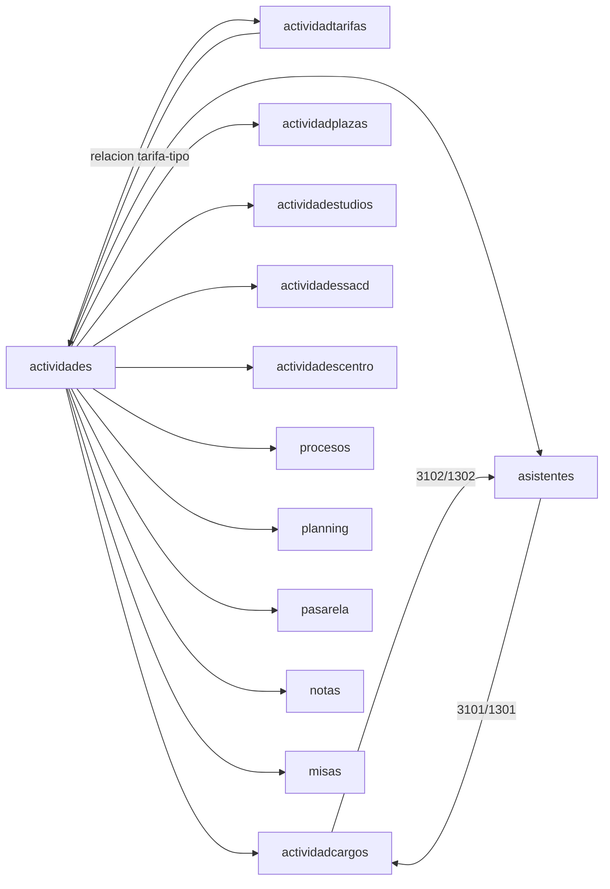

# Plan de documentacion de modulos Orbix

Documento maestro para documentar **todos los modulos** con el pipeline de `docs/scripts/`. Sirve como lista de control: nada se da por cerrado hasta marcar el repaso final de este fichero.

## Reglas de ejecucion

- **Ignorar `db/` y el estado de git** mientras el usuario trabaja en migrations; la documentacion se basa en `src/`, `frontend/` y `docs/dev/` (legacy).
- **Un modulo = una pasada completa** del pipeline + revision manual + actualizacion de este plan.
- **Regenerar con `--force --skip-openapi-validation`** si el entorno no tiene Node/OpenAPI CLI; validar OpenAPI cuando el entorno lo permita.
- **Legacy Obix** (`docs/legacy/obix/mapa_*.md`): usar como fuente de nombres visibles, rutas de menu y pasos de usuario; no duplicar, enlazar.
- **Widgets dossier** (`Select_*`, forms sin controller propio): documentar a mano en `pantallas/` y `manual/` aunque el generador no los detecte.

## Que hay que documentar por modulo

Cada modulo debe producir **o revisar** estos artefactos:

| # | Artefacto | Ruta | Generador | Revision manual obligatoria |
|---|-----------|------|-----------|---------------------------|
| 1 | Convenciones API (transversal, una vez) | `docs/catalogo/_convenciones_api.md` | — | Hecho |
| 2 | Fichas API (por endpoint) | `docs/catalogo/<mod>/api/*.md` | `generar_api_modulo_md.php` | Objetivo, permisos, errores, HashB, efectos |
| 3 | Capacidades | `docs/catalogo/<mod>/capacidades/*.md` | `generar_capacidades_modulo.php` | Fusionar duplicados, nombre de negocio |
| 4 | Pantallas / fragmentos | `docs/catalogo/<mod>/pantallas/*.md` | `generar_pantallas_modulo.php` | Dossiers, AJAX, campos visibles, JS |
| 5 | Relaciones pantalla ↔ API | `docs/catalogo/<mod>/relaciones/pantallas_api.md` | `generar_relaciones_pantallas_api.php` | Resolver endpoints huerfanos |
| 6 | Flujos de usuario | `docs/catalogo/<mod>/flujos/*.md` | `generar_flujos_modulo.php` | Objetivo en lenguaje usuario, pasos, errores |
| 7 | Manual de usuario | `docs/manual/<mod>.md` | `generar_manual_usuario_modulo.php` | Rutas menu, permisos, tablas de errores |
| 8 | Ayuda IA (RAG) | `docs/ai/<mod>/` | `generar_ayuda_ia_modulo.php` | Completar huecos vs flujos |
| 9 | OpenAPI | `docs/catalogo/<mod>/openapi.yaml` | `generar_openapi_desde_catalogo.php` | Validar con Redocly cuando sea posible |
| 10 | Enlaces cross-modulo | `docs/catalogo/<mod>/relaciones/modulos_relacionados.md` | Manual | Ver seccion «Conexiones entre modulos» |

### Comando estandar por modulo

```bash
docs/scripts/generar_documentacion_modulo.sh <modulo> --force --skip-openapi-validation
```

### Checklist de revision manual (copiar por modulo)

```markdown
- [ ] Pipeline ejecutado sin errores
- [ ] api/*.md: objetivo funcional, errores, permisos, HashB revisados
- [ ] capacidades: sin duplicados absurdos
- [ ] pantallas: dossiers/widgets anadidos si faltaban
- [ ] relaciones/pantallas_api.md: 0 endpoints huerfanos (o justificados)
- [ ] flujos: objetivo_usuario en castellano claro
- [ ] manual: estado_revision revisado_parcial minimo; secciones clave revisado
- [ ] ai/: indice coherente con flujos
- [ ] openapi.yaml generado
- [ ] relaciones/modulos_relacionados.md actualizado
- [ ] mapas legacy Obix enlazados (si existen)
- [ ] Fila actualizada en tabla maestra (abajo)
```

### Procedimiento de revision profunda (metodo zonassacd, jun 2026)

Para cerrar los `estado_revision: "generado"` de un modulo (o una tanda de el),
un agente IA debe:

1. **Leer codigo real, no confiar en lo autogenerado**: por cada pantalla, leer
   `frontend/<mod>/controller/X.php` + `view/X.phtml` + los casos de uso de
   `src/<mod>/application/` que tocan sus endpoints (y `config/routes.php`).
2. **Completar fichas** `catalogo/<mod>/api/*.md` y `pantallas/*.md`:
   - Descripcion funcional (que hace, semantica de cada parametro y sus valores
     especiales tipo `'no'`), correccion de `operacion` (consulta/mutacion),
     forma real de `data`, permisos reales (incluido "el caso de uso no valida,
     el control esta en la UI" cuando sea el caso).
   - Pantallas: subtipo real, tabla de acciones (funcion JS → endpoint → parametros),
     validaciones en cliente. Enlazar al manual, no duplicarlo.
   - Marcar `estado_revision: "revisado"` y sustituir la seccion "Revision Manual"
     por lo verificado + lo pendiente real.
3. **Contrastar con el original en `apps/`** (git history) cuando algo no cuadre
   entre vista y backend: asi se detectan regresiones de migracion (ej. boton
   `modificar` de zona_sacd perdido y restaurado en jun 2026).
4. **Anotar hallazgos** (rutas muertas, endpoints sin consumidor, regresiones) en
   las notas del manual y de la ficha afectada; arreglar codigo solo si el usuario
   lo aprueba.
5. **Actualizar** `docs/ai/<mod>/api_resumen.md` (rutas muertas, semantica corregida),
   `docs/manual/<mod>.md` (conceptos del dominio + tareas habituales orientadas a
   "como hago X") y la fila de la tabla maestra.

Modulos grandes: trocear en tandas funcionales y ejecutar cada tanda en una sesion
nueva; dejar anotada la tanda completada en la fila de la tabla maestra.

---

## Tabla maestra de modulos (36)

Leyenda **Doc**: `—` sin generar | `GEN` generado sin revision | `REV` revision manual en curso | `OK` cerrado para este plan.

| Modulo | API | FE | Endpoints | Prioridad | Ola | Doc | Manual | Notas |
|--------|-----|----|-----------:|-----------|-----|-----|--------|-------|
| actividadtarifas | y | y | 14 | Piloto | 0 | OK | REV | Menu documentado; 3 flujos revisados |
| actividadcargos | y | y | 5 | Piloto | 0 | OK | REV | Widgets 3102/1302; pantallas select anadidas |
| zonassacd | y | y | 7 | Media | 1 | REV | OK | API y pantallas revisadas en profundidad jun 2026 (falta flujos/capacidades); boton modificar restaurado; rutas muertas detectadas |
| cartaspresentacion | y | y | 8 | Media | 1 | REV | REV | Manual + modulos_relacionados |
| cambios | y | y | 12 | Media | 1 | REV | REV | Manual + huérfanos AJAX |
| actividadplazas | y | y | 11 | Media | 1 | REV | REV | Manual + enlace actividades/asistentes |
| actividadessacd | y | y | 14 | Media | 1 | REV | REV | Manual + cross-ref cargos |
| actividadescentro | y | y | 7 | Media | 1 | REV | REV | Manual + ubis |
| profesores | y | y | 6 | Media | 1 | REV | REV | Manual STGR |
| pasarela | y | y | 21 | Media | 2 | REV | REV | Manual Exterior |
| procesos | y | y | 23 | Media | 2 | REV | REV | Manual + cambios |
| planning | y | y | 7 | Media | 2 | REV | REV | Manual multi-vista |
| casas | y | y | 15 | Media | 2 | REV | REV | Manual + tarifas |
| asistentes | y | y | 15 | Media | 2 | REV | REV | Dossiers 3101/1301 |
| certificados | y | y | 20 | Media | 2 | REV | REV | Manual STGR |
| ubiscamas | y | y | 9 | Media | 2 | REV | REV | Sin menu CSV |
| misas | y | y | 32 | Media | 2 | REV | REV | 32 flujos catalogo |
| actividades | y | y | 32 | **Hub** | 3 | REV | REV | Hub central. Revision profunda en 3 tandas: (1) ficha actividad `actividad_*` CRUD/fases/permisos — **completada jun 2026** (16 fichas API + pantallas `actividad_que`/`actividad_ver` revisadas; hallazgos: StatusId legacy en twig sin procesos, `tipo_horario` entrada muerta, `actividad_fase_completada_datos` sin consumidor), (2) listados `lista_*`/`calendario_listas`/`actividad_select*`/`actividades_centro_que`, (3) `tipo_activ_*`/`planning_casa_*`/`actividad_nuevo_curso`. Pendientes tandas 2-3 |
| personas | y | y | 9 | **Hub** | 3 | REV | REV | Ficha + dossiers |
| dossiers | y | y | 6 | **Hub** | 3 | REV | REV | Shell + tipos_dossier |
| ubis | y | y | 40 | **Hub** | 3 | REV | REV | Centros/casas |
| notas | y | y | 34 | Grande | 4 | REV | REV | Manual + modulos_relacionados |
| inventario | y | y | 43 | Grande | 4 | REV | REV | Manual + modulos_relacionados |
| encargossacd | y | y | 34 | Grande | 4 | REV | REV | Manual + modulos_relacionados |
| actividadestudios | y | y | 27 | Grande | 4 | REV | REV | Manual + modulos_relacionados |
| usuarios | y | y | 44 | Grande | 4 | REV | REV | Manual + permisos cross-ref |
| menus | y | y | 18 | Grande | 4 | REV | REV | Manual + menus.csv |
| devel_db_admin | y | y | 15 | Dev | 5 | REV | REV | Fix regex routes.php |
| devel_codegen | y | y | 0 | Dev | 5 | — | — | Sin controllers HTTP |
| dbextern | y | y | 16 | Dev | 5 | REV | REV | Manual breve |
| utils_database | y | n | 0 | Dev | 5 | — | — | Utilidad CLI |
| shared | y | y | 6 | Infra | 5 | REV | REV | tablaDB generico |
| configuracion | y | y | 6 | Infra | 5 | REV | REV | Registro modulos |
| asignaturas | y | n | 2 | Minimo | 6 | REV | REV | API-only + ai |
| tablonanuncios | y | n | 1 | Minimo | 6 | REV | REV | API-only + ai |
| permisos | n | n | 0 | Minimo | 6 | — | — | Ver excepciones_modulos.md |

### Ola 2 — Completada (2026-05-21)

Manuales revisados + `modulos_relacionados.md`: pasarela, procesos, planning, casas, asistentes, certificados, ubiscamas, misas.

### Ola 3 — Completada (2026-05-21)

Manuales + `modulos_relacionados.md` + indice `tipos_dossier.md`: actividades, personas, dossiers, ubis.

### Ola 4 — Completada (2026-05-21)

Manuales revisados: notas, inventario, encargossacd, actividadestudios, usuarios, menus.

### Ola 5–6 — Completada parcial (2026-05-21)

- `devel_db_admin` — pipeline OK tras fix regex `function (): void`; manual admin
- `dbextern`, `shared`, `configuracion` — manual breve
- `asignaturas`, `tablonanuncios` — solo API
- `devel_codegen` — sin rutas HTTP (excepcion)
- `permisos`, `utils_database` — sin catalogo (dominio/CLI)

**Fix generador:** `docs/scripts/generar_api_modulo_md.php` acepta return type en closures de routes.php.

**Progreso:** 33/36 modulos con catalogo · 33 manuales · 33 openapi · 33 modulos_relacionados · 33 ai · **repaso final:** `docs/REPASSO_FINAL.md`

### Ola 1 — Completada (2026-05-21)

- [x] Pipeline 7 modulos
- [x] Manuales revisados + `modulos_relacionados.md` + huérfanos API

### Ola 2 — Negocio medio con frontend claro (8 modulos)

`pasarela`, `procesos`, `planning`, `casas`, `asistentes`, `certificados`, `ubiscamas`, `misas`

→ Documentar enlaces a actividades, personas, ubis.

### Ola 3 — Hubs (4 modulos)

`actividades`, `personas`, `dossiers`, `ubis`

→ Revisar y completar `relaciones/modulos_relacionados.md` de modulos ya hechos.

### Ola 4 — Dominios grandes (6 modulos)

`notas`, `inventario`, `encargossacd`, `actividadestudios`, `usuarios`, `menus`

→ Partir manual por flujos; usar mapas Obix como indice.

### Ola 5 — Dev e infra (5 modulos)

`devel_db_admin`, `devel_codegen`, `dbextern`, `utils_database`, `shared`, `configuracion`

→ Manual opcional; catalogo API siempre.

### Ola 6 — Minimos (3 modulos)

`asignaturas`, `tablonanuncios`, `permisos` — ficha breve o inclusion en modulo padre.

---

## Conexiones entre modulos

Documentar en `docs/catalogo/<mod>/relaciones/modulos_relacionados.md` (crear al documentar cada modulo). Mapa de referencia:

### Shell y navegacion

| Desde | Hacia | Tipo de enlace | Documentar en |
|-------|-------|----------------|---------------|
| `dossiers` | *cualquier mod con Select/Form* | `dossiers_ver.php`, `id_tipo_dossier` | dossiers + modulo widget |
| `menus` | todos los modulos con pantalla | entradas de menu, permisos | menus + modulo destino |
| `configuracion` | todos | `mods_req`, `apps_req` en BD | configuracion |
| `usuarios` | todos | permisos oficina, sesion | usuarios + convenciones API |

### Ecosistema actividades (prioritario)



### Dossiers conocidos (no exhaustivo; ampliar al documentar)

| id_tipo | codigo | Modulo | PAU |
|--------:|--------|--------|-----|
| 3102 | cargos_de_actividad | actividadcargos | actividad |
| 1302 | cargos_personas_en_actividad | actividadcargos | persona |
| 3101 | asistentes actividad | asistentes | actividad |
| 1301 | asistentes persona | asistentes | persona |

*(Completar filas desde baselines en `docs/dev/*_migracion_baseline.md` durante ola 1–4.)*

### Hubs de entidad

| Hub | Consumidores tipicos |
|-----|---------------------|
| `personas` | asistentes, notas, planning, certificados, encargossacd, actividadcargos |
| `ubis` / `casas` | planning, inventario, actividadtarifas (tarifa_ubi), misas, encargossacd |
| `shared` | CRUD generico `tablaDB_*` usado en varios modulos legacy |

### Transporte HTTP (transversal)

- Patron: `PostRequest::getDataFromUrl('/src/<modulo>/<endpoint>')`
- Convenciones: `docs/catalogo/_convenciones_api.md`
- HashB: `docs/dev/hash_arquitectura.md`

---

## Repaso final global

Ejecutado 2026-05-21 — informe: `docs/REPASSO_FINAL.md`

### A. Cobertura

- [x] 36 modulos listados; cada uno con `docs/catalogo/<mod>/api/` (o excepcion documentada en ola 6)
- [x] 33 modulos con frontend tienen `pantallas/` o nota «solo dossier/API»
- [x] Cada modulo con endpoints tiene `openapi.yaml`
- [x] Cada modulo con flujos de usuario tiene `docs/manual/<mod>.md`
- [x] Cada modulo con manual tiene `docs/ai/<mod>/00_indice.md`

### B. Calidad transversal

- [x] `_convenciones_api.md` enlazado desde manuales que usan HashB
- [x] Sin endpoints huerfanos sin justificar (normalizados en repaso 2026-05-21)
- [ ] Errores sin duplicados en manuales (generador + revision)
- [ ] Objetivos de flujo en castellano, no nombres de clase PHP

### C. Conexiones entre modulos

- [x] Cada `relaciones/modulos_relacionados.md` existe y tiene backlinks
- [x] Mapa dossiers central en `docs/catalogo/dossiers/relaciones/tipos_dossier.md` (parcial)
- [x] Indice legacy: `docs/legacy_mapping.md` (parcial, ampliacion continua)
- [x] Grafo `configuracion` mods_req reflejado en documentacion

### D. Publicacion

- [ ] OpenAPI validado (Redocly) en modulos principales — bloqueado entorno Node/npm
- [x] Manuales piloto con `estado_revision: revisado` o `revisado_parcial` justificado
- [x] `docs/00_indice_modulos.md` generado con enlaces a manual + catalogo + ai

### E. Excepciones aceptadas

| Modulo | Excepcion |
|--------|-----------|
| permisos | Solo dominio; ver `docs/excepciones_modulos.md` + usuarios |
| devel_codegen | Sin API HTTP; omitir openapi |
| utils_database | Herramienta CLI; catalogo minimo |
| tablonanuncios / asignaturas | Manual corto; dependencia de modulos padre |

---

## Legacy Obix → pipeline nuevo

Por modulo, al revisar manual, buscar:

```text
docs/legacy/obix/<modulo>/mapa_*.md
```

Anotar en `docs/legacy_mapping.md` (crear en ola 1):

| mapa legacy | pantalla catalogo | flujo catalogo | manual seccion |
|-------------|-------------------|----------------|----------------|

---

## Seguimiento de sesiones

| Fecha | Modulo(s) | Accion | Responsable |
|-------|-----------|--------|-------------|
| 2026-05-21 | actividadtarifas, actividadcargos | Pipeline + revision manual parcial | agente |
| 2026-05-21 | actividadtarifas, actividadcargos | **Ola 0 cerrada**: menu, modulos_relacionados, legacy_mapping, huérfanos | agente |
| 2026-05-21 | zonassacd … profesores | **Ola 1 pipeline** completo (7 modulos) | agente |
| 2026-05-21 | olas 1–6 | Pipeline + manuales + repaso final | agente |
| 2026-05-21 | repaso global | REPASSO_FINAL.md, 12 modulos_relacionados, huerfanos API, ai asignaturas/tablonanuncios | agente |
| 2026-06-11 | actividades | **Tanda 1 revision profunda** (ficha actividad): 16 api/*.md + 2 pantallas revisados, api_resumen + manual actualizados; 3 hallazgos anotados (sin tocar codigo) | agente |

*(Anadir fila por cada sesion de trabajo.)*

---

## Respuesta operativa

**Si, se puede ejecutar en paralelo** mientras se modifican migrations: el plan no depende de `db/` ni del estado de git. El agente ira modulo a modulo segun el orden de olas, actualizando esta tabla y creando `relaciones/modulos_relacionados.md` en cada paso.

**Siguiente accion inmediata:** cerrar ola 0 (menu/permisos pilotos) y arrancar ola 1 con `zonassacd`.
