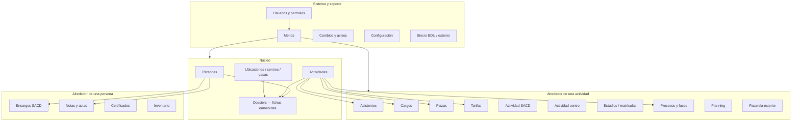

# Orbix — qué es y qué se puede hacer

Documento de síntesis para entender el alcance del sistema, orientar a nuevos usuarios o montar una presentación.  
Para detalle operativo por módulo: [índice de documentación](00_indice_modulos.md).

---

## 1. En una frase

**Orbix** es el sistema de gestión interna de una organización religiosa con estructura territorial (delegaciones, centros, casas, zonas SACD). Centraliza **personas**, **actividades**, **encargos**, **planificación**, **notas y certificados**, **inventario** y la **administración de usuarios y permisos**, accesible desde navegador web y, en parte, desde aplicación móvil nativa.

Sustituye y evoluciona el antiguo sistema **Obix**, manteniendo los flujos de oficina pero con arquitectura modular moderna.

---

## 2. Problema que resuelve

Las oficinas (SACD, centros, formación, exterior, administración…) necesitan:

- Saber **quién** participa en **qué** actividad, en **qué** centro y en **qué** fase del proceso.
- Gestionar **encargos**, **planning**, **plazas**, **tarifas** y **comunicaciones** sin duplicar datos.
- Emitir **notas**, **certificados**, **cartas de presentación** e **informes** coherentes con el expediente.
- Controlar **quién puede ver o modificar** cada pantalla según rol, oficina y estado de la actividad.
- Sincronizar datos con sistemas externos (p. ej. **BDU** de listas de personas).

Orbix unifica esos procesos en un solo entorno con fichas enlazadas (dossiers), menús por rol y más de **560 endpoints API** documentados.

---

## 3. Quién lo usa (perfiles típicos)

| Perfil | Ejemplos de uso |
|--------|-----------------|
| **Oficina SACD / Exterior** | Personas SACD, zonas, encargos, planning, actividades conjuntas, misas |
| **Centro / casa (CTR)** | Actividades del centro, asistentes, cargos, plazas, casas, inventario local |
| **Formación / estudios (STGR)** | Matrículas, actas, notas, certificados, profesores |
| **Administración** | Usuarios, roles, menús, permisos, configuración de módulos |
| **Desarrollo / mantenimiento** | Esquemas BD, sincronización externa, herramientas de migración |

El acceso se define por **rol** y **permisos de menú y actividad**; no todos los usuarios ven las mismas entradas ni las mismas acciones en una ficha.

---

## 4. Mapa funcional (visión de pájaro)



---

## 5. Qué se puede hacer — por áreas

### 5.1 Personas y expediente

- **Buscar** personas por tipo: numerarios, agregados, de paso, SACD, SSSC…
- Abrir la **ficha de persona** con datos, traslados entre delegaciones y cambios STGR.
- Ver **dossiers** laterales: asistentes a actividades, cargos, notas, inventario asignado, etc.

*Módulos:* `personas`, `dossiers`, `dbextern` (sincronización con listas externas).

---

### 5.2 Actividades (hub central)

Casi todo el trabajo de oficina gira en torno a una **actividad** (curso, retiro, encuentro, período formativo…).

Se puede:

- **Buscar, crear, editar, duplicar, importar y eliminar** actividades.
- Gestionar **tipos de actividad** y sus metadatos.
- Consultar **calendarios** y listas por casa o conjunto.
- **Publicar** actividades y cambiar tipo o estado.
- Abrir la ficha con todos los dossiers relacionados.

*Módulo principal:* `actividades` (32 endpoints API).  
*Satélites:* `actividadcargos`, `actividadplazas`, `actividadtarifas`, `actividadessacd`, `actividadescentro`, `actividadestudios`, `asistentes`.

---

### 5.3 Participación en actividades

| Área | Qué permite |
|------|-------------|
| **Asistentes** | Alta, baja, mover entre actividades, plazas, listados por centro o conjunto |
| **Cargos** | Asignar responsables/cargos a una actividad |
| **Plazas** | Balance de plazas, peticiones, cesiones, resumen |
| **Tarifas** | Tarifas por ubicación, series, tipos, relaciones |
| **Actividad SACD** | Comunicaciones, asignación SACD, solapes, locales |
| **Actividad centro** | Encargados de centro, centros disponibles |
| **Estudios** | Matrículas, asignaturas, actas, plan de estudios, E43 |

---

### 5.4 Ubicaciones (centros, casas, direcciones)

- **Buscar y mantener** centros (CTR), casas, delegaciones y regiones.
- Gestionar **direcciones**, **teléfonos**, **calendarios de períodos**.
- **Trasladar** ubicaciones entre contextos.
- Opciones para **camas y habitaciones** (`ubiscamas`).

*Módulo:* `ubis` (40 endpoints — uno de los más amplios).

---

### 5.5 SACD: zonas, encargos y misas

- **Zonas SACD** y relación zona–centro (`zonassacd`).
- **Fichas de encargo** centro y SACD, listados, propuestas, ausencias (`encargossacd`).
- **Planning** por persona, centro, casa o zonas.
- **Plan de misas**: cuadrículas, encargos por zona/centro, plantillas, horarios (`misas`).

---

### 5.6 Formación, notas y certificados

- **Notas** por persona y actividad, actas, informes STGR, tesseræ, exámenes.
- **Certificados** emitidos y recibidos: guardar, PDF, envío, impresión.
- **Profesores** y **asignaturas** (catálogos y desplegables).
- **Cartas de presentación** para trámites externos.

*Módulos:* `notas`, `certificados`, `profesores`, `actividadestudios`, `asignaturas`, `cartaspresentacion`.

---

### 5.7 Casas, inventario y logística

- **Casas**: ingresos, gastos, grupos, previsión de asistentes, calendario por ubicación.
- **Inventario**: equipajes, documentos numerados, asignación a centros/delegaciones, movimientos, colecciones.

*Módulos:* `casas`, `inventario` (43 endpoints).

---

### 5.8 Procesos, permisos y avisos

- **Procesos**: cada tipo de actividad tiene fases; la oficina marca avances (p. ej. «falta matricular», «falta SACD»).
- Los **permisos por actividad** pueden depender de la fase (`procesos` + `usuarios`).
- **Cambios y avisos**: registro de cambios en preferencias de usuario, generación de avisos por correo (`cambios`).

---

### 5.9 Exterior y pasarela

- Configuración de **activación**, **contribuciones**, **nombres** y excepciones para actividades de exterior.
- **Exportar** datos de actividades hacia sistemas externos.

*Módulo:* `pasarela`.

---

### 5.10 Administración del sistema

| Función | Módulo |
|---------|--------|
| Login, 2FA, usuarios, roles, grupos de menú | `usuarios` |
| Construcción y exportación de menús | `menus` |
| Parámetros globales y registro de módulos | `configuracion` |
| Tablas genéricas reutilizables | `shared` |
| Tablón de anuncios | `tablonanuncios` |
| Herramientas de esquema BD (entornos dev) | `devel_db_admin` |

---

## 6. Conceptos transversales (clave para entender el sistema)

### Dossiers

Las **fichas embebidas** (dossiers) son el mecanismo para ver, desde una persona o actividad, widgets de otros módulos sin cambiar de pantalla principal. Ejemplos: listado de asistentes (3101), cargos (3102), notas, inventario.

### Menús y roles

Cada usuario tiene un **rol**; el menú muestra solo las entradas permitidas. Los administradores mantienen plantillas de menú, grupos y permisos por pantalla.

### API JSON bajo `/src/`

La interfaz web y la app móvil consumen endpoints REST-like:

- URL: `/src/<modulo>/<accion>`
- Respuesta estándar: `{ success, mensaje, data }`
- Mutaciones protegidas con **HashB** (cápsula de autorización) cuando aplica.

Documentación: [convenciones API](catalogo/_convenciones_api.md) · [clientes nativos](catalogo/_clientes_nativos.md).

### Procesos no lineales

Una actividad puede tener **varias fases completadas a la vez** (no hay una única «fase actual»). Las dependencias entre fases impiden marcar una fase si no está la previa.

---

## 7. Arquitectura (resumen para presentación técnica)

| Capa | Ubicación | Rol |
|------|-----------|-----|
| **Interfaz** | `frontend/<modulo>/` | Pantallas PHP/Twig, JS, forms |
| **API HTTP** | `src/<modulo>/infrastructure/ui/http/controllers/` | Entrada/salida JSON |
| **Casos de uso** | `src/<modulo>/application/` | Orquestación de negocio |
| **Dominio** | `src/<modulo>/domain/` | Entidades, reglas |
| **Persistencia** | `src/<modulo>/infrastructure/persistence/` | PostgreSQL |

- **~36 módulos** de negocio en `src/`.
- Migración en curso desde legacy `apps/` hacia **DDD** (ver [agents.md](../agents.md) y [REFACTOR_INDICE.md](../documentacion/REFACTOR_INDICE.md)).
- Base de datos **PostgreSQL**; histórico documentado en Obix legacy.

---

## 8. Cifras de referencia (junio 2026)

| Métrica | Valor |
|---------|------:|
| Módulos con API HTTP documentada | 33 |
| Fichas de endpoints (`docs/catalogo/*/api/`) | 563 |
| Especificaciones OpenAPI | 33 |
| Manuales de usuario | 33 |
| Paquetes de ayuda IA (`docs/ai/*/`) | 33 |
| Controllers HTTP | ~562 |

---

## 9. Documentación disponible

Todo el conocimiento del sistema está organizado en `docs/`:

| Tipo | Ruta | Para qué sirve |
|------|------|----------------|
| **Este resumen** | `docs/QUE_ES_ORBIX.md` | Visión global / presentación |
| **Índice** | `docs/00_indice_modulos.md` | Enlaces a cada módulo |
| **Manuales** | `docs/manual/<modulo>.md` | Uso desde menú, paso a paso |
| **Catálogo API** | `docs/catalogo/<modulo>/api/` | Cada endpoint: entrada, salida, permisos |
| **Capacidades** | `docs/catalogo/<modulo>/capacidades/` | Agrupación funcional |
| **Flujos** | `docs/catalogo/<modulo>/flujos/` | Recorridos de usuario |
| **Ayuda IA** | `docs/ai/<modulo>/` | Resúmenes para asistente local |
| **Legacy Obix** | `documentacion/Documentacion_Obix/` | Mapas históricos de menú |

Regenerar documentación tras cambios en código:

```bash
php docs/scripts/generar_api_modulo_md.php <modulo> --force
php docs/scripts/generar_openapi_desde_catalogo.php <modulo> --force
php docs/scripts/generar_ayuda_ia_modulo.php <modulo> --force
```

---

## 10. Esquema sugerido para una presentación (12 diapositivas)

1. **Título** — Orbix: gestión integral de personas, actividades y oficinas.
2. **Contexto** — Organización territorial; múltiples oficinas y roles.
3. **Problema** — Datos dispersos, permisos complejos, muchos procesos manuales.
4. **Solución** — Un sistema web modular con fichas enlazadas y API documentada.
5. **Usuarios** — SACD, centros, formación, administración (tabla §3).
6. **Núcleo** — Personas + Actividades + Ubicaciones + Dossiers (diagrama §4).
7. **Ciclo de una actividad** — Crear → asistentes/cargos/plazas → procesos → cierre.
8. **SACD y exterior** — Zonas, encargos, planning, misas, pasarela.
9. **Formación** — Notas, certificados, matrículas, profesores.
10. **Seguridad** — Usuarios, roles, menús, permisos por fase.
11. **Tecnología** — Web + API + móvil; PostgreSQL; 563 endpoints documentados.
12. **Recursos** — Manuales, catálogo API, ayuda IA; contacto mantenimiento.

---

## 11. Módulos agrupados (tabla rápida)

| Grupo | Módulos |
|-------|---------|
| **Hubs** | `actividades`, `personas`, `ubis`, `dossiers` |
| **Actividad** | `asistentes`, `actividadcargos`, `actividadplazas`, `actividadtarifas`, `actividadessacd`, `actividadescentro`, `actividadestudios` |
| **SACD / territorial** | `zonassacd`, `encargossacd`, `planning`, `misas` |
| **Formación** | `notas`, `certificados`, `profesores`, `asignaturas`, `cartaspresentacion` |
| **Logística** | `casas`, `inventario`, `ubiscamas` |
| **Proceso y comunicación** | `procesos`, `cambios`, `pasarela`, `tablonanuncios` |
| **Plataforma** | `usuarios`, `menus`, `configuracion`, `shared`, `permisos` |
| **Integración / dev** | `dbextern`, `devel_db_admin`, `devel_codegen`, `utils_database` |

---

## 12. Próximos pasos según audiencia

| Si eres… | Empieza por… |
|----------|----------------|
| **Usuario nuevo** | Manual de tu rol en `docs/manual/` + mapas Obix de tu menú |
| **Responsable de oficina** | §5 de este documento + manual de `actividades` y `procesos` |
| **Desarrollador** | [agents.md](../agents.md), catálogo API del módulo, [REFACTOR_INDICE.md](../documentacion/REFACTOR_INDICE.md) |
| **Integrador / móvil** | [_clientes_nativos.md](catalogo/_clientes_nativos.md), OpenAPI del módulo |

---

*Documento generado a partir del catálogo y manuales en `docs/`. Actualizar cuando cambie el alcance funcional o el número de módulos documentados.*
