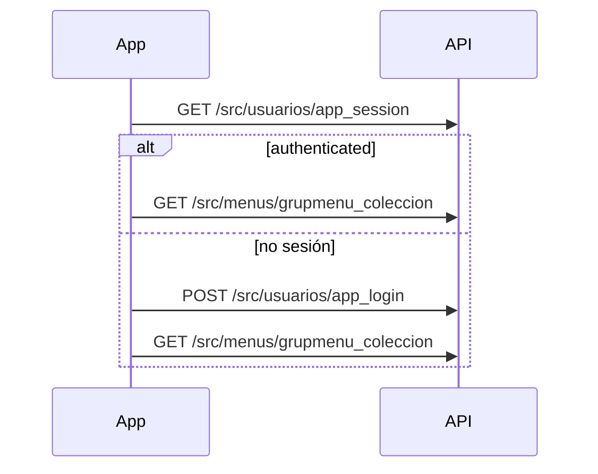

# Clientes nativos (Android, iOS, etc.)

Guía transversal para consumir la API Orbix **sin WebView**, usando cookies de sesión PHP y JSON bajo `/src/...`.

Convenciones generales del envelope: [`_convenciones_api.md`](_convenciones_api.md).

Índice de endpoints ya revisados para la app móvil: [`_endpoints_cliente_movil.md`](_endpoints_cliente_movil.md).

## Construcción de la URL

La base configurada en el cliente suele ser la misma que en el navegador, p. ej.:

`http://servidor:8003/orbix/public/index.php`

Para llamar a la API:

1. Quitar el segmento `/index.php` final si existe.
2. Quitar el segmento `/public` si existe (las rutas API viven en `…/orbix/src/…`, no en `…/orbix/public/src/…`).
3. Añadir la ruta del endpoint, p. ej. `/src/usuarios/app_login`.

Ejemplo:

| Base en ajustes | URL final |
|-----------------|-----------|
| `http://10.0.2.2:8003/orbix/public/index.php` | `http://10.0.2.2:8003/orbix/src/usuarios/app_login` |
| `http://orbix.docker:8003/orbix/index.php` | `http://orbix.docker:8003/orbix/src/usuarios/app_login` |

## Transporte común

| Aspecto | Valor |
|---------|--------|
| Autenticación | Cookie `PHPSESSID` tras login exitoso (OkHttp `CookieJar`, etc.) |
| Cabecera recomendada | `Accept: application/json` (evita HTML de login en rutas `/src/` sin sesión) |
| Mutaciones | `POST` + `application/x-www-form-urlencoded` salvo que la ficha indique JSON |
| Login móvil | `POST` + `application/json` también aceptado en `/src/usuarios/app_login` |

## Parseo del envelope `ContestarJson`

Respuesta típica:

```json
{
  "success": true,
  "data": "…"
}
```

En error de negocio (HTTP suele ser 200):

```json
{
  "success": false,
  "mensaje": "texto traducido",
  "data": "none"
}
```

### Doble codificación de `data`

La mayoría de endpoints usan `ContestarJson::enviar`: si `data` es array/objeto, se serializa como **string JSON escapado** dentro del campo `data`. El cliente debe:

1. Parsear el cuerpo HTTP como JSON.
2. Si `data` es string no vacía, hacer un segundo `JSON.parse` / `JSONObject(data)`.

Excepción: endpoints con `enviarDataAnidado` (p. ej. `grupmenu_coleccion`) devuelven `data` como **objeto JSON nativo** (un solo parse).

### Ack `"ok"`

Mutaciones sin payload devuelven `data: "ok"` (string literal). No hace falta segundo parse.

## Secuencia de arranque recomendada



1. **`app_session`** — comprobar cookie guardada.
2. **`app_login`** — si no hay sesión (JSON o form).
3. **`grupmenu_coleccion`** — menú lateral / drawer.
4. Pantallas concretas según la URL del ítem de menú (ver flujos en cada ficha API).

## Cierre de sesión

No hay endpoint dedicado en la app móvil actual: el cliente **borra las cookies locales** (`PHPSESSID`, `esquema`, …) y vuelve a la pantalla de login. Opcionalmente puede llamar a la URL de logout web si se documenta en el módulo usuarios.

## Errores frecuentes

| Síntoma | Causa habitual |
|---------|----------------|
| 404 en `/public/src/...` | Base URL mal normalizada; quitar `/public` |
| HTML en lugar de JSON | Falta sesión o falta `Accept: application/json` |
| Menú vacío con HTTP 200 | `success=false` con `auth_required` en `data`, o usuario sin grupmenus |
| Cuadrícula vacía | `id_zona` incorrecto o periodo sin datos |
| Atención actividades vacía | Falta `que`/`sacd` o periodo no resuelto (`mensaje_periodo`) |

## Referencia de implementación

Cliente de referencia: repositorio `orbix-android` (`OrbixApi.kt`, `MisasApi.kt`, `ActividadesSacdApi.kt`, `PlanningApi.kt`).
