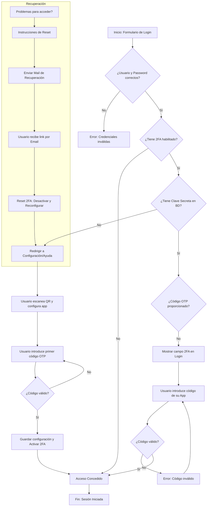

# Flujo de Autenticación de Doble Factor (2FA)

Este documento detalla el funcionamiento del sistema 2FA en Orbix, incluyendo el proceso de inicio de sesión, la configuración inicial y los mecanismos de recuperación.

## Esquema del Flujo General

El siguiente diagrama muestra el proceso desde que el usuario introduce sus credenciales hasta que obtiene acceso al sistema.

---

## Casos Posibles y Acciones del Usuario

A continuación se detallan los escenarios que un usuario puede encontrar y las acciones requeridas.

### 1. Login Estándar (Sin 2FA)
- **Caso**: El usuario no tiene activado el 2FA en sus preferencias.
- **Acción del Usuario**:
    1. Introducir Nombre de Usuario y Contraseña.
    2. Hacer clic en "Iniciar Sesión".
- **Resultado**: Acceso directo al sistema.

### 2. Login con 2FA ya configurado
- **Caso**: El usuario tiene 2FA activo y ya vinculó su aplicación (Google Authenticator, etc.).
- **Acción del Usuario**:
    1. Introducir Nombre de Usuario y Contraseña.
    2. Si el sistema lo requiere (Error 3), aparecerá un campo adicional: **"Código de verificación (2FA)"**.
    3. Abrir la App de autenticación en el móvil.
    4. Introducir el código de 6 dígitos actual.
    5. Hacer clic en "Iniciar Sesión".
- **Resultado**: Acceso concedido tras validar el código.

### 3. Login con 2FA habilitado pero NO configurado
- **Caso**: Un administrador activó el 2FA para el usuario, o es la primera vez que el usuario intenta entrar tras activarlo.
- **Acción del Usuario**:
    1. El sistema redirigirá a una pantalla de configuración o ayuda.
    2. Seguir los pasos de configuración (ver sección siguiente).
- **Resultado**: El usuario deberá completar el vínculo antes de poder entrar.

### 4. Configuración Inicial / Activación
- **Caso**: El usuario desea activar 2FA desde sus preferencias o es forzado por el sistema.
- **Acción del Usuario**:
    1. Escanear el **Código QR** mostrado con una App de autenticación.
    2. Alternativamente, introducir la **Clave Secreta** manualmente en la App.
    3. Introducir el código generado por la App en el campo de **"Verificación"**.
    4. Hacer clic en **"Guardar configuración"**.
- **Resultado**: 2FA queda vinculado y activo para futuros logins.

### 5. Recuperación (Pérdida de acceso)
- **Caso**: El usuario ha borrado la App, ha perdido el móvil o el código no funciona.
- **Acción del Usuario**:
    1. En la pantalla de login, hacer clic en **"¿Tiene problemas para acceder?"**.
    2. Seguir los pasos de recuperación (email de reset).
- **Resultado**: Se permite el acceso y se pide reconfigurar el 2FA desde cero.

---

## Resumen de Errores Comunes

| Error | Mensaje | Causa | Solución |
| :--- | :--- | :--- | :--- |
| **Error 1** | Usuario o Password inválidos | Credenciales básicas incorrectas | Revisar login y password. |
| **Error 3** | Se requiere código 2FA | No se introdujo el código OTP | Introducir el código de la App. |
| **Error 4** | Código 2FA inválido | El código ha expirado o no coincide | Esperar al siguiente código o sincronizar hora del móvil. |
