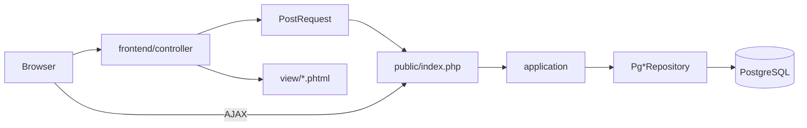

# Guía técnica de Orbix (onboarding)

Documento para programadores que entran al proyecto y necesitan el mapa técnico sin leer todo el repo. No sustituye las normas canónicas: si hay conflicto, mandan [`agents.md`](../../agents.md) y el baseline del módulo.

| Documento | Rol |
|-----------|-----|
| [`agents.md`](../../agents.md) | Reglas DDD, capas, checklist PR |
| [`REFACTOR_INDICE.md`](REFACTOR_INDICE.md) | Estado de migración por módulo |
| [`tests/agents.md`](../../tests/agents.md) | Cómo escribir tests |
| [`db/migrations/README.md`](../../db/migrations/README.md) | Cómo evolucionar el esquema SQL |
| [`QUE_ES_ORBIX.md`](../QUE_ES_ORBIX.md) | Qué hace el producto (visión funcional) |

---

## 1. Stack en una frase

Orbix es una **aplicación web monolítica en PHP 8.2**, con arquitectura **propia** (no es Laravel ni Symfony completo), capas estilo **DDD por módulo**, UI en `frontend/` y negocio en `src/`, persistencia en **PostgreSQL vía PDO** (sin ORM), tests con **PHPUnit 11** y análisis estático con **PHPStan nivel 9**.

### Dependencias que importan

| Pieza | Paquete / tool | Para qué |
|-------|----------------|----------|
| DI | `php-di/php-di` | Inyectar repositorios en casos de uso |
| Router API | `nikic/fast-route` | Rutas `/src/...` |
| Plantillas | Twig (casos puntuales) + vistas `.phtml` | HTML |
| Entorno | `vlucas/phpdotenv` | `.env` |
| Tests | PHPUnit ^11 | Unit + integration |
| Estático | PHPStan ^2, nivel 9 | Tipado y deuda |
| Vendor | `libs/vendor/` | Composer no usa `vendor/` en la raíz |

Autoload PSR-4 (`composer.json`):

- `src\` → `src/`
- `frontend\` → `frontend/`
- `Tests\` → `tests/` (dev)

---

## 2. Arquitectura pretendida

### 2.1 Separación UI / negocio

```text
frontend/<modulo>/     → pantallas HTML (controller + view .phtml)
src/<modulo>/          → dominio, casos de uso, SQL, endpoints JSON
public/index.php       → front controller de /src/...
```

Regla de oro: el frontend **no** instancia casos de uso ni repositorios. Pide datos con `PostRequest::getDataFromUrl('/src/...')` y pinta la vista.

### 2.2 Capas dentro de `src/<modulo>/`

```text
src/<modulo>/
  domain/
    contracts/       # interfaces de repositorio (puertos)
    entity/
    value_objects/
  application/       # casos de uso (*Data lectura, *Guardar escritura…)
  infrastructure/
    persistence/postgresql/   # Pg*Repository (SQL + PDO)
    ui/http/controllers/      # scripts PHP cortos → JSON
  config/
    dependencies.php # wiring PHP-DI
    routes.php       # FastRoute
```

| Patrón | ¿Se usa? | Notas |
|--------|----------|--------|
| DDD por módulo | Sí (objetivo) | Un módulo = un bounded context aproximado |
| Capas Domain / Application / Infrastructure | Sí | UI vive en `frontend/`, no dentro de `src/` |
| Repositorios | Sí | Interface en domain → `Pg*` en infrastructure |
| Value Objects | Sí | Tipado fuerte de IDs, textos, fechas de dominio |
| CQRS formal (buses) | **No** | Separación práctica: `*Data` vs mutaciones |
| ORM (Eloquent/Doctrine) | **No** | SQL preparado a mano |
| Controllers como clases | **Casi nunca** | Son scripts `.php` procedurales |

Piloto de referencia: módulo **asistentes** (`docs/dev/asistentes_migracion_baseline.md`).

### 2.3 Flujo HTTP (dos caminos)

**A) Página HTML**

```text
Navegador
  → frontend/<mod>/controller/foo.php
  → FrontBootstrap (sesión, hash, PDO, DI)
  → PostRequest → /src/<mod>/foo_data
  → application/FooData + Pg*Repository
  → JSON → vista .phtml
```

**B) Mutación AJAX**

```text
Navegador
  → POST /src/<mod>/foo_guardar
  → public/index.php + FastRoute
  → controller → caso de uso → ContestarJson
```

Diagrama:



---

## 3. ¿Se cumple al 100 %?

**No.** El norte es DDD estricto; la realidad es una migración muy avanzada con excepciones documentadas.

### Lo que sí está cerrado (junio 2026)

| Métrica | Estado |
|---------|--------|
| Módulos de negocio en `src/` | ~36, con cierre DI |
| `$GLOBALS['container']` en módulos | 0 en runtime (solo bootstrap) |
| Lecturas `$GLOBALS['oDB*']` directas en `src/` | 0; usar `GlobalPdo` |
| PHPStan **sin** baseline por módulo | 36/36 a 0 errores |
| `apps/<modulo>/` de negocio | Eliminados |

### Lo que no es “perfecto”

| Deuda | Qué implica |
|-------|-------------|
| PHPStan baseline vacío; árbol `src`+`frontend` en **0** (nivel 9) | Mantener `composer phpstan` en verde; ver §5.4 |
| Naming de casos de uso | Mezcla `FooGuardar`, `ListaFooData`, a veces `*UseCase` |
| Controllers = scripts | No es MVC de clases; son entrypoints finos |
| Frontend con `use src\` | Más de las 3 excepciones documentadas; inventario en [`frontend_pendiente_refactor_src.md`](frontend_pendiente_refactor_src.md) (puede estar desfasado) |
| Hash anti-tamper | `HashB` piloto en algunos módulos; UI sigue en `HashFront` ([`hash_arquitectura.md`](hash_arquitectura.md)) |
| Tests / smoke | Cobertura desigual; scripts `test:report:*` pueden faltar en `tools/qa/` |

**Conclusión práctica:** escribe código **nuevo** como manda `agents.md`. Al tocar legacy, mejora un paso (tests, DI, PHPStan sin baseline del módulo) sin reescribir el mundo.

Estado vivo por módulo: [`REFACTOR_INDICE.md`](REFACTOR_INDICE.md).

---

## 4. Persistencia

### 4.1 Motor y acceso

- **PostgreSQL** + extensión PHP `pdo_pgsql`.
- **Sin ORM:** repositorios con SQL explícito.
- Conexión: `DBConnection` crea `PDO`, fija `search_path` al esquema de la sesión.
- Acceso tipado a las conexiones: `GlobalPdo::get('oDBC')` (etc.), no `$GLOBALS['oDB…']` a mano en código nuevo.
- Credenciales: ficheros fuera del repo (`ConfigDB`, directorio de passwords del servidor). `ServerConf.php` está en `.gitignore`.

Excepción: módulo `dbextern` puede hablar con **SQL Server** (BDU/listas) vía ODBC.

### 4.2 Patrón en código

```text
Caso de uso (application)
  → interface *RepositoryInterface (domain/contracts)
  → PgFooRepository (infrastructure/persistence/postgresql)
       escritura: getoDbl()
       lectura:   getoDbl_Select()   # réplica si existe
```

Helpers frecuentes: `Condicion` (WHERE), `Set` (colecciones), trait `HandlesPdoErrors`, a veces `PdoUnitOfWork` para transacciones + eventos.

Los borrados suelen ser **DELETE físico**; no hay soft-delete global tipo `deleted_at`.

### 4.3 Bases, esquemas y multi-tenant

Orbix no es “una BD, schema `public`”. Hay **varias bases** y **schemas por delegación (DL)**.

| Base | Rol |
|------|-----|
| `comun` | Datos compartidos entre DLs |
| `comun_select` | Réplica de **lectura** de `comun` |
| `sv` / `sv-e` | Datos sv (interior / exterior) |
| `sv-e_select` | Réplica de lectura de `sv-e` |
| `sf` | Entorno formación: concentra sv+sv-e con sufijos `f`; **sin réplica** |
| `listas` | Externa (SQL Server), solo si `dbextern` está activo |

El “tenant” es el **esquema** del usuario logueado (`H-dlbv`, `…f`, etc.), no una columna `tenant_id`. Cada PDO ya lleva `search_path` al schema correcto.

Claves PDO habituales (`GlobalPdo`):

| Clave | Uso típico |
|-------|------------|
| `oDBC` / `oDBC_Select` | Comun, schema DL |
| `oDB` / `oDBP` / `oDBR` | SV/SF (DL, public, resto) |
| `oDBE` / `oDBE_Select` | sv-e |
| `oDBPC` | Comun `public` (catálogo, migraciones) |
| `oDBListas` | BDU externa |

En **Docker local** las réplicas `_Select` suelen apuntar al mismo Postgres (`ReplicaSelectPolicy`: sin suscriptor lógico). En producción sí hay publicador + suscriptor.

### 4.4 Réplicas (lectura / escritura)

Modelo: **replicación lógica PostgreSQL**, no un pool genérico.

- Escrituras → BD principal (`comun`, `sv-e`, …).
- Lecturas → `*_select` cuando el entorno las tiene.
- Migraciones de **estructura** en `comun` / `sv-e`: desactivar suscripción → migrar publicador → migrar select → reactivar. Detalle en [`db/migrations/README.md`](../../db/migrations/README.md).

No hay connection pool de aplicación: se abren PDOs al bootstrap de la petición y se reutilizan.

### 4.5 Evolución del esquema

Dos vías:

1. **Migraciones SQL** en `db/migrations/` — nombre `YYYYMMDDHHMM_desc__db.sql` (`comun`, `sv`, `sv-e`, `sf`). Se ejecutan desde el menú `devel_db_admin`.
2. **DDL PHP legacy** en `src/<modulo>/db/DB*.php` — crear/copiar esquemas DL enteros (herramientas admin).

Registro de migraciones aplicadas: `comun.public.migracion_aplicada`.

Convención de nombres de tablas (orientativa): prefijos `a_` (actividades), `d_` (dossiers/asistentes…), `e_` (extensiones), `aux_` (config), etc.

---

## 5. Tests y calidad

### 5.1 Dónde viven

```text
tests/unit/<modulo>/           # dominio, application con mocks
tests/integration/<modulo>/    # repos reales, smoke de casos de uso
tests/factories/<modulo>/      # datos de prueba en BD
e2e/                           # Playwright (HTTP real; no es PHPUnit)
```

Base de integración: `Tests\myTest` (sesión, PDO, DI). Unitarios puros de application pueden extender `PHPUnit\Framework\TestCase` con mocks.

### 5.2 Cómo ejecutarlos

```bash
composer test                          # unit + integration
composer test:integration
composer test:docker                   # recomendado si hace falta BD del contenedor
composer test:docker --filter FooTest

composer phpstan                       # global + baseline
composer phpstan:file -- src/<modulo>/ # sin baseline → objetivo 0 errores

composer test:report                   # ¿faltan carpetas/ficheros de test?
```

PHPUnit: `phpunit.xml` (suites `unit` e `integration`). Cobertura de líneas: `composer test:coverage` (necesita Xdebug/PCOV).

### 5.3 Qué se espera al tocar un módulo

Regla: código nuevo → tests nuevos; cambio → pasar los existentes.

| Capa | Test mínimo |
|------|-------------|
| Value object / entidad | `tests/unit/.../domain/` |
| Caso de uso | Unit con mock de `*RepositoryInterface` |
| `Pg*Repository` | Integration + factory + cleanup (`Eliminar`) |
| Pantalla crítica | E2E Playwright si aplica |

Checklist largo: [`agents.md`](../../agents.md) (sección tests) y [`tests/agents.md`](../../tests/agents.md).

### 5.4 PHPStan

- Nivel **9**, paths `src` + `frontend`.
- `phpstan-baseline.neon` está **vacío** (`ignoreErrors: []`): no hay deuda silenciada.
- Objetivo operativo: `composer phpstan` (todo el árbol `src`+`frontend`) en **0** errores — alcanzado 2026-07-22.

---

## 6. Mapa de carpetas (orientación)

```text
orbix/
├── src/                 # negocio DDD
├── frontend/            # UI
├── public/              # index de /src/
├── tests/               # PHPUnit
├── e2e/                 # Playwright
├── db/migrations/       # SQL versionado
├── docs/dev/            # esta guía, baselines, arquitectura
├── tools/               # CLI de desarrollo (qa, phpstan, i18n…)
├── scripts/             # JS servido por la web (runtime)
├── languages/           # gettext .po/.mo
├── agents.md            # normas canónicas
└── composer.json
```

Scripts CLI nuevos van en `tools/`, no en `scripts/` (reservado a runtime web).

---

## 7. Primer día: orden sugerido

1. Leer [`QUE_ES_ORBIX.md`](../QUE_ES_ORBIX.md) (qué es el producto).
2. Leer esta guía + la sección de capas de [`agents.md`](../../agents.md).
3. Seguir un flujo real en el piloto **asistentes** (controller frontend → PostRequest → caso de uso → `PgAsistenteRepository`).
4. Abrir [`ConnectionBootstrap.php`](../../src/shared/infrastructure/ConnectionBootstrap.php) y un `Pg*Repository` para ver las claves `oDB*`.
5. Correr `composer test:docker` sobre un módulo pequeño y `composer phpstan:file -- src/asistentes/`.
6. Antes de un cambio grande: leer `docs/dev/<modulo>_migracion_baseline.md`.

---

## 8. Glosario rápido

| Término | Significado en Orbix |
|---------|----------------------|
| DL | Delegación local; schema PostgreSQL del usuario |
| sv / sf | Series de entorno (interior vs formación) |
| `oDB*` | Conexiones PDO globales tipadas vía `GlobalPdo` |
| PostRequest | Cliente interno frontend → `/src/...` |
| ContestarJson | Respuesta JSON estándar de endpoints backend |
| Slice | Trozo de migración de un módulo (baseline) |
| PS₀ | PHPStan del módulo **sin** baseline a 0 errores |
| HashF / HashB | Visión futura de tokens UI vs backend ([doc](hash_arquitectura.md)) |
