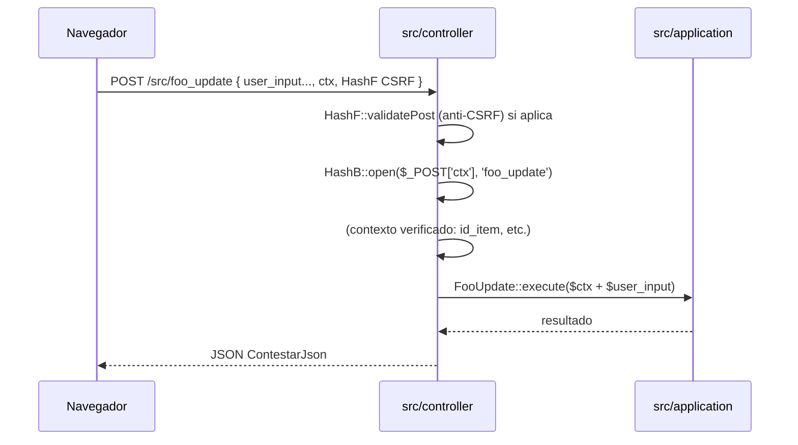

# Arquitectura de tokens de seguridad: `HashF` y `HashB`

Este documento fija la visión arquitectónica hacia la que queremos llevar el repo en lo relativo al token anti-tamper / anti-CSRF que hoy proporciona la clase única `web\Hash` (`apps/web/Hash.php`). **Es el *north star*, no el estado actual.** La migración real se hará por pasos, por módulos, y siguiendo los criterios de `agents.md` (sección *Migración `apps/` → `frontend/` + `src/`* y subsección *Hash al mover endpoints AJAX*).

Referencia cruzada: `agents.md` — *Hash al mover endpoints AJAX (`Hash::getCamposHtml` vs `Hash::linkSinVal`)*.

## 1. Problema a resolver

Hoy existe **una sola clase de hash** para todo:

- Vive en `apps/web/Hash.php`, namespace `web\Hash`.
- Firma con `md5(strOrdenado + session_id() + "a+a+")`. El "secreto" es el `session_id` + una sal constante.
- Se usa tanto para **emitir** tokens (métodos `getCamposHtml`, `linkSinVal`, `linkConVal`, `Hash::link`, `Hash::add_hash`, `Hash::cmdCon/SinParametros`, `getParamAjax*`) como para **validar** los que llegan (`validatePost`).
- La validación se invoca en dos bootstraps: `src/shared/global_object.inc` (vía `after_global_object.inc`) para `/src/...` y `frontend\shared\FrontBootstrap` para controladores `frontend/`.
- Como `frontend/` y `src/` son el mismo monolito PHP con la misma cookie `PHPSESSID`, el mismo `session_id()` sirve de secreto a ambos lados. Es una **coincidencia del monolito**, no una decisión arquitectónica.

Cuatro síntomas del problema conceptual:

1. **La clase mezcla dos roles** (emisor / receptor) en la misma superficie.
2. **No distingue de dónde viene la firma** ni a dónde va destinada.
3. **Cualquier código puede firmar** cualquier cosa para cualquier endpoint, porque el secreto es universal dentro de la sesión.
4. **Un campo `hidden` en un form** (p.ej. `id_item=5`) solo está "protegido" en el sentido de "si lo modificas, el hash ya no coincide". El navegador **puede** modificarlo — la garantía es de detección, no de arquitectura.

El día que `src/` se exponga como una API consumida desde un cliente externo (SPA, móvil, otro servicio), nada de lo anterior será aceptable.

## 2. Visión final

Dos clases distintas con responsabilidades asimétricas.

### `HashF` (frontend)

- Vive en `frontend/shared/security/HashF.php`.
- Sigue el algoritmo actual (session-derived) **sin cambios**.
- **Simétrica:** cualquier código de `frontend/` puede firmar y cualquier código de `frontend/` puede validar.
- Usos:
    - Anti-CSRF para endpoints en `frontend/` (validación en `FrontBootstrap::boot()` / `HashFront::validatePost`).
    - Integridad de URL en navegaciones `frontend/`↔`frontend/` (listas, filtros, paginación, scroll memory).
    - Integridad de nombres de campos en forms (el `h` de hoy): el usuario puede editar los valores, pero no puede añadir/quitar campos.
- `src/` **no importa** `HashF`. Las piezas de `src/` que hoy generan URLs para el navegador (layouts, etc.) se mueven a `frontend/shared/` (ver §7.2).

### `HashB` (backend)

- Vive en `src/shared/security/HashB.php` (o equivalente según convención final).
- **Asimétrica:** solo el backend firma, solo el backend verifica. El frontend **transporta** el token opaco.
- Formato: **cápsula sellada opaca**. No es "un hash de unos campos"; es un *token* que contiene:
    - `action` — el nombre de la acción backend que autoriza (p.ej. `tarifa_ubi_eliminar`).
    - `context` — el payload firmado (los antiguos "campos hidden" de identidad: `id_item`, `id_ubi`, …).
    - `session_id` — para atar el token a un usuario concreto y evitar replay cross-user.
    - `exp` — caducidad opcional.
    - `sig` — la firma (MD5/HMAC según implementación).
- API mínima esperada:
    - `HashB::sign(string $action, array $context, ?int $ttl = null): string` — **solo se llama desde código `src/`**.
    - `HashB::open(string $capsule, string $expectedAction): array` — desempaqueta `$context` y valida action, session y exp; lanza excepción si falla.
- **Secreto:** session-derived *por ahora* (igual que HashF). La separación de clases deja preparado el día que queramos independizar el secreto (HMAC con env var / `ConfigGlobal`).

## 3. Invariante clave: los hidden de contexto no existen en el DOM

Bajo `HashB`, los antiguos `<input type="hidden" name="id_item" value="5">` **desaparecen del DOM**. En su lugar hay un único `<input type="hidden" name="ctx" value="<token opaco>">`.

Consecuencias:

- El navegador **no puede mutar** `id_item`: no existe como campo en el DOM. Lo que existe es un string firmado. Para modificarlo habría que volver a firmar, y el secreto está en el backend.
- El caso de uso en `src/.../application/` recibe el contexto desde `HashB::open($ctx)`, **no** desde `$_POST`. Los únicos valores de `$_POST` que el caso de uso consume son los que el usuario realmente puede editar (campos visibles del form).
- El frontend no necesita "saber" qué hay dentro de la cápsula. Lo recibe opaco y lo reenvía opaco.

Esta es una **garantía arquitectónica**, no de detección.

## 4. Flujos

### 4.1 Lectura (data-fetch) — autenticación por sesión, respuesta con tokens

```mermaid
sequenceDiagram
    participant N as Navegador
    participant F as frontend/controller
    participant S as src/controller
    participant App as src/application
    
    N->>F: GET /frontend/foo (+ HashF CSRF)
    F->>F: HashF::validatePost OK
    F->>S: PostRequest /src/foo_data (cookie sesión)
    S->>S: (sin HashB, solo permisos del caso de uso)
    S->>App: FooData::execute($input)
    App-->>S: $datos
    S->>S: $tokens[acc] = HashB::sign('acc', $ctx[acc])
    S-->>F: JSON { data: $datos, tokens: {...} }
    F->>F: Construye $a_campos con url_xxx + token_xxx
    F-->>N: HTML renderizado con <input name="ctx" value="...">
```



- La llamada de lectura se autentica **solo con la cookie de sesión**. El caso de uso verifica permisos del usuario autenticado sobre el recurso que pide.
- Opcionalmente, la request puede llevar un `HashF` como gesto "vienes de nuestra UI"; no es imprescindible para la lectura, pero mantiene coherencia con el resto del repo mientras se completa la migración.
- **El backend incluye en la respuesta los tokens `HashB` de las acciones que esa pantalla va a ofrecer** (update, eliminar, duplicar…). Un token por acción y por recurso si aplica.

### 4.2 Mutación — el frontend solo transporta la cápsula



- La mutación **no necesita pasar por un proxy `frontend/`** solo por motivos de firma. El navegador POSTea directo a `/src/...`.
- El `ctx` viene de una lectura previa (§4.1). El navegador lo relega opaco.
- `HashF` CSRF es compatible: si la pantalla quiere defensa CSRF adicional, `src/` puede validar `HashF` además de abrir la cápsula. Las dos comprobaciones son ortogonales.
- `src/application/` recibe el contexto desde `HashB::open`, **nunca** desde `$_POST` directamente.

### 4.3 Listado con acciones por fila — tokens embebidos en la respuesta

```json
GET /src/actividadtarifas/tarifa_ubi_lista →
{
  "success": true,
  "data": {
    "filas": [
      {
        "casa": "Barcelona",
        "year": 2026,
        "id_tarifa": 3,
        "cantidad": 100,
        "tokens": {
          "update":   "B64.SIG",
          "eliminar": "B64.SIG"
        }
      },
      ...
    ],
    "tokens_globales": {
      "copiar": "B64.SIG"
    }
  }
}
```

El JS al clicar en una acción de fila hace:

```javascript
$.ajax({
    url: '/src/actividadtarifas/tarifa_ubi_eliminar',
    method: 'POST',
    data: { ctx: fila.tokens.eliminar },
    dataType: 'json'
});
```

No envía `id_tarifa` ni nada que identifique la fila como campo plano. Todo va dentro de `ctx`.

### 4.4 Form de creación — cápsula sin contexto de recurso

Para acciones "crear nuevo" donde aún no hay recurso, la cápsula contiene solo `action`, `session_id` y `exp`. Sigue siendo útil como autorización firmada ("el backend autorizó a este usuario a crear una tarifa en esta sesión y el token aún no caducó"). El flujo es el mismo que §4.1 + §4.2.

## 5. Cuadro resumen

| | `HashF` | `HashB` |
|---|---|---|
| **Ubicación** | `frontend/shared/security/` | `src/shared/security/` |
| **Propósito** | Anti-CSRF de UI, integridad de URL en navegación frontend | Autorización de acción + contexto firmado |
| **Simetría** | Simétrica (cualquier frontend firma y valida) | Asimétrica (solo backend firma y valida) |
| **Secreto (hoy)** | session-derived | session-derived |
| **Secreto (futuro)** | session-derived (CSRF basado en sesión es estándar) | HMAC con env var / clave backend-only |
| **Formato** | Parámetros `h`, `hh`, `hno`, `hchk`, `hnov`, `horig`, `hpos` como hoy | Token opaco `base64(payload).sig` |
| **El navegador lo ve** | Sí (es su CSRF, debe verlo) | Sí (lo transporta), pero opaco y sin posibilidad de manipulación útil |
| **Métodos del emisor** | `getCamposHtml`, `linkSinVal`, `linkConVal`, `Hash::link`, `Hash::add_hash`, … | `HashB::sign($action, $context, $ttl?)` |
| **Método del receptor** | `validatePost` en `FrontBootstrap` (`HashFront`) | `HashB::open($ctx, $expectedAction)` en cada controlador HTTP de `src/` |
| **Quién puede llamar al emisor** | `frontend/` (controllers, views) | `src/` (controllers HTTP, `application/` cuando responde lecturas) |
| **Quién puede llamar al receptor** | Cualquier controlador `frontend/` | Cualquier controlador `src/` |

## 6. Cómo queda cada capa respecto a `Hash` / `HashF` / `HashB`

### 6.1 `frontend/controller/*.php`

- Puede `use frontend\shared\security\HashF` para firmar URLs hacia **otros controladores `frontend/`** (caso a en las conversaciones previas: frontend→frontend).
- **No** importa `HashB` nunca. Si necesita un token de acción backend, lo obtiene como string desde `PostRequest::getDataFromUrl` y lo pasa a la vista tal cual.
- **No** genera HTML con hidden de identidad (`id_item`, …). Solo pasa a la vista el string de la cápsula y los campos visibles.

### 6.2 `frontend/view/*.phtml`

- Usa `HashF::getCamposHtml()` (o el helper equivalente) para meter el bloque CSRF si el form postea a otro `frontend/`.
- Renderiza `<input type="hidden" name="ctx" value="<?= $token_xxx ?>">` con los tokens que recibe ya armados.
- **Nunca** importa `HashB`. Nunca construye un token.

### 6.3 `src/<modulo>/infrastructure/ui/http/controllers/*.php`

- Al **recibir** mutación: `HashB::open($_POST['ctx'], 'accion_concreta')` → obtiene contexto verificado → llama al caso de uso.
- Al **responder** lectura: genera los tokens necesarios con `HashB::sign(...)` y los incluye en el payload bajo `tokens` o `tokens_globales`.
- No vuelve a emitir `HashF` (no es capa UI).
- Sigue haciendo `ContestarJson::enviar(...)` como dice `agents.md` (*Comunicación Frontend-Backend*).

### 6.4 `src/<modulo>/application/*.php`

- **No** importa `HashB` ni `HashF`. Sigue siendo lógica pura: recibe `array $input` ya verificado y devuelve datos/errores.
- Es responsabilidad del controlador HTTP haber ejecutado `HashB::open` antes de invocar al caso de uso.

### 6.5 `frontend/shared/PostRequest.php`

- Deja de producir `Hash` internamente.
- Para **lecturas**: se limita a hacer el request con las cookies de sesión. Es un cliente HTTP fino.
- Para **mutaciones vía proxy** (si se mantienen): reenvía literalmente `{ user_input, ctx }` al backend, sin tocar la cápsula.

## 7. Qué piezas toca esta migración

### 7.1 La validación del bootstrap frontend

`frontend\shared\FrontBootstrap::boot()` (sustituto del antiguo `global_header_front.inc`) hace:

```php
$oValidator = new HashFront();
echo $oValidator->validatePost($a_data);
```

En la visión futura pasará a `HashF`. **No** valida `HashB`. Si un endpoint de `src/` necesita verificar cápsula, lo hace él mismo con `HashB::open`.

### 7.2 `apps/web/Hash.php`, `apps/web/Posicion.php`, `src/layouts/*`

Son **capa UI**:

- `apps/web/Hash.php` → se divide en `frontend/shared/security/HashF.php` + `src/shared/security/HashB.php`. Queda una fase transicional con *shim* en `apps/web/Hash.php` delegando a `HashF` para no romper nada hasta que esté todo migrado.
- `apps/web/Posicion.php` → se mueve a `frontend/shared/` y usa solo `HashF`.
- `src/layouts/BurgerLayout.php`, `src/layouts/LegacyLayout.php` → se mueven a `frontend/shared/layouts/`. `src/` deja de producir HTML de UI (coherente con `agents.md` — *Qué evitar al migrar pantallas*).

### 7.3 `apps/core/global_object.inc`

Es el header legacy de `apps/`. Se mantiene mientras exista `apps/`. Su `validatePost` pasa a usar `HashF` (el legacy `apps/` es UI, sigue la misma regla que `frontend/`).

### 7.4 Controladores `src/` que hoy generan HTML o URLs firmadas

Los ~30 ficheros de `src/` que hoy usan `Hash` caen en dos grupos:

- **Productores de HTML de UI** (layouts, `Select_certificados_de_una_persona`, etc.) → se mueven a `frontend/shared/` y usan `HashF`.
- **`application/` que genera URLs** (p.ej. para listados con enlaces) → emite los strings de URL ya firmados con `HashF`, pero desde `src/application/` esto rompe la separación de capas. Preferible: el `application/` devuelve datos crudos (ids, nombres) y el frontend controller firma las URLs al construir la vista.

### 7.5 Forms y AJAX existentes

Los ~210 usos de `Hash` en `frontend/` se clasificarán en tres patrones durante la migración:

- **(a) frontend→frontend:** cambia `new Hash()` por `new HashF()`. Mecánico.
- **(b) frontend→src directo (navegador POSTea a `/src/...`):** cambia el modelo. La vista deja de llevar hidden `id_item`; lleva `<input name="ctx" value="<?= $token ?>">` con el token obtenido vía `PostRequest` desde el controller frontend, que a su vez lo pidió al backend.
- **(b') frontend como proxy → src:** el proxy recibe `{ user_input, ctx }`, hace `PostRequest` con eso mismo. No hay conversión de tokens; es un reenvío.

## 8. Qué NO cambia

- **Sigue habiendo sesión PHP con `PHPSESSID`.** El esquema de auth del usuario (login, 2FA) no se toca.
- **`refactor.md` sigue siendo la referencia** para el reparto de capas, naming (`*Data`, `*Service`, etc.), `ContestarJson::enviar`, y el resto de convenciones. Este documento solo fija *el modelo de seguridad de requests*.
- **Los parámetros `h`, `hh`, `hno`, `hchk`, `hnov`, `horig`, `hpos`, `hhorig`** siguen existiendo mientras `HashF` conserve el protocolo actual. Son internos de `HashF`.
- **No hay cambio criptográfico** en esta primera fase: ambos hash usan `md5(str + session_id() + sal)`. Lo único que cambia es la organización y el modelo de confianza.

## 9. Orden sugerido de migración (alto nivel)

Este orden minimiza el riesgo y permite verificar la arquitectura antes de aplicarla masivamente:

1. **Crear `HashF`** como alias/subclase de `web\Hash` en `frontend/shared/security/HashF.php`. Cero cambios de comportamiento.
2. **Crear `HashB`** con `sign`/`open` en `src/shared/security/HashB.php`. Incluir tests unitarios mínimos (sign-open roundtrip, sesión cruzada, expiración, action distinto).
3. **Piloto en un solo módulo** (candidato: `actividadtarifas`, porque ya está listo con el patrón `_lista` / `_form` / `_update` / `_eliminar` / `_copiar`). Migrar solo ese vertical slice al modelo cápsula y verificar comportamiento.
4. **Piloto en un segundo módulo** con patrón distinto (p.ej. `ubis` por su mezcla de proxies y datos compartidos).
5. **Ola por módulo**, siguiendo el plan de migración acordado por equipo (prioridades por módulo en baselines `docs/dev/*_migracion_baseline.md`).
6. **Última fase:** cuando no queden `new Hash()` fuera de `apps/` legacy, borrar `web\Hash` o dejarlo como shim final. Decidir qué hacer con el secreto de `HashB` (seguir session-derived o pasar a HMAC).

## 10. Checklist para cada slice

Al migrar una pantalla al modelo `HashF` / `HashB`:

- [ ] Identificar qué endpoints de `src/` son **mutaciones** (update, delete, insert, acción de estado) y cuáles son **lecturas** (form_data, listados, búsquedas).
- [ ] Para cada **lectura**: quitar `new Hash()` en su respuesta. El endpoint pasa a devolver los **tokens HashB** de las acciones ofrecidas.
- [ ] Para cada **mutación**: quitar todos los `<input type="hidden" name="id_xxx">` de identidad. Sustituir por `<input type="hidden" name="ctx">` con el token obtenido en la lectura previa. El controlador HTTP hace `HashB::open` y ya no lee los ids del `$_POST`.
- [ ] El frontend controller pasa los tokens a la vista como strings (`$a_campos['token_xxx']`). **Nunca** llama a `HashB`.
- [ ] Si la pantalla tiene navegación frontend→frontend, los links/forms internos siguen usando `HashF` como hoy, sin cambios funcionales.
- [ ] Actualizar los JS consumidores: dejar de mandar `id_xxx` en `data` de `$.ajax`, mandar solo `ctx`.
- [ ] Probar: éxito, manipulación de `ctx` (debe fallar `HashB::open`), manipulación de `id_xxx` (no existe ya, no debería haber forma de mandarlo), sesión caducada, `action` incorrecta.
- [ ] Documentar en el baseline del módulo (`docs/dev/<modulo>_migracion_baseline.md`) el mapeo `form → tokens` y las acciones backend resultantes.
