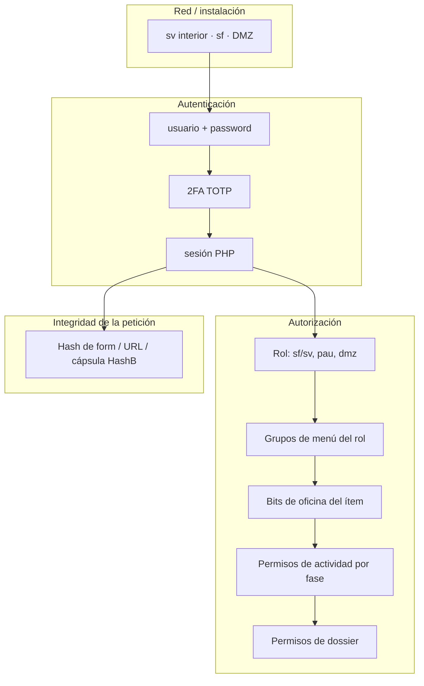
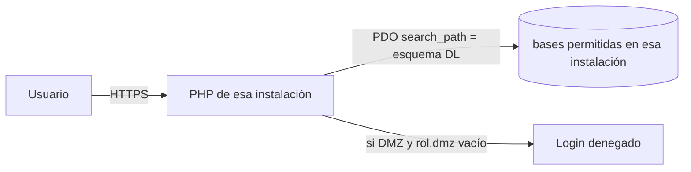
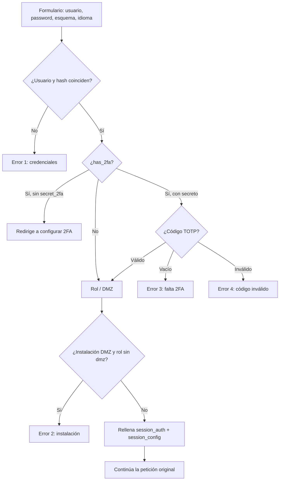
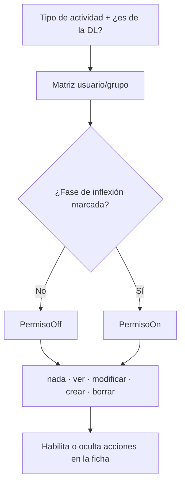

# Aquinate — autenticación y autorización

Documento de supervisión. El acceso **no** es un único interruptor: es un apilado de controles que se evaluan en este orden práctico:

1. ¿Esta **instalación** admite al usuario? (interior / sf / DMZ)
2. ¿Las **credenciales** son válidas? (password, 2FA)
3. ¿El **rol** puede ver este **grupo de menú**?
4. ¿El **ítem de menú** es visible para las **oficinas** del usuario?
5. ¿Sobre **esta actividad** (o persona / ubi) tiene permiso de ver / modificar / crear / borrar, según **fase del proceso**?
6. ¿El **dossier** concreto está permitido?
7. ¿El POST o la URL **no han sido alterados**? (hash)

Cambiar “el sistema de permisos” sin acotar **cuál de estas capas** se replantea suele fracasar.

Hermanos: [arquitectura](supervision_arquitectura.md) · [módulos y procesos](supervision_modulos_menus_procesos.md).

---

## 1. Mapa de capas

No hay servidor de identidad externo (LDAP, OAuth, SAML). Identidad y autorización viven **dentro de Aquinate**.

---

## 2. Instalaciones y frontera DMZ

El mismo código corre en varios sitios. Lo que cambia es `ServerConf` (host, rutas, flag `$dmz`, directorio de passwords) y las bases a las que puede conectar.

| Instalación | Datos que ve | Quién puede entrar |
|-------------|--------------|--------------------|
| Interior (`sv`) | Bases `sv`, `sv-e`, `comun` (escritura) | Roles de interior |
| Formación (`sf`) | Base `sf` (sv+sv-e concentrados, sin réplica) | Roles con flag `sf` |
| DMZ / exterior | Réplicas de lectura `comun_select`, `sv-e_select` y **copias filtradas** | Solo roles con flag `dmz` |

Al login, si `ConfigGlobal::is_dmz()` es verdadero y el rol **no** tiene `dmz`, el acceso se niega (error 2: “no puede entrar desde esta instalación”).

Hay un matiz: si la instalación está marcada DMZ pero la sesión trae `private=sf`, se trata como no-DMZ (entrada de formación sobre el mismo host).

**Implicación de datos.** La DMZ no consulta las tablas de origen de interior. Lo que debe verse fuera se **copia** a `comun` (tablas `cp_*`, `cd_*`, `cu_*`) con filtro de filas y columnas, y la replicación lógica lo lleva a `comun_select`. Esa copia es una **frontera de protección**: lo que entra, sale. Detalle: [copias entre bases](copias_entre_bases.md).

El correo se encola en interior y se envía desde la DMZ. La DMZ no escribe en las bases de origen.

---

## 3. Autenticación

### 3.1 Login web

El guardia de sesión se incluye en **todos** los bootstraps (`global_object.inc` para `/src/...`, `FrontBootstrap` para `frontend/...`). Si no hay `$_SESSION['session_auth']`, se pinta el formulario y se corta la petición.

Flujo (caso de uso `LoginProcesar`; la presentación está en `frontend/usuarios/controller/login.php`):

Datos que viajan en el POST: `username`, `password`, `esquema` (si no está forzado por `ESQUEMA`), `verification_code`, `idioma`. Cookies de 30 días: `esquema`, `idioma`.

El **esquema** (delegación) elige a qué base se consulta `aux_usuarios` y qué `search_path` tendrá el resto de la sesión. El tenant queda fijado al autenticarse.

### 3.2 Contraseñas

- Almacenamiento: **Whirlpool + salt** (`PasswordHasher`). No es `password_hash` / bcrypt / Argon2.
- Política al cambiar: longitud, clases de caracteres, no incluir el nombre de usuario; en algunos entornos se usa `cracklib` / `pwscore`.
- Primera vez o flag `cambio_password`: se marca `expire` en sesión para forzar cambio.
- Recuperación: flujo por correo (reset de password y de 2FA). En entornos de pruebas existe una herramienta que resetea passwords; **no** está disponible en producción.

**Hecho a tener en cuenta:** tras un login correcto, el array de sesión incluye el password en claro (`session_auth['password']`). Es legado. Cualquier replanteo de autenticación debería eliminarlo.

### 3.3 Doble factor (2FA)

TOTP (app tipo Google Authenticator). QR al configurar. Detalle operativo: [Sistema_2fa.md](Sistema_2fa.md).

| Situación | Comportamiento |
|-----------|----------------|
| 2FA desactivado | Login con usuario/password |
| 2FA activo y secreto en BD | Exige código de 6 dígitos |
| 2FA activo sin secreto | Redirige a ayuda / configuración; no entra |
| Pérdida del dispositivo | Enlace “¿problemas para acceder?” → mail de reset → reconfigurar |

El 2FA puede activarse por usuario (preferencias) o forzar desde administración.

### 3.4 Sesión

- Cookie `PHPSESSID` (sesión PHP clásica).
- Tras el login se rellenan `$_SESSION['session_auth']` y `$_SESSION['config']`: id de usuario, rol, pau, esquema, id_schema, idioma, módulos instalados, etc.
- Los permisos de actividad se cachean en sesión (`PermisosActividades` / `$_SESSION['oPerm']`) para no consultar la matriz en cada pintado.
- No hay timeout de producto documentado distinto del de PHP/`session.gc_maxlifetime` del servidor.
- Cerrar sesión invalida esa cookie; no hay lista de revocación central.

### 3.5 App móvil

Mismos usuarios, mismas credenciales, mismo 2FA.

- `POST /src/usuarios/app_login` — acepta JSON o form-urlencoded.
- `POST /src/usuarios/app_session` — ¿hay sesión ya?
- A partir de ahí: cookie `PHPSESSID` y los mismos `/src/...`.

No hay token de API de larga vida. Si se replantea “API para terceros”, este contrato no basta.

---

## 4. Roles

Tabla `aux_roles` (en `comun`). Un usuario tiene **un** `id_role`.

| Flag / campo | Significado |
|--------------|-------------|
| `sf` / `sv` | El rol existe en formación / interior |
| `pau` | Ámbito principal: `none`, `cdc` (casa), `ctr` (centro), `nom` (persona), `sacd` |
| `dmz` | Puede autenticarse en la instalación exterior |

El **pau** no es un permiso fino: orienta qué tipo de ficha “es” el usuario (casa, centro, persona, SACD) y condiciona pantallas y dossiers.

Sobre el rol se cuelgan:

- **Grupos de menú** (`aux_grupmenu_rol`): qué bloques del menú lateral puede ver.
- Más abajo, bits y matrices que ya no son del rol sino del usuario, del grupo de usuarios o de la oficina.

Administración: pantallas de `usuarios` (lista de roles, formulario sf/sv/pau/dmz, asignación de grupmenus).

---

## 5. Autorización de menús

El menú visible **no** es un fichero de configuración. Se compone en tres piezas (detalle de implementación en [módulos y menús](supervision_modulos_menus_procesos.md)):

1. **Metamenú** (global, igual para todos): destino URL + módulo + parámetros.
2. **Árbol por layout** (etiquetas y orden; Legacy vs Pills2, distinto por esquema).
3. **Filtro de autorización:**
   - el rol debe tener el **grupmenu** de esa rama;
   - cada ítem tiene `menu_perm` (máscara de bits de **oficina**: `des`, `est`, `scdl`, `sacd`, `ctr`, `admin_sv`, …);
   - `PermisoMenu::visible($menu_perm)` compara esa máscara con los bits del usuario en sesión (`iPermMenus`).

Un usuario puede “tener el rol correcto” y aun así no ver una entrada si su oficina no está en la máscara del ítem.

Los bits de menú son históricos y **no** coinciden 1:1 con los permisos de actividad. Oficinas típicas: adl, agd, des, est, scdl, sg, sm, sr, sacd, ctr, jefeZona, admin_sf, admin_sv, calendario, etc.

---

## 6. Permisos de actividad (la capa más compleja)

Independiente del menú. Responde: *sobre esta actividad, ¿puedo ver o modificar datos, asistentes, cargos, SACD, tarifas…?*

### 6.1 Qué se protege

Conjuntos (`PermisosActividades::AFECTA`):

| Ámbito | Bit |
|--------|-----|
| Datos de la actividad | `datos` |
| Dossiers económicos | `economic` |
| Atención SACD | `sacd` |
| Centros encargados | `ctr` |
| Tarifas | `id_tarifa` |
| Cargos | `cargos` |
| Asistentes | `asistentes` |
| Asistentes SACD | `asistentesSacd` |

### 6.2 Niveles de acción (inclusivos)

Máscara acumulativa (`PermAccionBits`):

| Nivel | Valor | Incluye |
|-------|------:|---------|
| nada | 0 | — |
| ocupado | 1 | |
| ver | 3 | ocupado |
| modificar | 7 | ver |
| crear | 15 | modificar |
| borrar | 31 | crear |

Tener “borrar” implica crear, modificar y ver.

### 6.3 Cómo se decide el nivel

Se define un **proceso por tipo de actividad**, con **fases**. El proceso **no es lineal**: una actividad tiene varias fases completadas a la vez; las dependencias impiden marcar una fase si falta la previa.

Para cada conjunto de datos hay una **fase de inflexión** (p. ej. “aprobada” para los datos, “ok asistentes” para asistentes):

- fase **sin marcar** → `PermisoOff`
- fase **marcada** → `PermisoOn`

El resto de fases no influye en ese permiso. Si la fase no existe en el proceso, se aplica el “sin marcar”.

Además:

- Distinto si la actividad es **de la DL** o de otras (`aPermDl` / `aPermOtras`).
- El tipo de actividad se busca de **más específico a más genérico** (`sv n crt o-fl` → `sv n crt` → `sv n` → `sv`). El primer acierto gana.
- Los permisos se asignan a **usuario** o a **grupo de usuarios**. El usuario gana sobre el grupo. Entre grupos la prioridad no está ordenada de forma estable: hay que evitar solapes contradictorios.
- Solo la oficina responsable de una fase puede marcarla/desmarcarla (si está en blanco, cualquiera). El paso de estado proyecto → actual está reservado a la oficina `des`.

Esta matriz se **carga en sesión** al trabajar. Resolver “permiso actual” todavía puede consultar la actividad y las fases completadas (I/O). Hay deuda documentada: separar el *snapshot* de sesión de las consultas de backend.

Texto de diseño original: [`README_procesos.md`](README_procesos.md).

### 6.4 Dónde se nota en la UI

Listados de actividades ocultan columnas de acción en DMZ. En una ficha, botones de editar, matricular, asignar SACD, etc. dependen de esta capa, no solo de que el menú sea visible.

---

## 7. Permisos de dossier

Las fichas embebidas (asistentes, cargos, notas, inventario, …) se abren desde persona, actividad o ubicación. Cada **tipo de dossier** tiene permiso propio (`perm_dossiers`), administrable por tipo: personas / actividades / ubis.

Ver el menú de la persona no implica ver todos los widgets laterales.

---

## 8. Integridad de peticiones (Hash)

Autenticado ≠ autorizado a cambiar el `id` oculto de un formulario.

Hoy convive:

| Pieza | Qué hace |
|-------|----------|
| `web\Hash` (legado) | Firma MD5 de campos/URL + `session_id` + sal constante. Detecta POST o query alterados. El navegador **puede** cambiar un hidden; el servidor lo rechaza si el hash no cuadra. |
| `HashFront` | Misma idea, usada desde `frontend/`. |
| `HashB` (piloto) | Cápsula opaca firmada en backend (`action` + contexto + sesión). Los ids de negocio **no** van en el DOM; el frontend reenvía el token. |
| `SignedDownloadToken` | HMAC con secreto de entorno, TTL 10 min, para PDF en nueva pestaña. |

Visión de destino (HashF emisor UI / HashB receptor API): [hash_arquitectura.md](hash_arquitectura.md). **No está migrado al 100 %.** Mientras tanto, cualquier código del monolito puede firmar para cualquier endpoint porque el secreto es la propia sesión.

Esto **rompe** el día que `src/` sea una API consumida por un SPA o un tercero sin compartir `session_id`.

---

## 9. Modelo mental: “¿quién puede hacer X?”

Pregunta típica de supervisión y dónde se responde:

| Pregunta | Capa |
|----------|------|
| ¿Puede entrar en la web de exterior? | Flag `dmz` del rol + instalación |
| ¿Ve el bloque “STGR” del menú? | Grupmenu del rol + bits de oficina del ítem |
| ¿Puede editar esta actividad? | Permiso `datos` según fase “aprobada” (DL vs otras) |
| ¿Puede matricular asistentes? | Permiso `asistentes` según su fase de inflexión |
| ¿Puede marcar la fase “ok SACD”? | Oficina responsable de esa fase en el proceso |
| ¿Ve el dossier de certificados de la persona? | Permiso de tipo de dossier |
| ¿Puede borrar el id 123 cambiando el hidden? | Hash / HashB |

Ninguna de esas respuestas está en un único “ACL REST”.

---

## 10. Puntos que suelen replantearse

1. **Unificar menú y permiso de actividad.** Hoy se puede ver la entrada y no poder editar, o al revés según cómo se haya configurado. Es flexible y difícil de auditar.
2. **Permisos por fase vs. máquina de estados.** El modelo no lineal (varias fases a la vez, una inflexión por ámbito) es potente para oficinas paralelas; es opaco para un revisor externo.
3. **Un rol vs. varios roles / grupos.** Un usuario = un rol; los grupos de usuarios entran en la matriz de actividades. La prioridad entre grupos no es determinista si se pisan.
4. **Bits de oficina históricos** (`des`, `scdl`, `vcsd`, …) vs. un catálogo de permisos nominado y versionado.
5. **Sesión PHP + password en sesión + Hash MD5** vs. IdP / OAuth / tokens de API. Afecta al móvil y a cualquier integración futura.
6. **2FA TOTP local** vs. 2FA del IdP corporativo.
7. **Algoritmo de password (Whirlpool)** vs. Argon2id, con plan de rehash al login.
8. **DMZ por instalación + copias filtradas** vs. un único cluster con políticas de fila (RLS). El diseño actual asume **separación de red y de bases**, no solo de permisos de aplicación.
9. **Caché de permisos en sesión**: rápido, puede quedar desfasado hasta nuevo login si se cambian reglas.

---

## 11. Lecturas

- [Arquitectura técnica](supervision_arquitectura.md)
- [2FA](Sistema_2fa.md)
- [Baseline login](usuarios_login_migracion_baseline.md)
- [Procesos y permisos (diseño)](README_procesos.md)
- [HashF / HashB](hash_arquitectura.md)
- [Copias DMZ](copias_entre_bases.md)
- Manual de usuario: [`docs/manual/usuarios.md`](../manual/usuarios.md)
