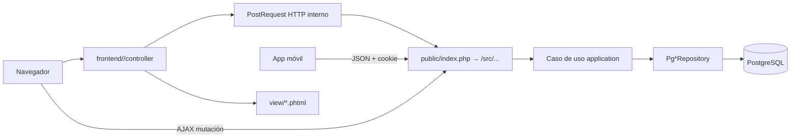
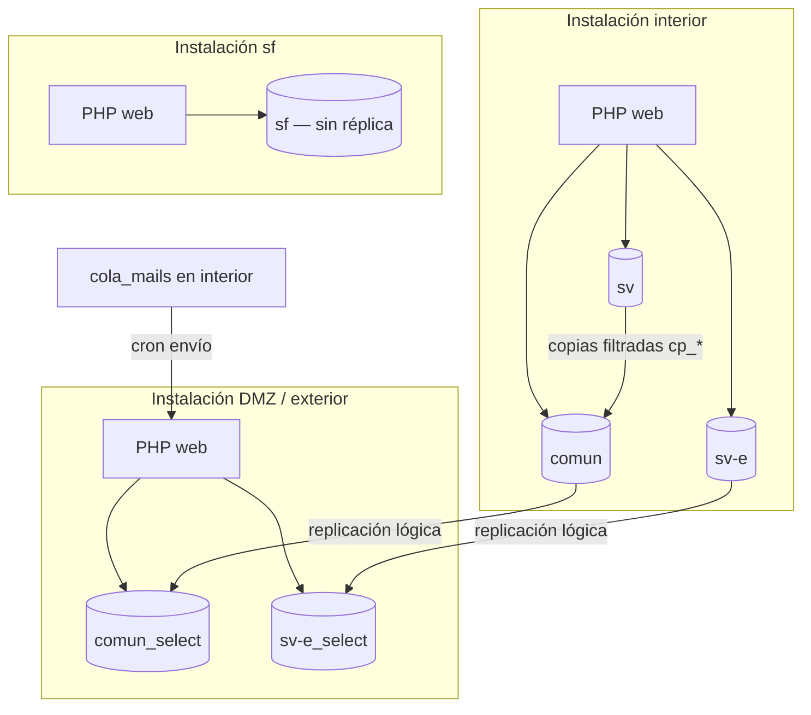

# Aquinate — arquitectura técnica

Documento de supervisión: describe **cómo está construido el sistema hoy**, no cómo se programa un cambio concreto. Sirve para entender el alcance, las fronteras y los puntos que suelen replantearse.

| Documento hermano | Contenido |
|-------------------|-----------|
| [Acceso y autorización](supervision_acceso_autorizacion.md) | Login, 2FA, roles, DMZ, menús, permisos por fase |
| [Módulos, menús y procesos](supervision_modulos_menus_procesos.md) | Cómo se añade un módulo, menús, catálogo funcional, diagramas de proceso |
| [Qué es Aquinate (visión funcional)](../QUE_ES_ORBIX.md) | Alcance de negocio, perfiles de usuario |

**Nombres.** En producción y en correos el producto se llama **Aquinate**. El repositorio, namespaces PHP y gran parte de la documentación interna usan **Orbix** (evolución del legado **Obix**). En este documento: Aquinate = producto; Orbix = código.

---

## 1. En una frase

Aquinate es una **aplicación web monolítica en PHP 8.2**, con UI en el servidor (`frontend/`) y API JSON propia (`/src/...`), persistencia en **PostgreSQL** (varias bases y un esquema por delegación), sin framework tipo Laravel/Symfony y sin ORM. Hay **app móvil nativa** que reutiliza la misma API y la misma cookie de sesión.

No es un conjunto de microservicios. Una petición HTTP entra en el mismo árbol PHP, abre las conexiones PDO del entorno y resuelve el caso de uso.

---

## 2. Stack tecnológico

| Capa | Tecnología | Notas |
|------|------------|--------|
| Runtime | PHP 8.2 | Extensiones: PDO, gettext, intl, zip, xml, bcmath, calendar |
| UI web | PHP + plantillas `.phtml` (Twig en casos puntuales), JavaScript (jQuery) | HTML generado en servidor |
| API | Scripts PHP + FastRoute (`nikic/fast-route`) | Rutas `/src/<modulo>/<accion>` |
| Inyección de dependencias | PHP-DI | Repositorios → casos de uso |
| Persistencia | PostgreSQL + PDO | SQL escrito a mano; **sin ORM** |
| PDF / QR | mPDF, Endroid QR | Actas, certificados, 2FA |
| i18n | gettext (`.po` / `.mo`) | Español fuente; ca, de, en, it, … |
| Tests | PHPUnit 11 (unit + integration), Playwright (E2E) | Integración contra PostgreSQL real |
| Análisis estático | PHPStan 2, **nivel 9** | Árbol `src/` + `frontend/` en 0 errores (julio 2026) |
| Entorno local | Docker (PHP + PostgreSQL) | Réplicas de lectura suelen apuntar al mismo Postgres |
| Móvil | Cliente nativo (Android; iOS previsto en el mismo contrato) | Cookie `PHPSESSID` + JSON |

Composer instala dependencias en `libs/vendor/` (no en `vendor/` de la raíz). Autoload PSR-4: `src\` → `src/`, `frontend\` → `frontend/`.

**No hay** en este repo un pipeline CI tipo GitHub Actions del producto. La calidad se ejecuta en local / entorno de desarrollo: `composer test`, `composer phpstan`, `npm run test:e2e`.

---

## 3. Separación frontend / backend

Hay **dos árboles de código** en el mismo monolito, no dos despliegues independientes.

```text
frontend/<modulo>/     pantallas HTML (controller PHP + vista .phtml)
src/<modulo>/          dominio, casos de uso, SQL, endpoints JSON
public/index.php       front controller de las rutas /src/...
```

Regla vigente:

- El frontend **no** instancia casos de uso ni repositorios.
- Pide datos con `PostRequest` a `/src/<modulo>/...` y pinta la vista.
- El backend **no** genera HTML de aplicación (listas, desplegables, menús). Devuelve JSON `{ success, mensaje, data }`.



**Matiz importante para supervisión.** Aunque la separación de capas está definida, `frontend/` y `src/` **comparten proceso PHP y la misma sesión**. El frontend llama al backend con una **subpetición HTTP** al mismo host (`PostRequest`). Eso permite, en el futuro, separar físicamente UI y API; hoy es un monolito con frontera de código, no de red.

---

## 4. Arquitectura por módulo (estilo DDD)

Cada módulo de negocio en `src/<modulo>/` sigue (o debe seguir) esta base:

```text
src/<modulo>/
  domain/
    contracts/          interfaces de repositorio (sin PDO)
    entity/
    value_objects/
  application/          casos de uso (*Data lectura, *Guardar escritura)
  infrastructure/
    persistence/postgresql/    Pg*Repository
    ui/http/controllers/       scripts PHP cortos → JSON
  config/
    dependencies.php    cableado PHP-DI
    routes.php          FastRoute
```

| Patrón | ¿Se usa? | Comentario |
|--------|----------|------------|
| Módulo ≈ bounded context | Sí (objetivo) | ~36 módulos en `src/` |
| Domain / Application / Infrastructure | Sí | La UI vive fuera, en `frontend/` |
| Repositorios | Sí | Interface en domain, `Pg*` en infrastructure |
| Value objects | Sí | IDs, textos, fechas de dominio |
| CQRS con buses | **No** | Separación práctica: lecturas `*Data` vs mutaciones |
| ORM | **No** | SQL preparado a mano |
| Controllers como clases | Casi nunca | Son scripts `.php` de entrada |

El piloto de referencia es el módulo **asistentes**.

### 4.1 Qué está cerrado y qué no

Migración desde el legado `apps/` → `frontend/` + `src/`: **muy avanzada**.

| Hecho (junio–julio 2026) | Estado |
|--------------------------|--------|
| Módulos de negocio en `src/` | ~36, con DI cerrado |
| `$GLOBALS['container']` en runtime de módulos | 0 (solo bootstrap) |
| Lecturas `$GLOBALS['oDB*']` en `src/` | 0; acceso vía `GlobalPdo` |
| PHPStan nivel 9 sin baseline | 0 errores en `src` + `frontend` |
| `apps/<modulo>/` de negocio | Eliminados; quedan `apps/core/` y `apps/web/` |

Deuda residual típica (detalle en [índice de refactor](REFACTOR_INDICE.md)):

- Controllers HTTP siguen siendo scripts, no clases.
- Hash anti-tamper: conviven el legado `web\Hash` y el piloto `HashB` ([visión](hash_arquitectura.md)).
- Cobertura de tests **desigual** por módulo.
- Configuración de instalación aún en `ServerConf` (constantes PHP), no solo `.env`.

---

## 5. Infraestructura de datos

### 5.1 Motor y acceso

- PostgreSQL; PHP habla por **PDO** (`pdo_pgsql`).
- Cada petición abre las conexiones necesarias al bootstrap y las reutiliza. **No hay pool de conexiones de aplicación.**
- Escritura y lectura pueden ir a servidores distintos (réplica lógica).
- Credenciales **fuera del repo** (`ConfigDB`, directorio de passwords del servidor). `ServerConf.php` está en `.gitignore`.
- Excepción: el módulo `dbextern` puede hablar con **SQL Server** (BDU / Listas) vía ODBC.

Los borrados suelen ser **DELETE físico**. No hay `deleted_at` global.

### 5.2 Varias bases, un esquema por delegación

Aquinate **no** es «una base, schema `public`». El tenant es el **esquema PostgreSQL de la delegación** del usuario logueado (p. ej. `H-dlbv`), no una columna `tenant_id`.

| Base | Rol |
|------|-----|
| `comun` | Datos compartidos entre delegaciones (roles, metamenús, catálogos globales, …) |
| `comun_select` | Réplica de **lectura** de `comun` |
| `sv` / `sv-e` | Datos de interior / exterior |
| `sv-e_select` | Réplica de lectura de `sv-e` |
| `sf` | Entorno formación: concentra sv+sv-e con sufijos `f`; **sin réplica** |
| `listas` | Externa (SQL Server), solo si `dbextern` está activo |

Claves PDO habituales (`GlobalPdo`): `oDBC` / `oDBC_Select` (comun), `oDB` / `oDBP` / `oDBR` (sv/sf), `oDBE` / `oDBE_Select` (sv-e), `oDBPC` (comun `public`), `oDBListas` (BDU).

### 5.3 Réplicas

Modelo: **replicación lógica PostgreSQL**, no un pool genérico.

- Escrituras → publicador (`comun`, `sv-e`, …).
- Lecturas → `*_select` cuando el entorno las tiene.
- En Docker local las réplicas suelen ser el **mismo** Postgres.
- Migrar estructura en `comun` / `sv-e` implica desactivar suscripción → migrar publicador → migrar select → reactivar. Ver [`db/migrations/README.md`](../../db/migrations/README.md).

### 5.4 Copias hacia `comun` (frontera DMZ)

Las instalaciones **sf** y la **DMZ** no tienen acceso a todas las bases de origen. Un subconjunto de datos se proyecta a tablas físicas en `comun` (`cp_*`, `cd_*`, `cu_*`) y la replicación las lleva a `comun_select`, que es lo que lee la DMZ.

Eso **no** es un espejo: hay filtro de filas y de columnas. Lo que entra en la copia es legible desde el exterior. Mecanismo: sincronización al guardar + reconciliación periódica. Detalle: [copias entre bases](copias_entre_bases.md).

### 5.5 Evolución del esquema

Ficheros SQL versionados en `db/migrations/`, nombre `YYYYMMDDHHMM_desc__db.sql` (`comun`, `sv`, `sv-e`, `sf`). Se ejecutan desde el menú de administración `devel_db_admin`. Registro: `comun.public.migracion_aplicada`.

En producción, un cambio de `sv` / `sv-e` debe tener su equivalente `__sf.sql`.

---

## 6. Instalaciones: interior, formación, DMZ

El mismo código se despliega en **varias instalaciones** con `ServerConf` distinto (host, rutas, flag DMZ, directorio de passwords).



Variables de entorno relevantes al arrancar: `UBICACION` (`sv` / `sf`), `ESQUEMA` (fuerza delegación), `PRIVATE`. El flag `ServerConf::$dmz` marca la instalación exterior; un rol sin permiso DMZ no puede entrar ahí.

El **correo saliente** se encola en interior y se envía desde la DMZ (`enviar_mails_en_cola`). La DMZ no escribe en las bases de origen.

---

## 7. Clientes

| Cliente | Cómo habla con el sistema |
|---------|---------------------------|
| Navegador | Páginas `frontend/...` + AJAX a `/src/...` |
| App móvil | Login JSON `/src/usuarios/app_login`, luego cookie de sesión y los mismos endpoints |

No hay API token / OAuth / JWT de producto. La autenticación es **sesión PHP** (`PHPSESSID`). El envelope JSON es `{ success, mensaje, data }`; `data` a menudo va **doble-codificado** (string JSON dentro de JSON). Contrato: [`docs/catalogo/_convenciones_api.md`](../catalogo/_convenciones_api.md).

---

## 8. Seguridad transversal (resumen)

El detalle está en [acceso y autorización](supervision_acceso_autorizacion.md). A nivel de arquitectura:

1. **Autenticación:** usuario + contraseña (Whirlpool + salt) + 2FA TOTP opcional/forzado.
2. **Autorización en capas:** rol → grupos de menú → bits de oficina en cada ítem → permisos por tipo de actividad y fase de proceso → permisos de dossier.
3. **Anti-tamper / CSRF:** firma de campos y URLs con hash ligado a `session_id` (legado `web\Hash`; evolución `HashF` / `HashB`).
4. **Descargas binarias** (PDF): token HMAC de corta vida (`SignedDownloadToken`), no el id en claro.
5. **Frontera de datos:** copias filtradas + flag DMZ en el rol.

---

## 9. Calidad de código y tests

### 9.1 Análisis estático

- PHPStan **nivel 9** sobre `src/` y `frontend/`.
- Baseline vacío: no hay errores silenciados.
- Objetivo operativo: `composer phpstan` en verde.

### 9.2 Tests automáticos

```text
tests/unit/<modulo>/           dominio y application con mocks
tests/integration/<modulo>/    repositorios reales + factories
tests/factories/<modulo>/      datos de prueba
e2e/                           Playwright (navegador real)
```

Norma de proyecto: código nuevo → tests nuevos; cambio → pasar los existentes. La cobertura **no es uniforme**: hay módulos con integración completa y otros con huecos. Hay scripts que listan faltantes (`composer test:report`).

Pendiente operativo documentado: smoke tests de login, menús y permisos (más allá del E2E existente).

### 9.3 Otros controles

| Control | Qué cubre |
|---------|-----------|
| `php -l` | Sintaxis en ficheros tocados |
| gettext / Poedit + `tools/i18n/` | Cadenas de UI traducibles |
| Migraciones SQL versionadas | Evolución de esquema auditable |
| `roave/security-advisories` | Dependencias Composer con avisos conocidos |
| Hash de formularios | Detección de POST/URL alterados |
| Documentación generada | Catálogo API, OpenAPI, manuales, ayuda IA por módulo |

No hay (en este repo) linter JS unificado ni suite de seguridad tipo OWASP ZAP. El endurecimiento de headers, TLS y `client_max_body_size` vive en el **servidor web** (fuera del árbol de código).

---

## 10. Observabilidad, jobs y correo

- Errores de PDO y de copias: logs en `log/` (p. ej. `log/<copia>.err`).
- Avisos de negocio: módulo `cambios` genera tabla de avisos; el cron de interior encola mails; el cron de DMZ los envía.
- Reconciliación de copias `cp_*` / `cd_*` / `cu_*`: cron (informe o apply).
- Sincronización BDU: pantallas y jobs del módulo `dbextern`.
- No hay APM / OpenTelemetry de producto en el código.

---

## 11. Documentación (dónde está el detalle)

La documentación de desarrollo es abundante y está pensada para programadores e IAs, no para supervisión. Mapa:

| Tipo | Ruta | Para quién |
|------|------|------------|
| Estos tres documentos | `docs/dev/supervision_*.md` | Supervisión técnica |
| Visión funcional | `docs/QUE_ES_ORBIX.md` | Gestores / onboarding |
| Onboarding de programador | `docs/dev/guia_tecnica_onboarding.md` | Desarrollo |
| Normas canónicas | `AGENTS.md` | Desarrollo |
| Manual de usuario | `docs/manual/<modulo>.md` | Oficinas |
| Catálogo API / OpenAPI | `docs/catalogo/` | Desarrollo / integración |
| Estado de migración | `docs/dev/REFACTOR_INDICE.md` | Desarrollo |

---

## 12. Puntos que suelen replantearse

Esta lista no es un backlog de trabajo: son **decisiones de diseño visibles** que un supervisor suele querer discutir. El estado actual está descrito arriba; cambiar cualquiera implica coste alto.

1. **Monolito PHP vs. API + SPA / microservicios.** La frontera `frontend`/`src` ya existe en código; la red aún no. Separar servidores choca con sesión PHP compartida, Hash ligado a `session_id` y `PostRequest` HTTP interno.
2. **Sesión PHP + cookie vs. tokens (JWT/OAuth).** El móvil ya usa cookie. No hay SSO corporativo en el producto.
3. **SQL a mano vs. ORM.** Control fino y rendimiento conocidos; más superficie de error y de tests de repositorio.
4. **Multi-base + esquema por DL vs. una BD con `tenant_id`.** Encaja con réplicas y DMZ; complica migraciones y copias.
5. **Hash MD5 de sesión vs. HMAC de servidor.** Hay visión `HashF`/`HashB`; la migración es por módulos.
6. **Configuración `ServerConf` vs. `.env`.** Decidido en backlog, no ejecutado.
7. **Permisos de actividad acoplados a fases de proceso.** Potente y opaco; ver documento de acceso.
8. **Menús duales (metamenú global + árbol por layout).** Flexible; costoso de administrar. Ver documento de módulos.
9. **Calidad: PHPStan alto vs. cobertura de tests irregular.** El tipado está cerrado; el comportamiento no está cubierto al mismo nivel.
10. **Hash de contraseña Whirlpool** (legado) frente a algoritmos actuales (`password_hash` / Argon2).

---

## 13. Lecturas si se necesita bajar al código

- [Guía técnica de onboarding](guia_tecnica_onboarding.md)
- [AGENTS.md](../../AGENTS.md) — capas, checklist de PR, contrato JSON
- [Índice de refactor](REFACTOR_INDICE.md)
- [Arquitectura HashF / HashB](hash_arquitectura.md)
- [Copias entre bases](copias_entre_bases.md)
- [Migraciones SQL](../../db/migrations/README.md)
