# Aquinate — módulos, menús y procesos

Cómo se **construye** una pieza nueva, cómo llega al **menú** del usuario, **para qué sirve** cada módulo y cómo se encadenan los **procesos de negocio**. Nivel de supervisión: bloques y contratos, no el detalle de cada pantalla.

Hermanos: [arquitectura](supervision_arquitectura.md) · [acceso y autorización](supervision_acceso_autorizacion.md). Visión funcional larga: [Qué es Aquinate](../QUE_ES_ORBIX.md). Índice por módulo: [00_indice_modulos.md](../00_indice_modulos.md).

---

## 1. Qué es un módulo

Un módulo es un **contexto de negocio** con código propio en tres sitios (cuando está migrado):

```text
src/<modulo>/          reglas, SQL, API JSON
frontend/<modulo>/     pantallas HTML
docs/{catalogo,manual,ai}/<modulo>/   documentación
```

Más tests (`tests/unit|integration/<modulo>/`) y, si hace falta, migraciones SQL en `db/migrations/`.

No es un plugin aislado: comparte sesión, PDO, menús y dossiers con el resto. El registro de “aplicaciones / módulos instalados por DL” vive en `configuracion` (`m0_apps`, `m0_modulos`, `m0_mods_installed_dl`) y se carga al login.

Hay ~36 módulos de negocio. `permisos` es excepcional: librería de autorización **sin** pantallas ni HTTP propio.

---

## 2. Cómo se implementa un módulo (contrato vigente)

El norte está en `AGENTS.md`. Un vertical slice típico (una pantalla o un flujo filtro + AJAX) sigue este recorte:

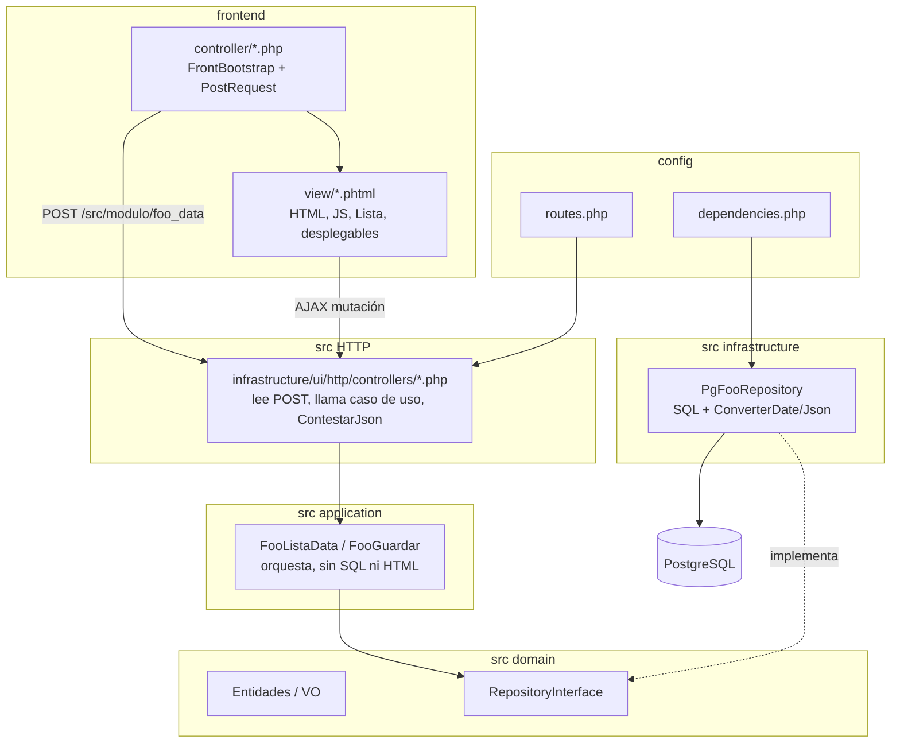

### 2.1 Reglas que definen el corte

| Debe | No debe |
|------|---------|
| Frontend pide datos por HTTP a `/src/...` | Frontend instancia casos de uso o repositorios |
| Backend devuelve JSON `{ success, mensaje, data }` | Backend pinta HTML de tablas o `<select>` |
| Un endpoint por acción (`_lista`, `_guardar`, `_eliminar`) | Dispatcher `switch ($que)` en código nuevo |
| SQL solo en `Pg*Repository` | SQL en application o en la vista |
| Enlaces a UI como `link_spec` (path + query) | `Hash::link` dentro de domain/application |
| Fechas/JSON de PG con `ConverterDate` / `ConverterJson` | `format()` / `json_encode` sueltos al persistir |

### 2.2 Añadir una pantalla nueva (pasos de producto)

1. Caso de uso en `src/<modulo>/application/` (lectura `*Data` o mutación).
2. Controller HTTP fino + ruta en `config/routes.php`.
3. Controller frontend + vista `.phtml`.
4. Tests (unitario del dominio o application; integración del repositorio si hay persistencia nueva).
5. Cadenas gettext si hay texto de UI.
6. Documentación de módulo (catálogo / manual) si el flujo es de usuario.
7. **Entrada de menú** (apartado siguiente). Sin esto, la pantalla existe pero nadie la ve.

Hay herramientas internas (`devel_codegen`) para esqueletos; no sustituyen el contrato de capas.

### 2.3 Tablas genéricas

Muchos catálogos (tipos de casa, fases, zonas, metamenús, …) no tienen un CRUD a medida: se editan con `frontend/shared/controller/tablaDB_lista_ver.php` + una clase `Info*` del módulo. El menú apunta a esa URL con `clase_info=src\...\InfoFoo`.

---

## 3. Configuración de menús

El menú **no** está hardcodeado en PHP. Es datos en PostgreSQL, distintos por layout, filtrados por rol y por oficina.

### 3.1 Piezas

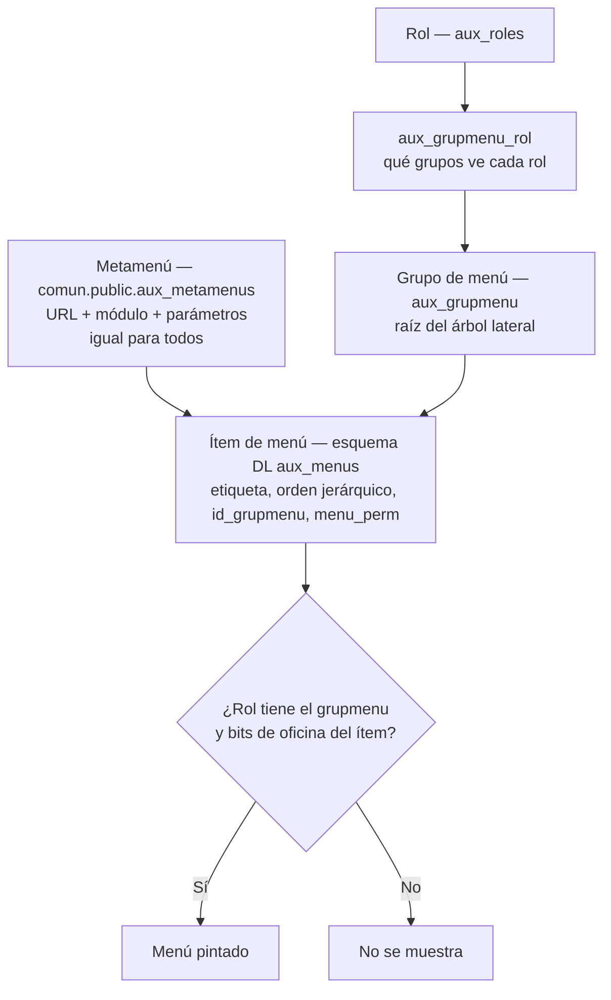

| Pieza | Dónde vive | Qué define |
|-------|------------|------------|
| **Metamenú** | `comun.public.aux_metamenus` | Destino: URL del controller frontend, módulo, parámetros. **Igual en todos los layouts.** |
| **Menú por layout** | `sv-e."<esquema>".aux_menus` | Árbol: etiqueta, `orden` (array de ruta jerárquica), grupmenu, `menu_perm`. |
| **Grupmenu** | `aux_grupmenu` | Bloque raíz (p. ej. “sistema”, “stgr”, “dre”). |
| **Rol ↔ grupmenu** | `aux_grupmenu_rol` | Qué bloques ve el rol. |

Layouts documentados: **Legacy** (esquema `H-dlbv`) y **Pills2** (esquema `H-dlpv`). Misma pantalla, distinta etiqueta y sitio en el árbol. Referencia generada: [`docs/guias/_referencia_menus.md`](../guias/_referencia_menus.md).

### 3.2 Cómo se da de alta una entrada

Flujo de administración (menú sistema / ADMIN GLOBAL):

1. Crear o reutilizar un **metamenú** (URL + parámetros). Pantalla de meta menús / `InfoMetaMenus`.
2. En el **gestor de menús** (`menus_que` / `menus_get`), colgar un ítem en el árbol del layout: texto, padre (`orden`), grupmenu, bits de oficina (`menu_perm`).
3. Asegurar que los **roles** que deben verlo tienen ese grupmenu.
4. Si el destino es un módulo no instalado en esa DL, el login ya restringe apps/módulos instalados.

Importar/exportar: hay pantallas para volcar menús a ficheros de referencia y cargarlos (útil al clonar layouts). No es el camino habitual de un cambio puntual.

### 3.3 Lo que el menú no hace

El menú **enseña o oculta entradas**. No decide si, una vez dentro, se puede editar una actividad o un dossier. Eso es la capa de permisos de actividad / dossier ([acceso](supervision_acceso_autorizacion.md)).

---

## 4. Dossiers (fichas embebidas)

Mecanismo transversal: desde una **persona**, **actividad** o **ubicación** se abren widgets de otros módulos sin cambiar de pantalla principal (asistentes, cargos, notas, inventario, habitaciones, …).

Cada tipo de dossier tiene número histórico (p. ej. 3101 asistentes, 3102 cargos) y permiso administrable (`perm_dossiers`). El backend devuelve datos + `link_spec`; el frontend firma URLs y pinta.

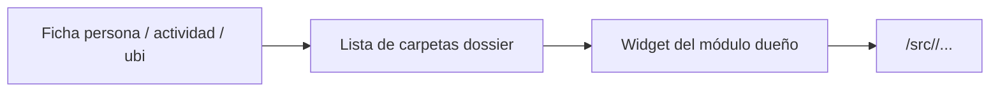

---

## 5. Procesos de actividad (fases)

Módulo `procesos`. No es un workflow lineal tipo BPMN.

- Cada **tipo de actividad** tiene un **tipo de proceso** (distinto si la actividad es de la DL o no).
- Al crear la actividad se **copia** ese proceso tipo.
- Un proceso = fases + dependencias (fase previa) + oficina responsable + estado de la actividad (proyecto / actual / terminada).
- Las **tareas** subdividen una fase (checklist); **no** afectan a permisos ni avisos.
- Una actividad tiene **varias fases completadas a la vez**. No hay “fase actual” única.
- Los **permisos** y **avisos** se enganchan a fases de inflexión (ver documento de acceso).

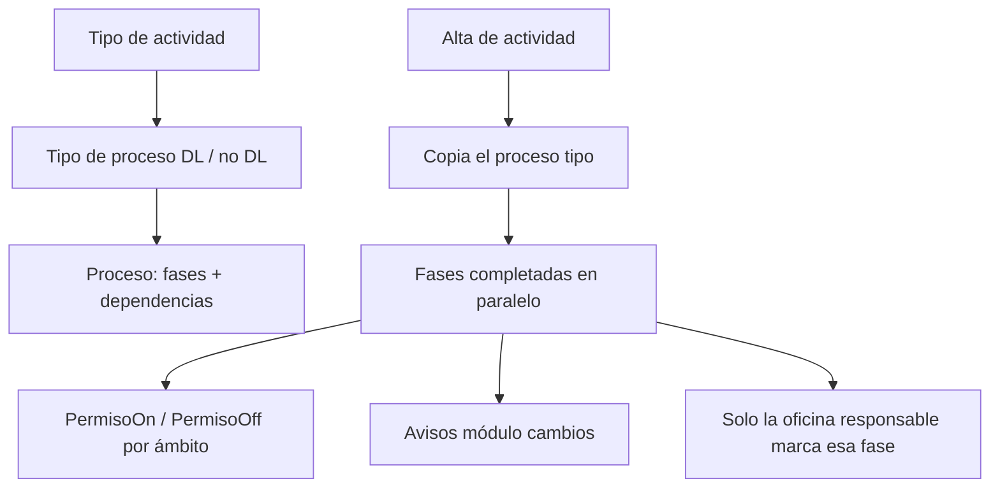

Consultas típicas de oficina: “actividades a las que falta SACD”, “falta matricular”, filtros `fases_on` / `fases_off` en la búsqueda de actividades.

---

## 6. Diagramas de procesos de negocio

### 6.1 Núcleo: personas, actividades, ubicaciones

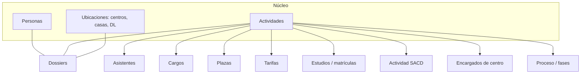

Casi toda la oficina gira alrededor de una **actividad** (curso, retiro, encuentro, período formativo). La persona y la ubi son el otro eje de ficha.

### 6.2 Ciclo de una actividad

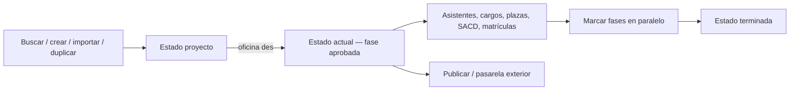

Permisos de edición suelen endurecerse al marcar la fase de inflexión (p. ej. tras “aprobada”, oficinas pasan de modificar a ver).

### 6.3 SACD: zonas, encargos, planning, misas

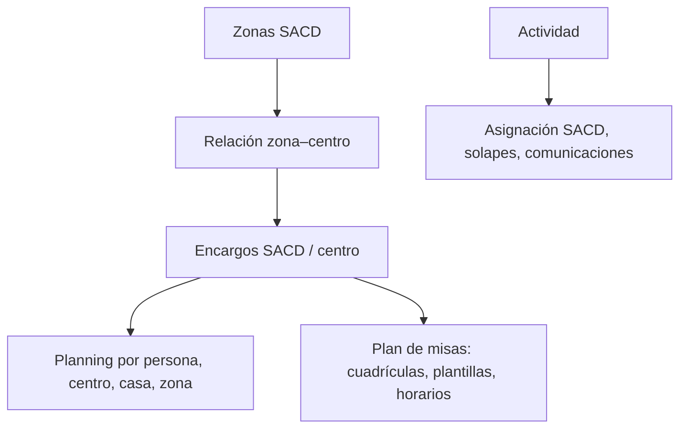

Público: oficina SACD / exterior. El planning lee personas según `pau` (SACD, numerario, …).

### 6.4 Formación (STGR)

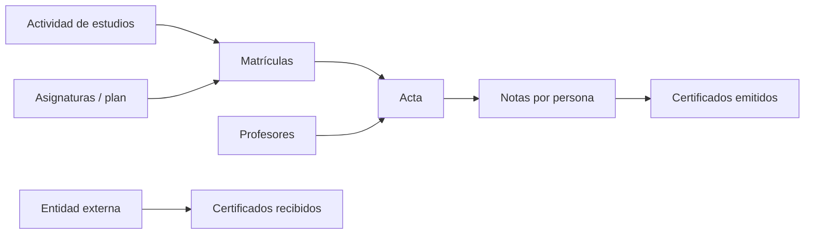

Las notas quedan ancladas al acta / DL del acta (modelo vigente 2026). Un certificado hacia fuera no es lo mismo que el expediente interno.

### 6.5 Exterior / pasarela y avisos

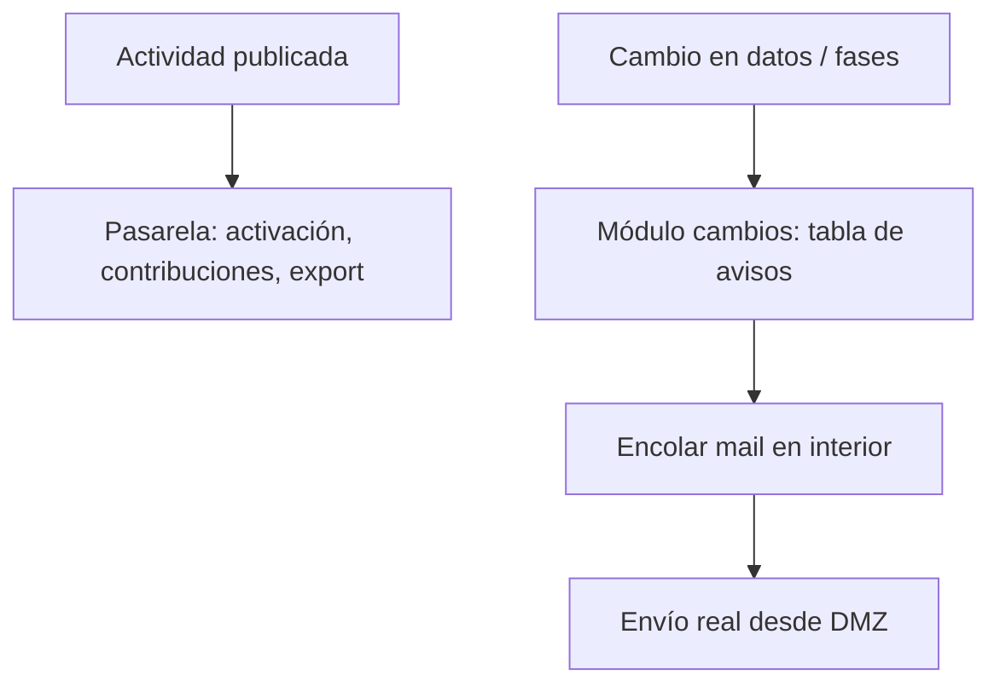

### 6.6 Sincronización BDU (Listas)

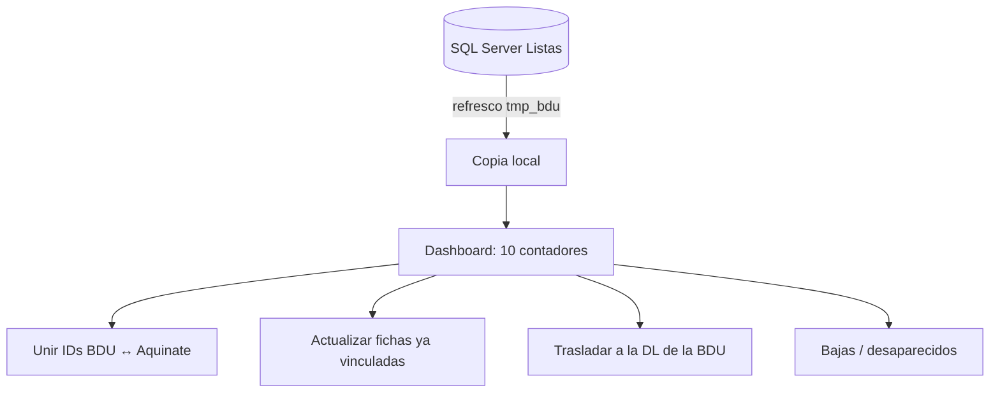

Solo en instalaciones con `dbextern` activo. La BDU es maestra de identidad externa; Aquinate mantiene el expediente de oficina.

### 6.7 Alta de un usuario (administración)

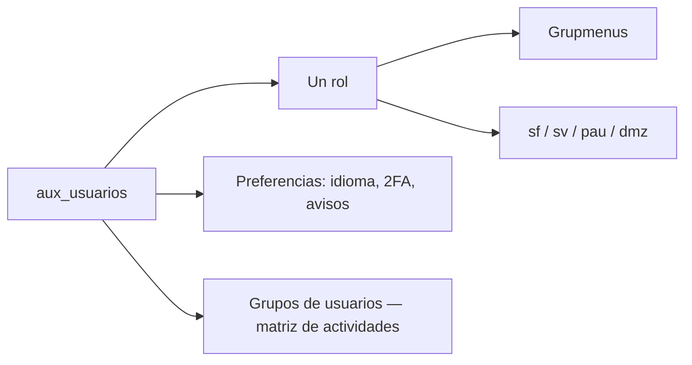

Sin grupmenu, el usuario entra y ve un menú vacío o mínimo. Sin bits de oficina y sin matriz de procesos, verá pantallas pero no podrá actuar.

---

## 7. Catálogo de módulos (para qué sirve cada uno)

Agrupados por función. El detalle de pantallas está en `docs/manual/<modulo>.md`.

### 7.1 Hubs

| Módulo | Para qué |
|--------|----------|
| **personas** | Fichas (numerarios, agregados, de paso, SACD, SSSC, …), búsqueda, traslados entre DL, cambios STGR. |
| **actividades** | Hub: buscar, crear, editar, duplicar, importar, publicar, tipos, calendarios, ficha con dossiers. |
| **ubis** | Centros, casas, delegaciones, regiones, direcciones, teléfonos, calendarios de períodos, traslados. |
| **dossiers** | Carpetas embebidas y permisos por tipo de ficha. |

### 7.2 Alrededor de una actividad

| Módulo | Para qué |
|--------|----------|
| **asistentes** | Alta/baja, mover entre actividades, listados por centro o conjunto. |
| **actividadcargos** | Cargos / responsables de la actividad. |
| **actividadplazas** | Balance, peticiones, cesiones. |
| **actividadtarifas** | Tarifas por ubicación, series, tipos. |
| **actividadessacd** | SACD que atienden la actividad, solapes, comunicaciones. |
| **actividadescentro** | Encargados de centro, centros disponibles. |
| **actividadestudios** | Matrículas, plan, actas de estudios, E43. |
| **procesos** | Tipos de proceso, fases, tareas, proceso de una actividad, filtros por fase. |
| **planning** | Calendario de ocupaciones (persona, centro, casa, zonas). |
| **pasarela** | Exterior: activación, contribuciones, export a sistemas externos. |

### 7.3 SACD y territorial

| Módulo | Para qué |
|--------|----------|
| **zonassacd** | Zonas geográficas y relación zona–centro. |
| **encargossacd** | Fichas de encargo centro/SACD, propuestas, ausencias, horarios. |
| **misas** | Plan de misas: cuadrículas, plantillas, encargos por zona/centro. |

### 7.4 Formación y documentos

| Módulo | Para qué |
|--------|----------|
| **notas** | Notas por persona, actas, informes STGR, tesseræ, exámenes, PDF de acta. |
| **certificados** | Emitidos y recibidos: PDF, firma, envío, impresión. |
| **profesores** | Catálogo y ficha STGR. |
| **asignaturas** | Catálogo, departamentos, opcionales, sectores. |
| **cartaspresentacion** | Cartas para trámites externos. |

### 7.5 Logística

| Módulo | Para qué |
|--------|----------|
| **casas** | Ingresos, gastos, grupos, previsión de asistentes, calendario por ubi. |
| **inventario** | Equipajes, documentos numerados, asignación a centros/DL, movimientos, colecciones. |
| **ubiscamas** | Habitaciones y camas de una actividad (CDC). |

### 7.6 Comunicación y sistema

| Módulo | Para qué |
|--------|----------|
| **cambios** | Registro de cambios, preferencias de aviso, generación y cola de correos. |
| **tablonanuncios** | Tablón interno. |
| **usuarios** | Login, 2FA, usuarios, roles, grupos, preferencias, perm. de menú. |
| **menus** | Metamenús, árboles por layout, grupmenus, import/export. |
| **configuracion** | Parámetros de esquema, apps y módulos instalados. |
| **permisos** | Librería: bits de menú, matriz de actividades. Sin UI propia. |
| **shared** | Infra transversal: PDO, JSON, tablas genéricas, copias, ContestarJson, HashB. |

### 7.7 Integración y herramientas internas

| Módulo | Para qué |
|--------|----------|
| **dbextern** | Sincro con BDU/Listas (SQL Server). |
| **devel_db_admin** | Esquemas, migraciones SQL, copiar/renombrar/eliminar DL. Solo entornos de mantenimiento. |
| **devel_codegen** | Generación de esqueletos. |
| **utils_database** | Utilidades de BD. |

---

## 8. Puntos que suelen replantearse

1. **Granularidad de módulos.** Actividad está partida en satélites (`asistentes`, `plazas`, `cargos`, …). Facilita equipos y tests; multiplica rutas y dossiers.
2. **Menú en BD + dos layouts.** Permite personalizar por DL y por piel; el coste es administración y divergencia Legacy / Pills2.
3. **Metamenú global vs. rutas en código.** Mover una pantalla implica datos en BD, no solo un commit.
4. **Procesos no lineales + permisos.** Muy acoplado a cómo trabajan las oficinas; difícil de sustituir por un motor BPM genérico sin redefinir el negocio.
5. **Dossiers numerados (legado Obix).** El número de tipo sigue siendo la clave de resolución de widgets.
6. **PostRequest HTTP interno.** Contrato preparado para separar UI y API; hoy es un hop extra en el mismo servidor. Hay backlog de dispatcher interno opcional.
7. **Módulos instalados por DL.** Permite no desplegar inventario o BDU en todas partes; hay que mantener el catálogo `m0_*`.

---

## 9. Lecturas

- [Arquitectura](supervision_arquitectura.md)
- [Acceso](supervision_acceso_autorizacion.md)
- [AGENTS.md](../../AGENTS.md) — contrato de implementación
- [Guía de onboarding](guia_tecnica_onboarding.md)
- [Procesos (diseño original)](README_procesos.md)
- [Referencia de menús](../guias/_referencia_menus.md)
- Manuales: [`docs/manual/`](../manual/)
