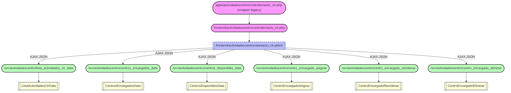

La entrada canonica es `frontend/actividadescentro/controller/activ_ctr.php`. El
wrapper legacy en `apps/` solo existe por compatibilidad con entradas de menu
en BD que todavia apuntan a `apps/...`; redirige al controlador frontend.

Todos los endpoints backend viven en `src/actividadescentro/config/routes.php`
bajo el prefijo `/src/actividadescentro/` y responden JSON con el contrato
estandar `{success: bool, mensaje: string, data: string|array}`.
