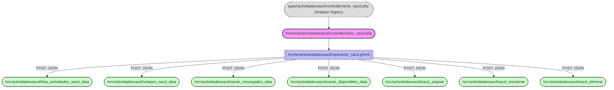

```mermaid
flowchart TD
    %% Estils de nodes
    classDef controller fill:#f9f,stroke:#333,stroke-width:2px;
    classDef vista fill:#bbf,stroke:#333,stroke-width:1px,stroke-dasharray: 5 5;
    classDef backend fill:#cfc,stroke:#333,stroke-width:1px;
    classDef legacy fill:#ddd,stroke:#666,stroke-width:1px,stroke-dasharray: 2 4;

    frontend_actividadessacd_controller_activ_sacd_php(["frontend/actividadessacd/controller/activ_sacd.php"]):::controller --> frontend_actividadessacd_view_activ_sacd_phtml[["frontend/actividadessacd/view/activ_sacd.phtml"]]:::vista

    frontend_actividadessacd_view_activ_sacd_phtml -- POST JSON --> src_lista_actividades_sacd_data(["/src/actividadessacd/lista_actividades_sacd_data"]):::backend
    frontend_actividadessacd_view_activ_sacd_phtml -- POST JSON --> src_solapes_sacd_data(["/src/actividadessacd/solapes_sacd_data"]):::backend
    frontend_actividadessacd_view_activ_sacd_phtml -- POST JSON --> src_sacds_encargados_data(["/src/actividadessacd/sacds_encargados_data"]):::backend
    frontend_actividadessacd_view_activ_sacd_phtml -- POST JSON --> src_sacds_disponibles_data(["/src/actividadessacd/sacds_disponibles_data"]):::backend
    frontend_actividadessacd_view_activ_sacd_phtml -- POST JSON --> src_sacd_asignar(["/src/actividadessacd/sacd_asignar"]):::backend
    frontend_actividadessacd_view_activ_sacd_phtml -- POST JSON --> src_sacd_reordenar(["/src/actividadessacd/sacd_reordenar"]):::backend
    frontend_actividadessacd_view_activ_sacd_phtml -- POST JSON --> src_sacd_eliminar(["/src/actividadessacd/sacd_eliminar"]):::backend

    apps_actividadessacd_controller_activ_sacd_php(["apps/actividadessacd/controller/activ_sacd.php (wrapper legacy)"]):::legacy --> frontend_actividadessacd_controller_activ_sacd_php
```
