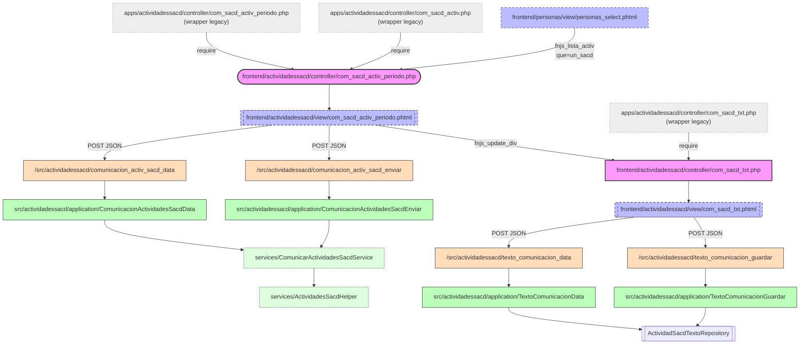

```mermaid
flowchart TD
    %% Estils de nodes
    classDef controller fill:#f9f,stroke:#333,stroke-width:2px;
    classDef vista fill:#bbf,stroke:#333,stroke-width:1px,stroke-dasharray: 5 5;
    classDef usecase fill:#bfb,stroke:#333,stroke-width:1px;
    classDef endpoint fill:#fdb,stroke:#333,stroke-width:1px;
    classDef wrapper fill:#eee,stroke:#999,stroke-width:1px,stroke-dasharray: 3 3;
    classDef service fill:#dfd,stroke:#333,stroke-width:1px,stroke-dasharray: 2 2;

    %% com_sacd_activ_periodo (slice 4 migrado)
    periodo_wrap["apps/actividadessacd/controller/com_sacd_activ_periodo.php<br/>(wrapper legacy)"]:::wrapper -->|require| periodo_ctrl
    activ_wrap["apps/actividadessacd/controller/com_sacd_activ.php<br/>(wrapper legacy)"]:::wrapper -->|require| periodo_ctrl

    periodo_ctrl(["frontend/actividadessacd/controller/com_sacd_activ_periodo.php"]):::controller --> periodo_view[["frontend/actividadessacd/view/com_sacd_activ_periodo.phtml"]]:::vista

    %% Entrada externa desde personas_select
    personas_select["frontend/personas/view/personas_select.phtml"]:::vista -->|fnjs_lista_activ<br/>que=un_sacd| periodo_ctrl

    %% AJAX del listado y del envio
    periodo_view -->|POST JSON| ep_activ_data["/src/actividadessacd/comunicacion_activ_sacd_data"]:::endpoint
    periodo_view -->|POST JSON| ep_activ_enviar["/src/actividadessacd/comunicacion_activ_sacd_enviar"]:::endpoint

    ep_activ_data --> uc_activ_data["src/actividadessacd/application/ComunicacionActividadesSacdData"]:::usecase
    ep_activ_enviar --> uc_activ_enviar["src/actividadessacd/application/ComunicacionActividadesSacdEnviar"]:::usecase

    uc_activ_data --> svc_comunicar["services/ComunicarActividadesSacdService"]:::service
    uc_activ_enviar --> svc_comunicar
    svc_comunicar --> svc_helper["services/ActividadesSacdHelper"]:::service

    %% Link a com_sacd_txt (slice 3 migrado)
    periodo_view -->|fnjs_update_div| txt_front["frontend/actividadessacd/controller/com_sacd_txt.php"]:::controller
    txt_wrap["apps/actividadessacd/controller/com_sacd_txt.php<br/>(wrapper legacy)"]:::wrapper -->|require| txt_front
    txt_front --> txt_view[["frontend/actividadessacd/view/com_sacd_txt.phtml"]]:::vista

    %% AJAX del editor de textos
    txt_view -->|POST JSON| ep_data["/src/actividadessacd/texto_comunicacion_data"]:::endpoint
    txt_view -->|POST JSON| ep_guardar["/src/actividadessacd/texto_comunicacion_guardar"]:::endpoint
    ep_data --> uc_data["src/actividadessacd/application/TextoComunicacionData"]:::usecase
    ep_guardar --> uc_guardar["src/actividadessacd/application/TextoComunicacionGuardar"]:::usecase
    uc_data --> texto_repo[[ActividadSacdTextoRepository]]
    uc_guardar --> texto_repo
```
