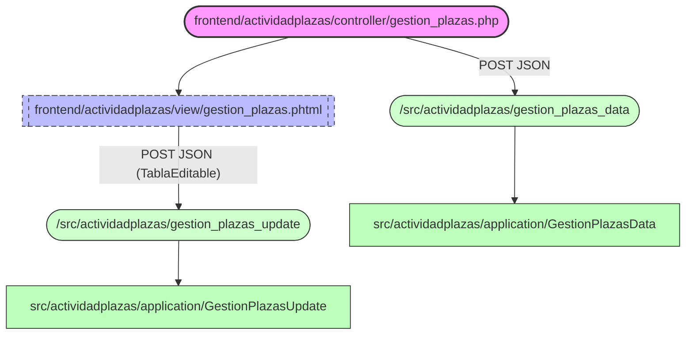

```mermaid
flowchart TD
    %% Estils de nodes
    classDef controller fill:#f9f,stroke:#333,stroke-width:2px;
    classDef vista fill:#bbf,stroke:#333,stroke-width:1px,stroke-dasharray: 5 5;
    classDef backend fill:#cfc,stroke:#333,stroke-width:1px;
    classDef usecase fill:#bfb,stroke:#333,stroke-width:1px;

    %% Frontend controller + view
    frontend_actividadplazas_controller_gestion_plazas_php(["frontend/actividadplazas/controller/gestion_plazas.php"]):::controller --> frontend_actividadplazas_view_gestion_plazas_phtml[["frontend/actividadplazas/view/gestion_plazas.phtml"]]:::vista

    %% Endpoints backend JSON
    frontend_actividadplazas_controller_gestion_plazas_php -- POST JSON --> src_gestion_plazas_data(["/src/actividadplazas/gestion_plazas_data"]):::backend
    frontend_actividadplazas_view_gestion_plazas_phtml -- POST JSON (TablaEditable) --> src_gestion_plazas_update(["/src/actividadplazas/gestion_plazas_update"]):::backend

    %% Use cases
    src_gestion_plazas_data --> uc_data["src/actividadplazas/application/GestionPlazasData"]:::usecase
    src_gestion_plazas_update --> uc_update["src/actividadplazas/application/GestionPlazasUpdate"]:::usecase
```
