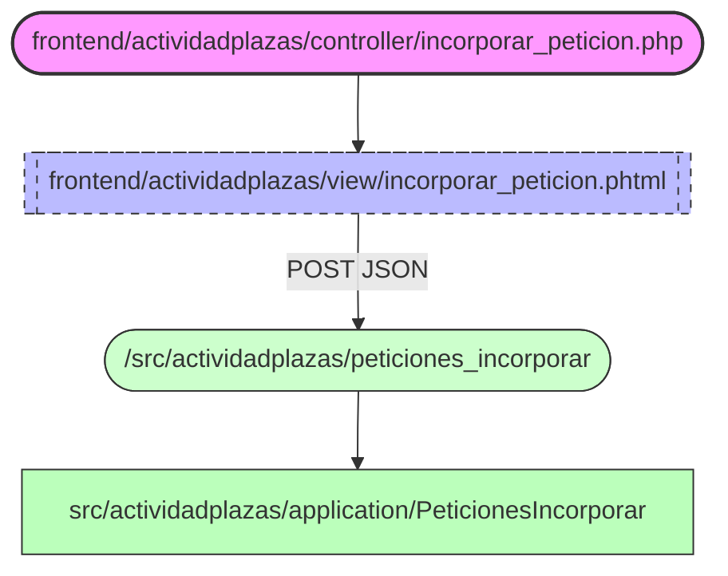

```mermaid
flowchart TD
    %% Estils de nodes
    classDef controller fill:#f9f,stroke:#333,stroke-width:2px;
    classDef vista fill:#bbf,stroke:#333,stroke-width:1px,stroke-dasharray: 5 5;
    classDef backend fill:#cfc,stroke:#333,stroke-width:1px;
    classDef usecase fill:#bfb,stroke:#333,stroke-width:1px;

    %% Frontend controller + view
    frontend_actividadplazas_controller_incorporar_peticion_php(["frontend/actividadplazas/controller/incorporar_peticion.php"]):::controller --> frontend_actividadplazas_view_incorporar_peticion_phtml[["frontend/actividadplazas/view/incorporar_peticion.phtml"]]:::vista

    %% Endpoints backend JSON (desde el boton "continuar")
    frontend_actividadplazas_view_incorporar_peticion_phtml -- POST JSON --> src_peticiones_incorporar(["/src/actividadplazas/peticiones_incorporar"]):::backend

    %% Use case
    src_peticiones_incorporar --> uc_incorporar["src/actividadplazas/application/PeticionesIncorporar"]:::usecase
```
