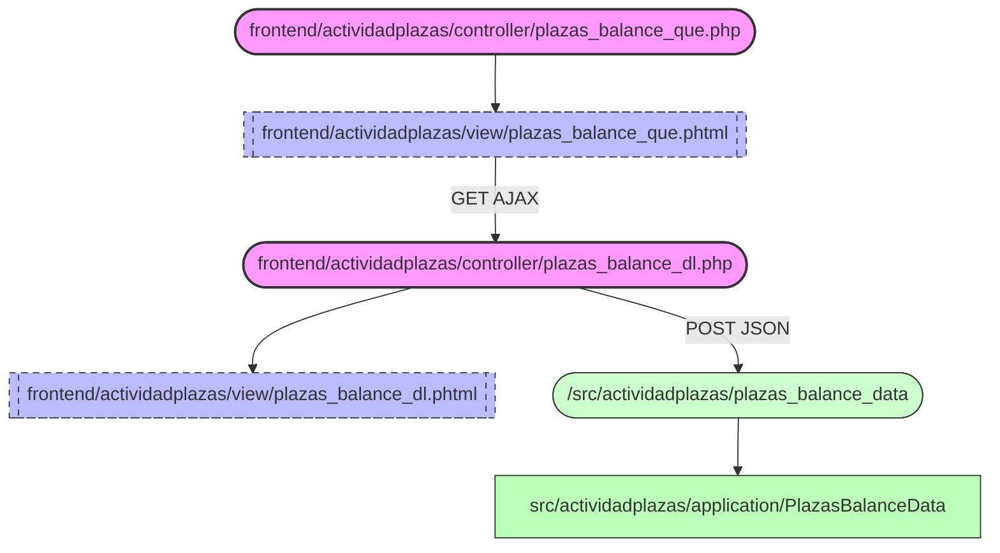

```mermaid
flowchart TD
    %% Estils de nodes
    classDef controller fill:#f9f,stroke:#333,stroke-width:2px;
    classDef vista fill:#bbf,stroke:#333,stroke-width:1px,stroke-dasharray: 5 5;
    classDef backend fill:#cfc,stroke:#333,stroke-width:1px;
    classDef usecase fill:#bfb,stroke:#333,stroke-width:1px;

    %% Entrada (menu)
    frontend_actividadplazas_controller_plazas_balance_que_php(["frontend/actividadplazas/controller/plazas_balance_que.php"]):::controller --> frontend_actividadplazas_view_plazas_balance_que_phtml[["frontend/actividadplazas/view/plazas_balance_que.phtml"]]:::vista

    %% AJAX al controlador de detalle (HTML de la tabla)
    frontend_actividadplazas_view_plazas_balance_que_phtml -- GET AJAX --> frontend_actividadplazas_controller_plazas_balance_dl_php(["frontend/actividadplazas/controller/plazas_balance_dl.php"]):::controller
    frontend_actividadplazas_controller_plazas_balance_dl_php --> frontend_actividadplazas_view_plazas_balance_dl_phtml[["frontend/actividadplazas/view/plazas_balance_dl.phtml"]]:::vista

    %% Endpoints backend JSON
    frontend_actividadplazas_controller_plazas_balance_dl_php -- POST JSON --> src_plazas_balance_data(["/src/actividadplazas/plazas_balance_data"]):::backend

    %% Use cases
    src_plazas_balance_data --> uc_data["src/actividadplazas/application/PlazasBalanceData"]:::usecase
```
