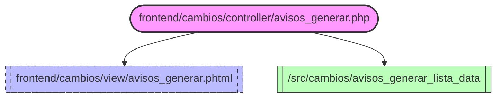

> El legacy usaba dos vistas Twig (`avisos_generar_condicion.html.twig` y
> `avisos_generar_lista.html.twig` en `apps/cambios/view/`). Ambas han
> sido eliminadas tras la migracion a `frontend/` (vertical slice 2).
