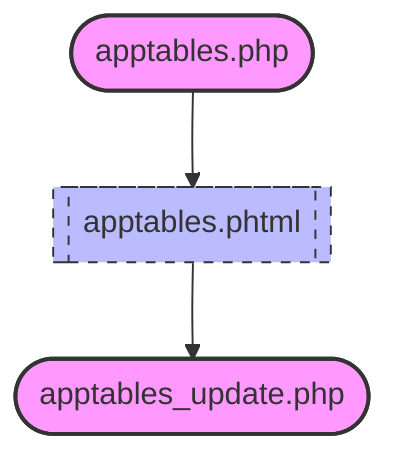

```mermaid
flowchart TD
    %% Estils de nodes
    classDef controller fill:#f9f,stroke:#333,stroke-width:2px;
    classDef vista fill:#bbf,stroke:#333,stroke-width:1px,stroke-dasharray: 5 5;
    classDef error fill:#ff9999,stroke:#cc0000,stroke-width:2px;

    frontend_devel_db_admin_controller_apptables_php(["apptables.php"]):::controller --> frontend_devel_db_admin_view_apptables_phtml[["apptables.phtml"]]:::vista
    frontend_devel_db_admin_view_apptables_phtml --> frontend_devel_db_admin_controller_apptables_update_php(["apptables_update.php"]):::controller
    %% DESTÍ NO RESOLT des de frontend_devel_db_admin_view_apptables_phtml: $oHash->getCamposHtml(); [DESTÍ NO RESOLT]
```