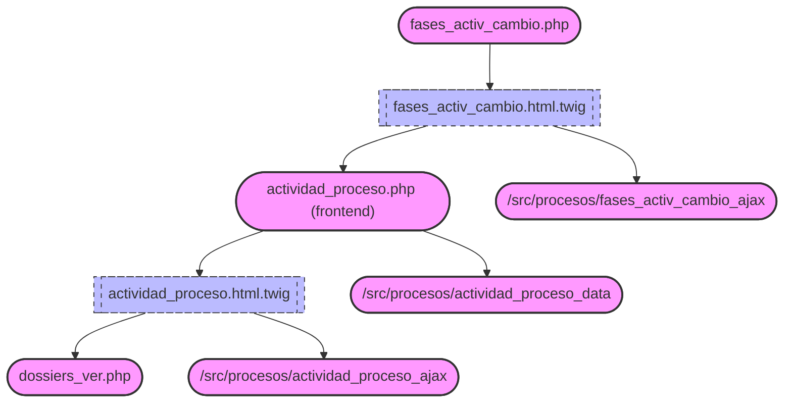

```mermaid
flowchart TD
    %% Estils de nodes
    classDef controller fill:#f9f,stroke:#333,stroke-width:2px;
    classDef vista fill:#bbf,stroke:#333,stroke-width:1px,stroke-dasharray: 5 5;
    classDef error fill:#ff9999,stroke:#cc0000,stroke-width:2px;

    frontend_procesos_controller_fases_activ_cambio_php(["fases_activ_cambio.php"]):::controller --> frontend_procesos_view_fases_activ_cambio_html_twig[["fases_activ_cambio.html.twig"]]:::vista
    frontend_procesos_view_fases_activ_cambio_html_twig --> frontend_procesos_controller_actividad_proceso_php(["actividad_proceso.php (frontend)"]):::controller
    frontend_procesos_view_fases_activ_cambio_html_twig --> src_procesos_fases_activ_cambio_ajax(["/src/procesos/fases_activ_cambio_ajax"]):::controller
    frontend_procesos_controller_actividad_proceso_php --> frontend_procesos_view_actividad_proceso_html_twig[["actividad_proceso.html.twig"]]:::vista
    frontend_procesos_controller_actividad_proceso_php --> src_procesos_actividad_proceso_data(["/src/procesos/actividad_proceso_data"]):::controller
    frontend_procesos_view_actividad_proceso_html_twig --> apps_dossiers_controller_dossiers_ver_php(["dossiers_ver.php"]):::controller
    frontend_procesos_view_actividad_proceso_html_twig --> src_procesos_actividad_proceso_ajax(["/src/procesos/actividad_proceso_ajax"]):::controller
```