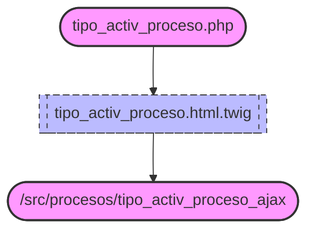

```mermaid
flowchart TD
    %% Estils de nodes
    classDef controller fill:#f9f,stroke:#333,stroke-width:2px;
    classDef vista fill:#bbf,stroke:#333,stroke-width:1px,stroke-dasharray: 5 5;
    classDef error fill:#ff9999,stroke:#cc0000,stroke-width:2px;

    frontend_procesos_controller_tipo_activ_proceso_php(["tipo_activ_proceso.php"]):::controller --> frontend_procesos_view_tipo_activ_proceso_html_twig[["tipo_activ_proceso.html.twig"]]:::vista
    frontend_procesos_view_tipo_activ_proceso_html_twig --> src_procesos_tipo_activ_proceso_ajax(["/src/procesos/tipo_activ_proceso_ajax"]):::controller
```