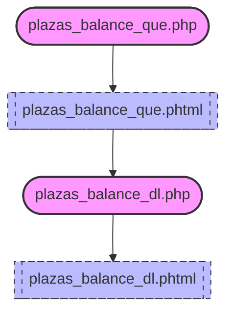

```mermaid
flowchart TD
    %% Estils de nodes
    classDef controller fill:#f9f,stroke:#333,stroke-width:2px;
    classDef vista fill:#bbf,stroke:#333,stroke-width:1px,stroke-dasharray: 5 5;
    classDef error fill:#ff9999,stroke:#cc0000,stroke-width:2px;

    apps_actividadplazas_controller_plazas_balance_que_php(["plazas_balance_que.php"]):::controller --> apps_actividadplazas_view_plazas_balance_que_phtml[["plazas_balance_que.phtml"]]:::vista
    apps_actividadplazas_view_plazas_balance_que_phtml --> apps_actividadplazas_controller_plazas_balance_dl_php(["plazas_balance_dl.php"]):::controller
    apps_actividadplazas_controller_plazas_balance_dl_php(["plazas_balance_dl.php"]):::controller --> apps_actividadplazas_view_plazas_balance_dl_phtml[["plazas_balance_dl.phtml"]]:::vista
```