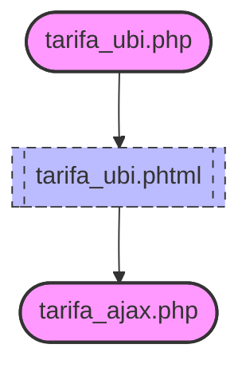

```mermaid
flowchart TD
    %% Estils de nodes
    classDef controller fill:#f9f,stroke:#333,stroke-width:2px;
    classDef vista fill:#bbf,stroke:#333,stroke-width:1px,stroke-dasharray: 5 5;
    classDef error fill:#ff9999,stroke:#cc0000,stroke-width:2px;

    apps_actividadtarifas_controller_tarifa_ubi_php(["tarifa_ubi.php"]):::controller --> apps_actividadtarifas_view_tarifa_ubi_phtml[["tarifa_ubi.phtml"]]:::vista
    apps_actividadtarifas_view_tarifa_ubi_phtml --> apps_actividadtarifas_controller_tarifa_ajax_php(["tarifa_ajax.php"]):::controller
    %% DESTÍ NO RESOLT des de apps_actividadtarifas_view_tarifa_ubi_phtml: $oForm->getDesplCasas()->desplegable(); [DESTÍ NO RESOLT]
```