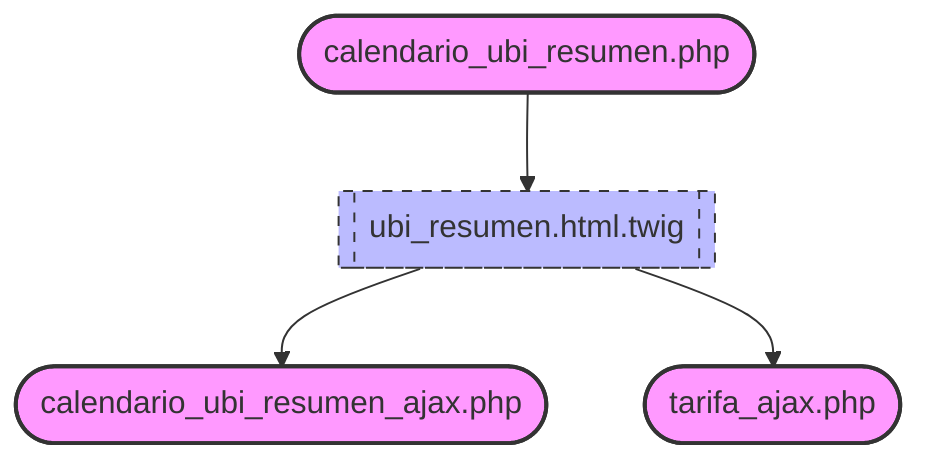

```mermaid
flowchart TD
    %% Estils de nodes
    classDef controller fill:#f9f,stroke:#333,stroke-width:2px;
    classDef vista fill:#bbf,stroke:#333,stroke-width:1px,stroke-dasharray: 5 5;
    classDef error fill:#ff9999,stroke:#cc0000,stroke-width:2px;

    apps_casas_controller_calendario_ubi_resumen_php(["calendario_ubi_resumen.php"]):::controller --> apps_casas_view_ubi_resumen_html_twig[["ubi_resumen.html.twig"]]:::vista
    apps_casas_view_ubi_resumen_html_twig --> apps_casas_controller_calendario_ubi_resumen_ajax_php(["calendario_ubi_resumen_ajax.php"]):::controller
    apps_casas_view_ubi_resumen_html_twig --> apps_actividadtarifas_controller_tarifa_ajax_php(["tarifa_ajax.php"]):::controller
    %% DESTÍ NO RESOLT des de apps_casas_view_ubi_resumen_html_twig: {{ oHash }} [DESTÍ NO RESOLT]
```