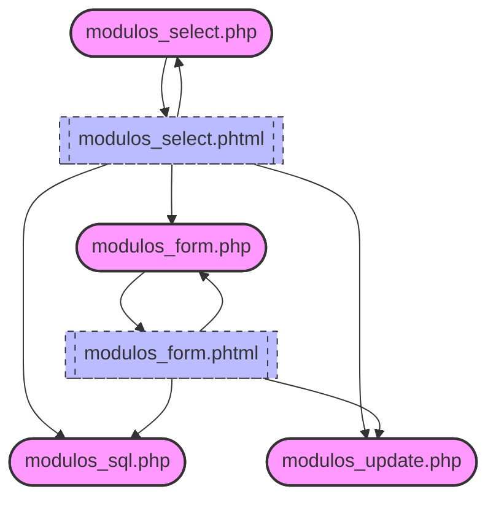

```mermaid
flowchart TD
    %% Estils de nodes
    classDef controller fill:#f9f,stroke:#333,stroke-width:2px;
    classDef vista fill:#bbf,stroke:#333,stroke-width:1px,stroke-dasharray: 5 5;
    classDef error fill:#ff9999,stroke:#cc0000,stroke-width:2px;

    frontend_configuracion_controller_modulos_select_php(["modulos_select.php"]):::controller --> frontend__configuracion__view_modulos_select_phtml[["modulos_select.phtml"]]:::vista
    frontend__configuracion__view_modulos_select_phtml --> frontend_configuracion_controller_modulos_form_php(["modulos_form.php"]):::controller
    frontend__configuracion__view_modulos_select_phtml --> frontend_configuracion_controller_modulos_update_php(["modulos_update.php"]):::controller
    frontend__configuracion__view_modulos_select_phtml --> frontend_configuracion_controller_modulos_sql_php(["modulos_sql.php"]):::controller
    frontend__configuracion__view_modulos_select_phtml --> frontend_configuracion_controller_modulos_select_php(["modulos_select.php"]):::controller
    %% DESTÍ NO RESOLT des de frontend__configuracion__view_modulos_select_phtml: $oHash->getCamposHtml(); [DESTÍ NO RESOLT]
    frontend_configuracion_controller_modulos_form_php(["modulos_form.php"]):::controller --> frontend__configuracion__view_modulos_form_phtml[["modulos_form.phtml"]]:::vista
    frontend__configuracion__view_modulos_form_phtml --> frontend_configuracion_controller_modulos_sql_php(["modulos_sql.php"]):::controller
    frontend__configuracion__view_modulos_form_phtml --> frontend_configuracion_controller_modulos_update_php(["modulos_update.php"]):::controller
    frontend__configuracion__view_modulos_form_phtml --> frontend_configuracion_controller_modulos_form_php(["modulos_form.php"]):::controller
```