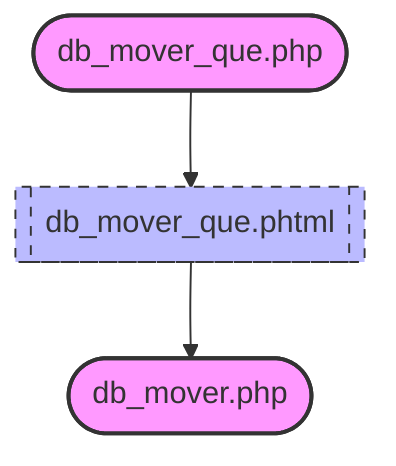

```mermaid
flowchart TD
    %% Estils de nodes
    classDef controller fill:#f9f,stroke:#333,stroke-width:2px;
    classDef vista fill:#bbf,stroke:#333,stroke-width:1px,stroke-dasharray: 5 5;
    classDef error fill:#ff9999,stroke:#cc0000,stroke-width:2px;

    apps_devel_controller_db_mover_que_php(["db_mover_que.php"]):::controller --> apps_devel_view_db_mover_que_phtml[["db_mover_que.phtml"]]:::vista
    apps_devel_view_db_mover_que_phtml --> apps_devel_controller_db_mover_php(["db_mover.php"]):::controller
    %% DESTÍ NO RESOLT des de apps_devel_view_db_mover_que_phtml: $oHash->getCamposHtml(); [DESTÍ NO RESOLT]
```