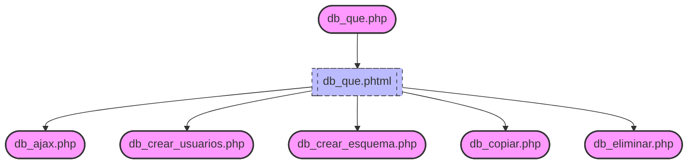

```mermaid
flowchart TD
    %% Estils de nodes
    classDef controller fill:#f9f,stroke:#333,stroke-width:2px;
    classDef vista fill:#bbf,stroke:#333,stroke-width:1px,stroke-dasharray: 5 5;
    classDef error fill:#ff9999,stroke:#cc0000,stroke-width:2px;

    frontend_devel_db_admin_controller_db_que_php(["db_que.php"]):::controller --> frontend_devel_db_admin_view_db_que_phtml[["db_que.phtml"]]:::vista
    frontend_devel_db_admin_view_db_que_phtml --> frontend_devel_db_admin_controller_db_ajax_php(["db_ajax.php"]):::controller
    frontend_devel_db_admin_view_db_que_phtml --> frontend_devel_db_admin_controller_db_crear_usuarios_php(["db_crear_usuarios.php"]):::controller
    frontend_devel_db_admin_view_db_que_phtml --> frontend_devel_db_admin_controller_db_crear_esquema_php(["db_crear_esquema.php"]):::controller
    frontend_devel_db_admin_view_db_que_phtml --> frontend_devel_db_admin_controller_db_copiar_php(["db_copiar.php"]):::controller
    frontend_devel_db_admin_view_db_que_phtml --> frontend_devel_db_admin_controller_db_eliminar_php(["db_eliminar.php"]):::controller
    %% DESTÍ NO RESOLT des de frontend_devel_db_admin_view_db_que_phtml: $oHash->getCamposHtml(); [DESTÍ NO RESOLT]
```