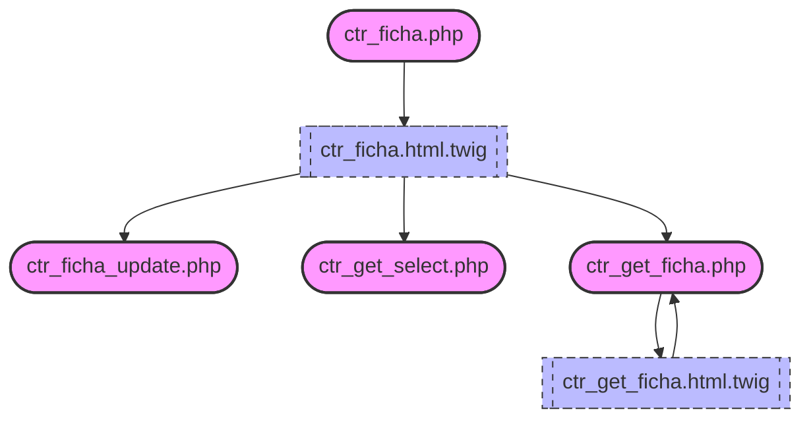

```mermaid
flowchart TD
    %% Estils de nodes
    classDef controller fill:#f9f,stroke:#333,stroke-width:2px;
    classDef vista fill:#bbf,stroke:#333,stroke-width:1px,stroke-dasharray: 5 5;
    classDef error fill:#ff9999,stroke:#cc0000,stroke-width:2px;

    apps_encargossacd_controller_ctr_ficha_php(["ctr_ficha.php"]):::controller --> apps_encargossacd_view_ctr_ficha_html_twig[["ctr_ficha.html.twig"]]:::vista
    apps_encargossacd_view_ctr_ficha_html_twig --> apps_encargossacd_controller_ctr_ficha_update_php(["ctr_ficha_update.php"]):::controller
    apps_encargossacd_view_ctr_ficha_html_twig --> apps_encargossacd_controller_ctr_get_select_php(["ctr_get_select.php"]):::controller
    apps_encargossacd_view_ctr_ficha_html_twig --> apps_encargossacd_controller_ctr_get_ficha_php(["ctr_get_ficha.php"]):::controller
    apps_encargossacd_controller_ctr_get_ficha_php(["ctr_get_ficha.php"]):::controller --> apps_encargossacd_view_ctr_get_ficha_html_twig[["ctr_get_ficha.html.twig"]]:::vista
    apps_encargossacd_view_ctr_get_ficha_html_twig --> apps_encargossacd_controller_ctr_get_ficha_php(["ctr_get_ficha.php"]):::controller
    %% DESTÍ NO RESOLT des de apps_encargossacd_view_ctr_get_ficha_html_twig: {{ e }} [DESTÍ NO RESOLT]
```