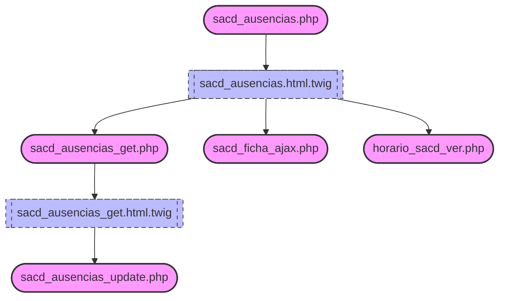

```mermaid
flowchart TD
    %% Estils de nodes
    classDef controller fill:#f9f,stroke:#333,stroke-width:2px;
    classDef vista fill:#bbf,stroke:#333,stroke-width:1px,stroke-dasharray: 5 5;
    classDef error fill:#ff9999,stroke:#cc0000,stroke-width:2px;

    apps_encargossacd_controller_sacd_ausencias_php(["sacd_ausencias.php"]):::controller --> apps_encargossacd_view_sacd_ausencias_html_twig[["sacd_ausencias.html.twig"]]:::vista
    apps_encargossacd_view_sacd_ausencias_html_twig --> apps_encargossacd_controller_sacd_ausencias_get_php(["sacd_ausencias_get.php"]):::controller
    apps_encargossacd_view_sacd_ausencias_html_twig --> apps_encargossacd_controller_sacd_ficha_ajax_php(["sacd_ficha_ajax.php"]):::controller
    apps_encargossacd_view_sacd_ausencias_html_twig --> apps_encargossacd_controller_horario_sacd_ver_php(["horario_sacd_ver.php"]):::controller
    apps_encargossacd_controller_sacd_ausencias_get_php(["sacd_ausencias_get.php"]):::controller --> apps_encargossacd_view_sacd_ausencias_get_html_twig[["sacd_ausencias_get.html.twig"]]:::vista
    apps_encargossacd_view_sacd_ausencias_get_html_twig --> apps_encargossacd_controller_sacd_ausencias_update_php(["sacd_ausencias_update.php"]):::controller
    %% DESTÍ NO RESOLT des de apps_encargossacd_view_sacd_ausencias_get_html_twig: {{ oHash }} [DESTÍ NO RESOLT]
```