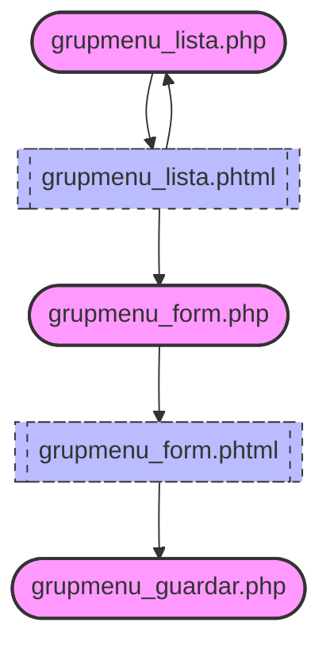

```mermaid
flowchart TD
    %% Estils de nodes
    classDef controller fill:#f9f,stroke:#333,stroke-width:2px;
    classDef vista fill:#bbf,stroke:#333,stroke-width:1px,stroke-dasharray: 5 5;
    classDef error fill:#ff9999,stroke:#cc0000,stroke-width:2px;

    frontend_menus_controller_grupmenu_lista_php(["grupmenu_lista.php"]):::controller --> frontend_menus_view_grupmenu_lista_phtml[["grupmenu_lista.phtml"]]:::vista
    frontend_menus_view_grupmenu_lista_phtml --> frontend_menus_controller_grupmenu_form_php(["grupmenu_form.php"]):::controller
    frontend_menus_view_grupmenu_lista_phtml --> frontend_menus_controller_grupmenu_lista_php(["grupmenu_lista.php"]):::controller
    %% DESTÍ NO RESOLT des de frontend_menus_view_grupmenu_lista_phtml: $oHashSelect->getCamposHtml() [DESTÍ NO RESOLT]
    frontend_menus_controller_grupmenu_form_php(["grupmenu_form.php"]):::controller --> frontend_menus_view_grupmenu_form_phtml[["grupmenu_form.phtml"]]:::vista
    frontend_menus_view_grupmenu_form_phtml --> src_menus_infrastructure_controllers_grupmenu_guardar_php(["grupmenu_guardar.php"]):::controller
    %% DESTÍ NO RESOLT des de frontend_menus_view_grupmenu_form_phtml: $oHashG->getCamposHtml(); [DESTÍ NO RESOLT]
```