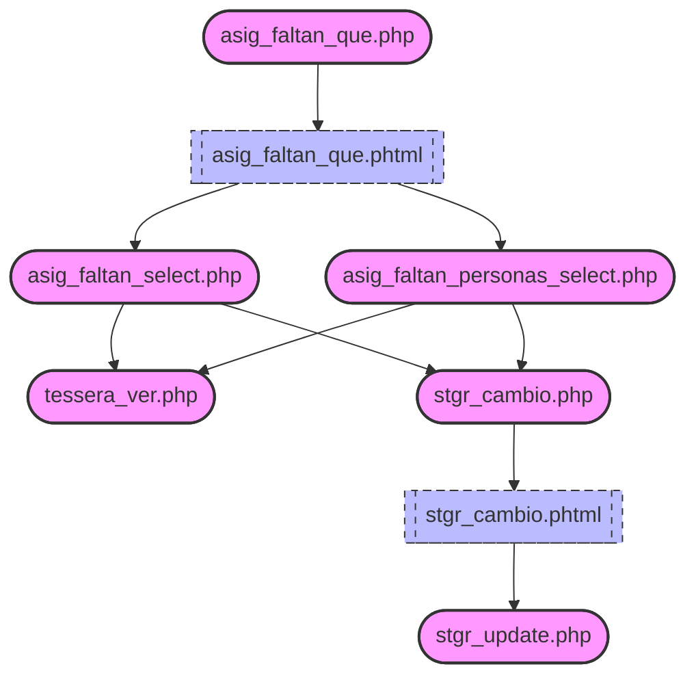

```mermaid
flowchart TD
    %% Estils de nodes
    classDef controller fill:#f9f,stroke:#333,stroke-width:2px;
    classDef vista fill:#bbf,stroke:#333,stroke-width:1px,stroke-dasharray: 5 5;
    classDef error fill:#ff9999,stroke:#cc0000,stroke-width:2px;

    apps_notas_controller_asig_faltan_que_php(["asig_faltan_que.php"]):::controller --> apps_notas_view_asig_faltan_que_phtml[["asig_faltan_que.phtml"]]:::vista
    apps_notas_view_asig_faltan_que_phtml --> apps_notas_controller_asig_faltan_select_php(["asig_faltan_select.php"]):::controller
    apps_notas_view_asig_faltan_que_phtml --> apps_notas_controller_asig_faltan_personas_select_php(["asig_faltan_personas_select.php"]):::controller
    apps_notas_controller_asig_faltan_select_php --> apps_notas_controller_tessera_ver_php(["tessera_ver.php"]):::controller
    apps_notas_controller_asig_faltan_select_php --> apps_personas_controller_stgr_cambio_php(["stgr_cambio.php"]):::controller
    apps_notas_controller_asig_faltan_personas_select_php --> apps_notas_controller_tessera_ver_php(["tessera_ver.php"]):::controller
    apps_notas_controller_asig_faltan_personas_select_php --> apps_personas_controller_stgr_cambio_php(["stgr_cambio.php"]):::controller
    apps_personas_controller_stgr_cambio_php(["stgr_cambio.php"]):::controller --> apps_personas_view_stgr_cambio_phtml[["stgr_cambio.phtml"]]:::vista
    apps_personas_view_stgr_cambio_phtml --> apps_personas_controller_stgr_update_php(["stgr_update.php"]):::controller
    %% DESTÍ NO RESOLT des de apps_personas_view_stgr_cambio_phtml: $oHash->getCamposHtml(); [DESTÍ NO RESOLT]
```