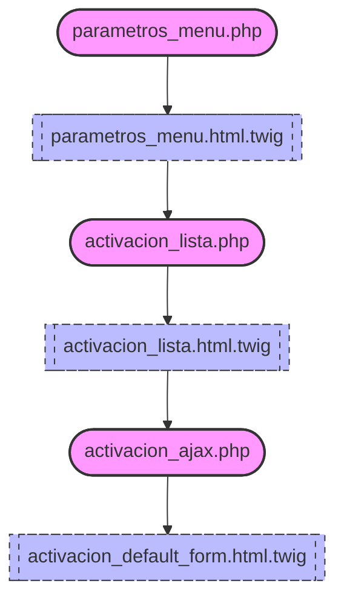

```mermaid
flowchart TD
    %% Estils de nodes
    classDef controller fill:#f9f,stroke:#333,stroke-width:2px;
    classDef vista fill:#bbf,stroke:#333,stroke-width:1px,stroke-dasharray: 5 5;
    classDef error fill:#ff9999,stroke:#cc0000,stroke-width:2px;

    apps_pasarela_controller_parametros_menu_php(["parametros_menu.php"]):::controller --> apps_pasarela_view_parametros_menu_html_twig[["parametros_menu.html.twig"]]:::vista
    %% DESTÍ NO RESOLT des de apps_pasarela_view_parametros_menu_html_twig: {{ url_activacion }} [DESTÍ NO RESOLT]
    %% DESTÍ NO RESOLT des de apps_pasarela_view_parametros_menu_html_twig: {{ url_nombre }} [DESTÍ NO RESOLT]
    %% DESTÍ NO RESOLT des de apps_pasarela_view_parametros_menu_html_twig: {{ url_contribucion_no_duerme }} [DESTÍ NO RESOLT]
    %% DESTÍ NO RESOLT des de apps_pasarela_view_parametros_menu_html_twig: {{ url_contribucion_reserva }} [DESTÍ NO RESOLT]
    apps_pasarela_view_parametros_menu_html_twig --> apps_pasarela_controller_activacion_lista_php(["activacion_lista.php"]):::controller
    apps_pasarela_controller_activacion_lista_php(["activacion_lista.php"]):::controller --> apps_pasarela_view_activacion_lista_html_twig[["activacion_lista.html.twig"]]:::vista
    apps_pasarela_view_activacion_lista_html_twig --> apps_pasarela_controller_activacion_ajax_php(["activacion_ajax.php"]):::controller
    apps_pasarela_controller_activacion_ajax_php(["activacion_ajax.php"]):::controller --> apps_pasarela_view_activacion_default_form_html_twig[["activacion_default_form.html.twig"]]:::vista
```