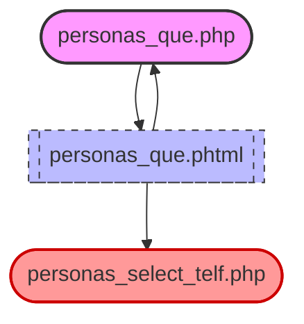

```mermaid
flowchart TD
    %% Estils de nodes
    classDef controller fill:#f9f,stroke:#333,stroke-width:2px;
    classDef vista fill:#bbf,stroke:#333,stroke-width:1px,stroke-dasharray: 5 5;
    classDef error fill:#ff9999,stroke:#cc0000,stroke-width:2px;

    apps_personas_controller_personas_que_php(["personas_que.php"]):::controller --> apps_personas_view_personas_que_phtml[["personas_que.phtml"]]:::vista
    apps_personas_view_personas_que_phtml --> apps_personas_controller_personas_que_php(["personas_que.php"]):::controller
    apps_personas_view_personas_que_phtml --> apps_personas_controller_personas_select_telf_php(["personas_select_telf.php"]):::controller
    class apps_personas_controller_personas_select_telf_php error;
```