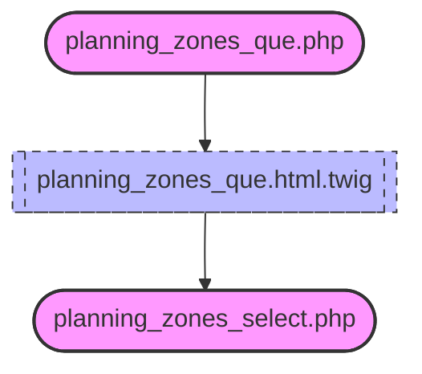

```mermaid
flowchart TD
    %% Estils de nodes
    classDef controller fill:#f9f,stroke:#333,stroke-width:2px;
    classDef vista fill:#bbf,stroke:#333,stroke-width:1px,stroke-dasharray: 5 5;
    classDef error fill:#ff9999,stroke:#cc0000,stroke-width:2px;

    apps_planning_controller_planning_zones_que_php(["planning_zones_que.php"]):::controller --> apps_planning_view_planning_zones_que_html_twig[["planning_zones_que.html.twig"]]:::vista
    apps_planning_view_planning_zones_que_html_twig --> apps_planning_controller_planning_zones_select_php(["planning_zones_select.php"]):::controller
    %% DESTÍ NO RESOLT des de apps_planning_view_planning_zones_que_html_twig: {{ oHash }} [DESTÍ NO RESOLT]
```