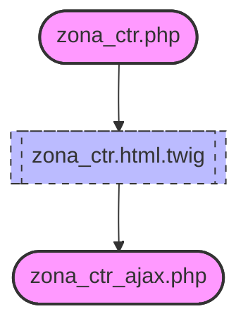

```mermaid
flowchart TD
    %% Estils de nodes
    classDef controller fill:#f9f,stroke:#333,stroke-width:2px;
    classDef vista fill:#bbf,stroke:#333,stroke-width:1px,stroke-dasharray: 5 5;
    classDef error fill:#ff9999,stroke:#cc0000,stroke-width:2px;

    apps_zonassacd_controller_zona_ctr_php(["zona_ctr.php"]):::controller --> apps_zonassacd_view_zona_ctr_html_twig[["zona_ctr.html.twig"]]:::vista
    apps_zonassacd_view_zona_ctr_html_twig --> apps_zonassacd_controller_zona_ctr_ajax_php(["zona_ctr_ajax.php"]):::controller
    %% DESTÍ NO RESOLT des de apps_zonassacd_view_zona_ctr_html_twig: {{ oHash }} [DESTÍ NO RESOLT]
```