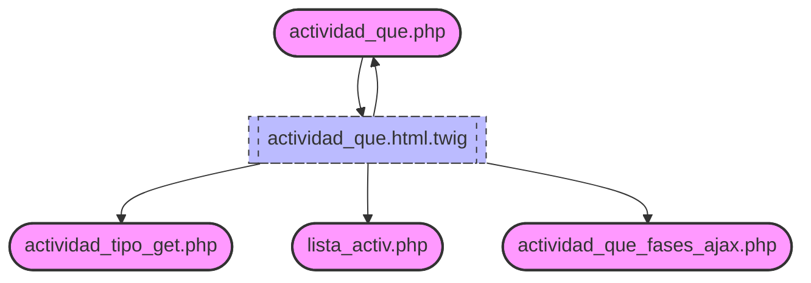

```mermaid
flowchart TD
    %% Estils de nodes
    classDef controller fill:#f9f,stroke:#333,stroke-width:2px;
    classDef vista fill:#bbf,stroke:#333,stroke-width:1px,stroke-dasharray: 5 5;
    classDef error fill:#ff9999,stroke:#cc0000,stroke-width:2px;

    apps_actividades_controller_actividad_que_php(["actividad_que.php"]):::controller --> apps_actividades_view_actividad_que_html_twig[["actividad_que.html.twig"]]:::vista
    apps_actividades_view_actividad_que_html_twig --> apps_actividades_controller_actividad_tipo_get_php(["actividad_tipo_get.php"]):::controller
    apps_actividades_view_actividad_que_html_twig --> apps_actividades_controller_lista_activ_php(["lista_activ.php"]):::controller
    apps_actividades_view_actividad_que_html_twig --> apps_actividades_controller_actividad_que_php(["actividad_que.php"]):::controller
    apps_actividades_view_actividad_que_html_twig --> apps_procesos_controller_actividad_que_fases_ajax_php(["actividad_que_fases_ajax.php"]):::controller
```