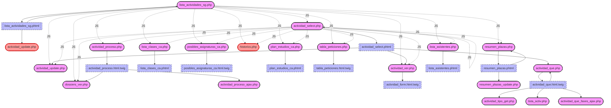

```mermaid
flowchart TD
    %% Estils de nodes
    classDef controller fill:#f9f,stroke:#333,stroke-width:2px;
    classDef vista fill:#bbf,stroke:#333,stroke-width:1px,stroke-dasharray: 5 5;
    classDef error fill:#ff9999,stroke:#cc0000,stroke-width:2px;

    apps_actividades_controller_lista_actividades_sg_php(["lista_actividades_sg.php"]):::controller --> apps_actividades_view_lista_actividades_sg_phtml[["lista_actividades_sg.phtml"]]:::vista
    apps_actividades_view_lista_actividades_sg_phtml --> programas_actividad_update_php(["actividad_update.php"]):::controller
    apps_actividades_view_lista_actividades_sg_phtml --> apps_actividades_controller_lista_actividades_sg_php(["lista_actividades_sg.php"]):::controller
    %% DESTÍ NO RESOLT des de apps_actividades_view_lista_actividades_sg_phtml: $oHash->getCamposHtml() [DESTÍ NO RESOLT]
    %% DESTÍ NO RESOLT des de apps_actividades_view_lista_actividades_sg_phtml: $oHashSel->getCamposHtml() [DESTÍ NO RESOLT]
    apps_actividades_controller_lista_actividades_sg_php -. JS .-> apps_actividades_controller_actividad_select_php(["actividad_select.php"]):::controller
    apps_actividades_controller_lista_actividades_sg_php -. JS .-> apps_actividades_controller_actividad_update_php(["actividad_update.php"]):::controller
    apps_actividades_controller_lista_actividades_sg_php -. JS .-> apps_procesos_controller_actividad_proceso_php(["actividad_proceso.php"]):::controller
    apps_actividades_controller_lista_actividades_sg_php -. JS .-> apps_actividades_controller_actividad_ver_php(["actividad_ver.php"]):::controller
    apps_actividades_controller_lista_actividades_sg_php -. JS .-> apps_actividadestudios_controller_lista_clases_ca_php(["lista_clases_ca.php"]):::controller
    apps_actividades_controller_lista_actividades_sg_php -. JS .-> apps_actividadestudios_controller_posibles_asignaturas_ca_php(["posibles_asignaturas_ca.php"]):::controller
    apps_actividades_controller_lista_actividades_sg_php -. JS .-> apps_actividadestudios_controller_plan_estudios_ca_php(["plan_estudios_ca.php"]):::controller
    apps_actividades_controller_lista_actividades_sg_php -. JS .-> apps_dossiers_controller_dossiers_ver_php(["dossiers_ver.php"]):::controller
    apps_actividades_controller_lista_actividades_sg_php -. JS .-> apps_asistentes_controller_tabla_peticiones_php(["tabla_peticiones.php"]):::controller
    apps_actividades_controller_lista_actividades_sg_php -. JS .-> apps_actividadplazas_controller_resumen_plazas_php(["resumen_plazas.php"]):::controller
    apps_actividades_controller_lista_actividades_sg_php -. JS .-> apps_asistentes_controller_lista_asistentes_php(["lista_asistentes.php"]):::controller
    apps_actividades_controller_lista_actividades_sg_php -. JS .-> apps_actividades_controller_dossiers_historics_php(["historics.php"]):::controller
    apps_actividades_controller_actividad_select_php(["actividad_select.php"]):::controller --> apps_actividades_view_actividad_select_phtml[["actividad_select.phtml"]]:::vista
    apps_actividades_view_actividad_select_phtml --> apps_actividades_controller_actividad_update_php(["actividad_update.php"]):::controller
    apps_actividades_view_actividad_select_phtml --> apps_actividades_controller_actividad_que_php(["actividad_que.php"]):::controller
    apps_actividades_view_actividad_select_phtml --> apps_actividades_controller_actividad_ver_php(["actividad_ver.php"]):::controller
    %% DESTÍ NO RESOLT des de apps_actividades_view_actividad_select_phtml: $oHash->getCamposHtml(); [DESTÍ NO RESOLT]
    %% DESTÍ NO RESOLT des de apps_actividades_view_actividad_select_phtml: $oHashSel->getCamposHtml(); [DESTÍ NO RESOLT]
    apps_actividades_controller_actividad_select_php -. JS .-> apps_actividades_controller_actividad_select_php(["actividad_select.php"]):::controller
    apps_actividades_controller_actividad_select_php -. JS .-> apps_actividades_controller_actividad_update_php(["actividad_update.php"]):::controller
    apps_actividades_controller_actividad_select_php -. JS .-> apps_procesos_controller_actividad_proceso_php(["actividad_proceso.php"]):::controller
    apps_actividades_controller_actividad_select_php -. JS .-> apps_actividades_controller_actividad_ver_php(["actividad_ver.php"]):::controller
    apps_actividades_controller_actividad_select_php -. JS .-> apps_actividadestudios_controller_lista_clases_ca_php(["lista_clases_ca.php"]):::controller
    apps_actividades_controller_actividad_select_php -. JS .-> apps_actividadestudios_controller_posibles_asignaturas_ca_php(["posibles_asignaturas_ca.php"]):::controller
    apps_actividades_controller_actividad_select_php -. JS .-> apps_actividadestudios_controller_plan_estudios_ca_php(["plan_estudios_ca.php"]):::controller
    apps_actividades_controller_actividad_select_php -. JS .-> apps_dossiers_controller_dossiers_ver_php(["dossiers_ver.php"]):::controller
    apps_actividades_controller_actividad_select_php -. JS .-> apps_asistentes_controller_tabla_peticiones_php(["tabla_peticiones.php"]):::controller
    apps_actividades_controller_actividad_select_php -. JS .-> apps_actividadplazas_controller_resumen_plazas_php(["resumen_plazas.php"]):::controller
    apps_actividades_controller_actividad_select_php -. JS .-> apps_asistentes_controller_lista_asistentes_php(["lista_asistentes.php"]):::controller
    apps_actividades_controller_actividad_select_php -. JS .-> apps_actividades_controller_dossiers_historics_php(["historics.php"]):::controller
    apps_procesos_controller_actividad_proceso_php(["actividad_proceso.php"]):::controller --> apps_procesos_view_actividad_proceso_html_twig[["actividad_proceso.html.twig"]]:::vista
    apps_procesos_view_actividad_proceso_html_twig --> apps_dossiers_controller_dossiers_ver_php(["dossiers_ver.php"]):::controller
    apps_procesos_view_actividad_proceso_html_twig --> apps_procesos_controller_actividad_proceso_ajax_php(["actividad_proceso_ajax.php"]):::controller
    apps_actividades_controller_actividad_ver_php(["actividad_ver.php"]):::controller --> apps_actividades_view_actividad_form_html_twig[["actividad_form.html.twig"]]:::vista
    apps_actividadestudios_controller_lista_clases_ca_php(["lista_clases_ca.php"]):::controller --> apps_actividadestudios_view_lista_clases_ca_phtml[["lista_clases_ca.phtml"]]:::vista
    apps_actividadestudios_controller_posibles_asignaturas_ca_php(["posibles_asignaturas_ca.php"]):::controller --> apps_actividadestudios_view_posibles_asignaturas_ca_html_twig[["posibles_asignaturas_ca.html.twig"]]:::vista
    apps_actividadestudios_controller_plan_estudios_ca_php(["plan_estudios_ca.php"]):::controller --> apps_actividadestudios_view_plan_estudios_ca_phtml[["plan_estudios_ca.phtml"]]:::vista
    apps_asistentes_controller_tabla_peticiones_php(["tabla_peticiones.php"]):::controller --> apps_asistentes_view_tabla_peticiones_html_twig[["tabla_peticiones.html.twig"]]:::vista
    apps_actividadplazas_controller_resumen_plazas_php(["resumen_plazas.php"]):::controller --> apps_actividadplazas_view_resumen_plazas_phtml[["resumen_plazas.phtml"]]:::vista
    apps_actividadplazas_view_resumen_plazas_phtml --> apps_actividadplazas_controller_resumen_plazas_update_php(["resumen_plazas_update.php"]):::controller
    apps_actividadplazas_view_resumen_plazas_phtml --> apps_actividadplazas_controller_resumen_plazas_php(["resumen_plazas.php"]):::controller
    %% DESTÍ NO RESOLT des de apps_actividadplazas_view_resumen_plazas_phtml: $oHash->getCamposHtml(); [DESTÍ NO RESOLT]
    apps_asistentes_controller_lista_asistentes_php(["lista_asistentes.php"]):::controller --> apps_asistentes_view_lista_asistentes_phtml[["lista_asistentes.phtml"]]:::vista
    apps_actividades_controller_actividad_que_php(["actividad_que.php"]):::controller --> apps_actividades_view_actividad_que_html_twig[["actividad_que.html.twig"]]:::vista
    apps_actividades_view_actividad_que_html_twig --> apps_actividades_controller_actividad_tipo_get_php(["actividad_tipo_get.php"]):::controller
    apps_actividades_view_actividad_que_html_twig --> apps_actividades_controller_lista_activ_php(["lista_activ.php"]):::controller
    apps_actividades_view_actividad_que_html_twig --> apps_actividades_controller_actividad_que_php(["actividad_que.php"]):::controller
    apps_actividades_view_actividad_que_html_twig --> apps_procesos_controller_actividad_que_fases_ajax_php(["actividad_que_fases_ajax.php"]):::controller
    class programas_actividad_update_php,apps_actividades_controller_dossiers_historics_php error;
```