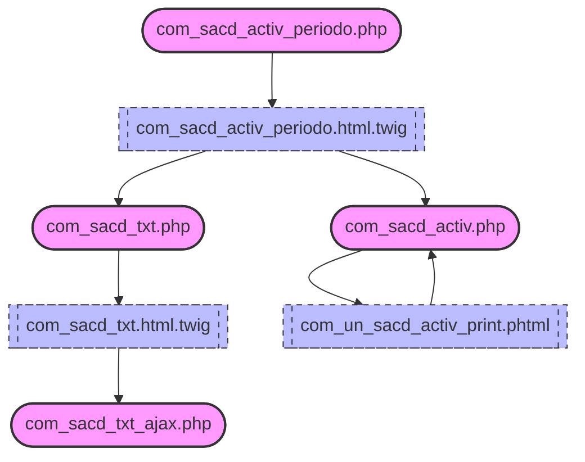

```mermaid
flowchart TD
    %% Estils de nodes
    classDef controller fill:#f9f,stroke:#333,stroke-width:2px;
    classDef vista fill:#bbf,stroke:#333,stroke-width:1px,stroke-dasharray: 5 5;
    classDef error fill:#ff9999,stroke:#cc0000,stroke-width:2px;

    apps_actividadessacd_controller_com_sacd_activ_periodo_php(["com_sacd_activ_periodo.php"]):::controller --> apps_actividadessacd_view_com_sacd_activ_periodo_html_twig[["com_sacd_activ_periodo.html.twig"]]:::vista
    apps_actividadessacd_view_com_sacd_activ_periodo_html_twig --> apps_actividadessacd_controller_com_sacd_txt_php(["com_sacd_txt.php"]):::controller
    apps_actividadessacd_view_com_sacd_activ_periodo_html_twig --> apps_actividadessacd_controller_com_sacd_activ_php(["com_sacd_activ.php"]):::controller
    apps_actividadessacd_controller_com_sacd_txt_php(["com_sacd_txt.php"]):::controller --> apps_actividadessacd_view_com_sacd_txt_html_twig[["com_sacd_txt.html.twig"]]:::vista
    apps_actividadessacd_view_com_sacd_txt_html_twig --> apps_actividadessacd_controller_com_sacd_txt_ajax_php(["com_sacd_txt_ajax.php"]):::controller
    apps_actividadessacd_controller_com_sacd_activ_php(["com_sacd_activ.php"]):::controller --> apps_actividadessacd_view_com_un_sacd_activ_print_phtml[["com_un_sacd_activ_print.phtml"]]:::vista
    apps_actividadessacd_view_com_un_sacd_activ_print_phtml --> apps_actividadessacd_controller_com_sacd_activ_php(["com_sacd_activ.php"]):::controller
```