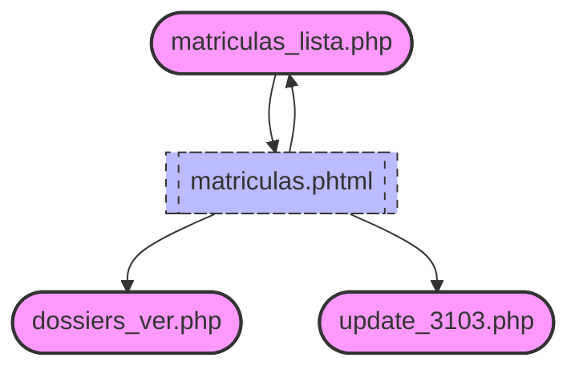

```mermaid
flowchart TD
    %% Estils de nodes
    classDef controller fill:#f9f,stroke:#333,stroke-width:2px;
    classDef vista fill:#bbf,stroke:#333,stroke-width:1px,stroke-dasharray: 5 5;
    classDef error fill:#ff9999,stroke:#cc0000,stroke-width:2px;

    apps_actividadestudios_controller_matriculas_lista_php(["matriculas_lista.php"]):::controller --> apps_actividadestudios_view_matriculas_phtml[["matriculas.phtml"]]:::vista
    apps_actividadestudios_view_matriculas_phtml --> apps_actividadestudios_controller_matriculas_lista_php(["matriculas_lista.php"]):::controller
    apps_actividadestudios_view_matriculas_phtml --> apps_dossiers_controller_dossiers_ver_php(["dossiers_ver.php"]):::controller
    apps_actividadestudios_view_matriculas_phtml --> apps_actividadestudios_controller_update_3103_php(["update_3103.php"]):::controller
    %% DESTÍ NO RESOLT des de apps_actividadestudios_view_matriculas_phtml: $oHashPeriodo->getCamposHtml(); [DESTÍ NO RESOLT]
    %% DESTÍ NO RESOLT des de apps_actividadestudios_view_matriculas_phtml: $oHash->getCamposHtml(); [DESTÍ NO RESOLT]
```