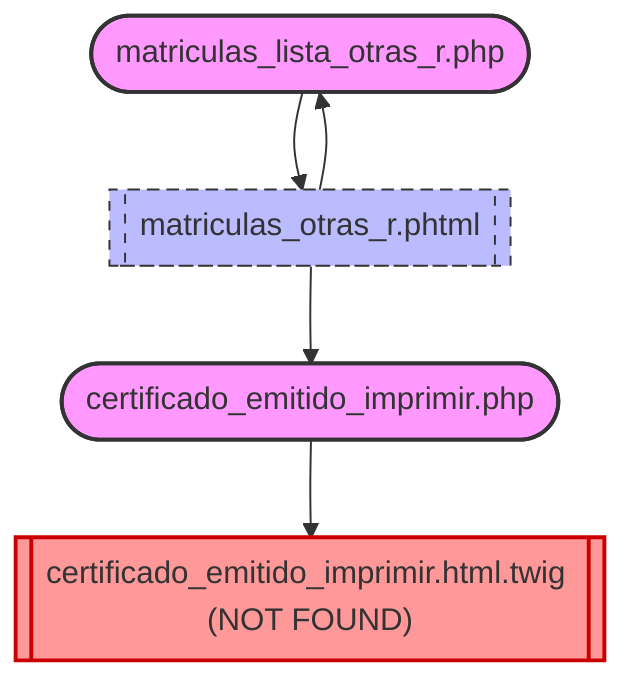

```mermaid
flowchart TD
    %% Estils de nodes
    classDef controller fill:#f9f,stroke:#333,stroke-width:2px;
    classDef vista fill:#bbf,stroke:#333,stroke-width:1px,stroke-dasharray: 5 5;
    classDef error fill:#ff9999,stroke:#cc0000,stroke-width:2px;

    apps_actividadestudios_controller_matriculas_lista_otras_r_php(["matriculas_lista_otras_r.php"]):::controller --> apps_actividadestudios_view_matriculas_otras_r_phtml[["matriculas_otras_r.phtml"]]:::vista
    apps_actividadestudios_view_matriculas_otras_r_phtml --> apps_actividadestudios_controller_matriculas_lista_otras_r_php(["matriculas_lista_otras_r.php"]):::controller
    apps_actividadestudios_view_matriculas_otras_r_phtml --> frontend_certificados_controller_certificado_emitido_imprimir_php(["certificado_emitido_imprimir.php"]):::controller
    %% DESTÍ NO RESOLT des de apps_actividadestudios_view_matriculas_otras_r_phtml: $oHashApellidos->getCamposHtml() [DESTÍ NO RESOLT]
    %% DESTÍ NO RESOLT des de apps_actividadestudios_view_matriculas_otras_r_phtml: $oHash->getCamposHtml() [DESTÍ NO RESOLT]
    frontend_certificados_controller_certificado_emitido_imprimir_php --> frontend_actividades_view_certificado_emitido_imprimir_html_twig[["certificado_emitido_imprimir.html.twig (NOT FOUND)"]]:::error
    class frontend_actividades_view_certificado_emitido_imprimir_html_twig error;
```