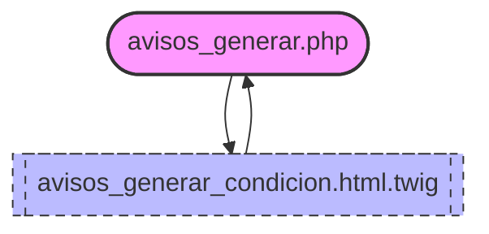

```mermaid
flowchart TD
    %% Estils de nodes
    classDef controller fill:#f9f,stroke:#333,stroke-width:2px;
    classDef vista fill:#bbf,stroke:#333,stroke-width:1px,stroke-dasharray: 5 5;
    classDef error fill:#ff9999,stroke:#cc0000,stroke-width:2px;

    apps_cambios_controller_avisos_generar_php(["avisos_generar.php"]):::controller --> apps_cambios_view_avisos_generar_condicion_html_twig[["avisos_generar_condicion.html.twig"]]:::vista
    apps_cambios_view_avisos_generar_condicion_html_twig --> apps_cambios_controller_avisos_generar_php(["avisos_generar.php"]):::controller
    %% DESTÍ NO RESOLT des de apps_cambios_view_avisos_generar_condicion_html_twig: {{ oHashCond }} [DESTÍ NO RESOLT]
```