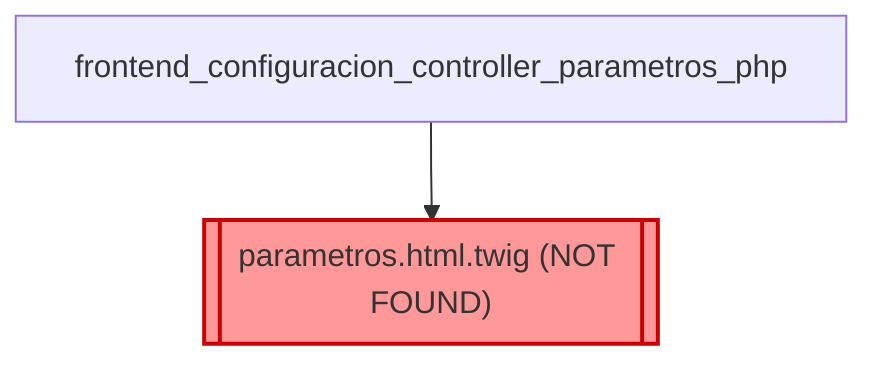

```mermaid
flowchart TD
    %% Estils de nodes
    classDef controller fill:#f9f,stroke:#333,stroke-width:2px;
    classDef vista fill:#bbf,stroke:#333,stroke-width:1px,stroke-dasharray: 5 5;
    classDef error fill:#ff9999,stroke:#cc0000,stroke-width:2px;

    frontend_configuracion_controller_parametros_php --> frontend_actividades_view_parametros_html_twig[["parametros.html.twig (NOT FOUND)"]]:::error
    class frontend_actividades_view_parametros_html_twig error;
```