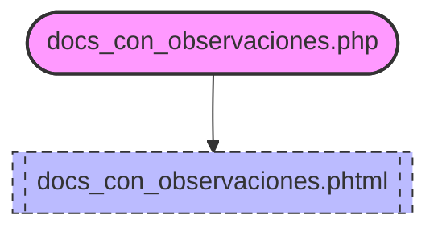

```mermaid
flowchart TD
    %% Estils de nodes
    classDef controller fill:#f9f,stroke:#333,stroke-width:2px;
    classDef vista fill:#bbf,stroke:#333,stroke-width:1px,stroke-dasharray: 5 5;
    classDef error fill:#ff9999,stroke:#cc0000,stroke-width:2px;

    frontend_inventario_controller_docs_con_observaciones_php(["docs_con_observaciones.php"]):::controller --> frontend_inventario_view_docs_con_observaciones_phtml[["docs_con_observaciones.phtml"]]:::vista
```