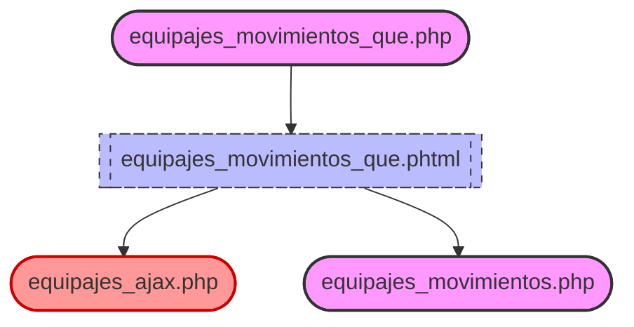

```mermaid
flowchart TD
    %% Estils de nodes
    classDef controller fill:#f9f,stroke:#333,stroke-width:2px;
    classDef vista fill:#bbf,stroke:#333,stroke-width:1px,stroke-dasharray: 5 5;
    classDef error fill:#ff9999,stroke:#cc0000,stroke-width:2px;

    frontend_inventario_controller_equipajes_movimientos_que_php(["equipajes_movimientos_que.php"]):::controller --> frontend_inventario_view_equipajes_movimientos_que_phtml[["equipajes_movimientos_que.phtml"]]:::vista
    frontend_inventario_view_equipajes_movimientos_que_phtml --> scdl_documentos_equipajes_ajax_php(["equipajes_ajax.php"]):::controller
    frontend_inventario_view_equipajes_movimientos_que_phtml --> frontend_inventario_controller_equipajes_movimientos_php(["equipajes_movimientos.php"]):::controller
    %% DESTÍ NO RESOLT des de frontend_inventario_view_equipajes_movimientos_que_phtml: $oHash->getCamposHtml() [DESTÍ NO RESOLT]
    class scdl_documentos_equipajes_ajax_php error;
```