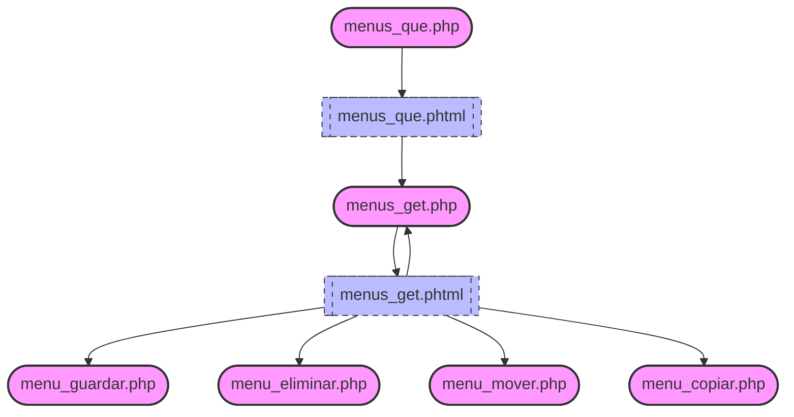

```mermaid
flowchart TD
    %% Estils de nodes
    classDef controller fill:#f9f,stroke:#333,stroke-width:2px;
    classDef vista fill:#bbf,stroke:#333,stroke-width:1px,stroke-dasharray: 5 5;
    classDef error fill:#ff9999,stroke:#cc0000,stroke-width:2px;

    frontend_menus_controller_menus_que_php(["menus_que.php"]):::controller --> frontend_menus_view_menus_que_phtml[["menus_que.phtml"]]:::vista
    frontend_menus_view_menus_que_phtml --> frontend_menus_controller_menus_get_php(["menus_get.php"]):::controller
    frontend_menus_controller_menus_get_php(["menus_get.php"]):::controller --> frontend_menus_view_menus_get_phtml[["menus_get.phtml"]]:::vista
    frontend_menus_view_menus_get_phtml --> src_menus_infrastructure_controllers_menu_guardar_php(["menu_guardar.php"]):::controller
    frontend_menus_view_menus_get_phtml --> frontend_menus_controller_menus_get_php(["menus_get.php"]):::controller
    frontend_menus_view_menus_get_phtml --> src_menus_infrastructure_controllers_menu_eliminar_php(["menu_eliminar.php"]):::controller
    frontend_menus_view_menus_get_phtml --> src_menus_infrastructure_controllers_menu_mover_php(["menu_mover.php"]):::controller
    frontend_menus_view_menus_get_phtml --> src_menus_infrastructure_controllers_menu_copiar_php(["menu_copiar.php"]):::controller
    %% DESTÍ NO RESOLT des de frontend_menus_view_menus_get_phtml: $oHash->getCamposHtml(); [DESTÍ NO RESOLT]
    %% DESTÍ NO RESOLT des de frontend_menus_view_menus_get_phtml: $oHash4->getCamposHtml(); [DESTÍ NO RESOLT]
    %% DESTÍ NO RESOLT des de frontend_menus_view_menus_get_phtml: $oHash2->getCamposHtml() [DESTÍ NO RESOLT]
    %% DESTÍ NO RESOLT des de frontend_menus_view_menus_get_phtml: $oHash3->getCamposHtml(); [DESTÍ NO RESOLT]
    %% DESTÍ NO RESOLT des de frontend_menus_view_menus_get_phtml: $oHash5->getCamposHtml(); [DESTÍ NO RESOLT]
    %% DESTÍ NO RESOLT des de frontend_menus_view_menus_get_phtml: $oHash6->getCamposHtml(); [DESTÍ NO RESOLT]
```