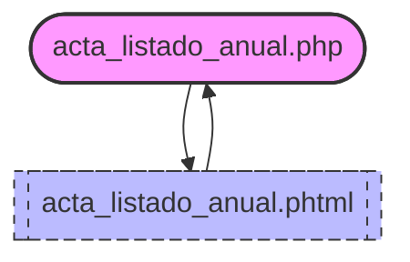

```mermaid
flowchart TD
    %% Estils de nodes
    classDef controller fill:#f9f,stroke:#333,stroke-width:2px;
    classDef vista fill:#bbf,stroke:#333,stroke-width:1px,stroke-dasharray: 5 5;
    classDef error fill:#ff9999,stroke:#cc0000,stroke-width:2px;

    apps_notas_controller_acta_listado_anual_php(["acta_listado_anual.php"]):::controller --> apps_notas_view_acta_listado_anual_phtml[["acta_listado_anual.phtml"]]:::vista
    apps_notas_view_acta_listado_anual_phtml --> apps_notas_controller_acta_listado_anual_php(["acta_listado_anual.php"]):::controller
    %% DESTÍ NO RESOLT des de apps_notas_view_acta_listado_anual_phtml: $oHashPeriodo->getCamposHtml(); [DESTÍ NO RESOLT]
```