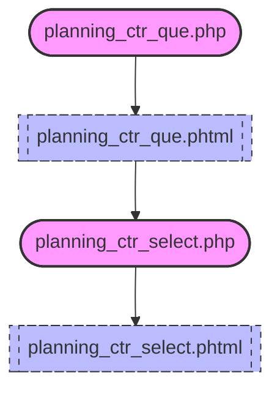

```mermaid
flowchart TD
    %% Estils de nodes
    classDef controller fill:#f9f,stroke:#333,stroke-width:2px;
    classDef vista fill:#bbf,stroke:#333,stroke-width:1px,stroke-dasharray: 5 5;
    classDef error fill:#ff9999,stroke:#cc0000,stroke-width:2px;

    apps_planning_controller_planning_ctr_que_php(["planning_ctr_que.php"]):::controller --> apps_planning_view_planning_ctr_que_phtml[["planning_ctr_que.phtml"]]:::vista
    apps_planning_view_planning_ctr_que_phtml --> apps_planning_controller_planning_ctr_select_php(["planning_ctr_select.php"]):::controller
    %% DESTÍ NO RESOLT des de apps_planning_view_planning_ctr_que_phtml: $oHash1->getCamposHtml(); [DESTÍ NO RESOLT]
    apps_planning_controller_planning_ctr_select_php(["planning_ctr_select.php"]):::controller --> apps_planning_view_planning_ctr_select_phtml[["planning_ctr_select.phtml"]]:::vista
```