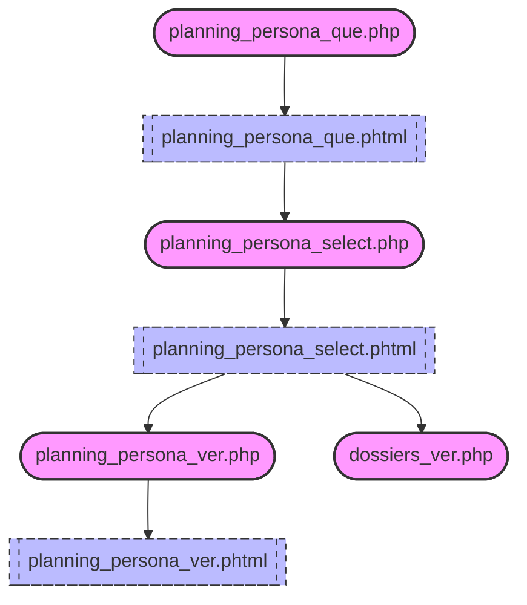

```mermaid
flowchart TD
    %% Estils de nodes
    classDef controller fill:#f9f,stroke:#333,stroke-width:2px;
    classDef vista fill:#bbf,stroke:#333,stroke-width:1px,stroke-dasharray: 5 5;
    classDef error fill:#ff9999,stroke:#cc0000,stroke-width:2px;

    apps_planning_controller_planning_persona_que_php(["planning_persona_que.php"]):::controller --> apps_planning_view_planning_persona_que_phtml[["planning_persona_que.phtml"]]:::vista
    apps_planning_view_planning_persona_que_phtml --> apps_planning_controller_planning_persona_select_php(["planning_persona_select.php"]):::controller
    apps_planning_controller_planning_persona_select_php(["planning_persona_select.php"]):::controller --> apps_planning_view_planning_persona_select_phtml[["planning_persona_select.phtml"]]:::vista
    apps_planning_view_planning_persona_select_phtml --> apps_planning_controller_planning_persona_ver_php(["planning_persona_ver.php"]):::controller
    apps_planning_view_planning_persona_select_phtml --> apps_dossiers_controller_dossiers_ver_php(["dossiers_ver.php"]):::controller
    %% DESTÍ NO RESOLT des de apps_planning_view_planning_persona_select_phtml: $oHash->getCamposHtml() [DESTÍ NO RESOLT]
    apps_planning_controller_planning_persona_ver_php(["planning_persona_ver.php"]):::controller --> apps_planning_view_planning_persona_ver_phtml[["planning_persona_ver.phtml"]]:::vista
```