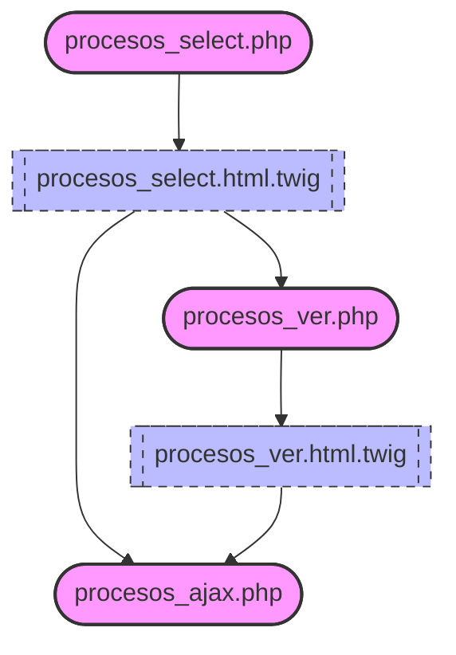

```mermaid
flowchart TD
    %% Estils de nodes
    classDef controller fill:#f9f,stroke:#333,stroke-width:2px;
    classDef vista fill:#bbf,stroke:#333,stroke-width:1px,stroke-dasharray: 5 5;
    classDef error fill:#ff9999,stroke:#cc0000,stroke-width:2px;

    apps_procesos_controller_procesos_select_php(["procesos_select.php"]):::controller --> apps_procesos_view_procesos_select_html_twig[["procesos_select.html.twig"]]:::vista
    apps_procesos_view_procesos_select_html_twig --> apps_procesos_controller_procesos_ajax_php(["procesos_ajax.php"]):::controller
    apps_procesos_view_procesos_select_html_twig --> apps_procesos_controller_procesos_ver_php(["procesos_ver.php"]):::controller
    apps_procesos_controller_procesos_ver_php(["procesos_ver.php"]):::controller --> apps_procesos_view_procesos_ver_html_twig[["procesos_ver.html.twig"]]:::vista
    apps_procesos_view_procesos_ver_html_twig --> apps_procesos_controller_procesos_ajax_php(["procesos_ajax.php"]):::controller
    %% DESTÍ NO RESOLT des de apps_procesos_view_procesos_ver_html_twig: {{ oHash }} [DESTÍ NO RESOLT]
```