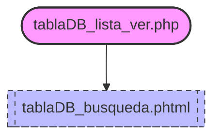

```mermaid
flowchart TD
    %% Estils de nodes
    classDef controller fill:#f9f,stroke:#333,stroke-width:2px;
    classDef vista fill:#bbf,stroke:#333,stroke-width:1px,stroke-dasharray: 5 5;
    classDef error fill:#ff9999,stroke:#cc0000,stroke-width:2px;

    frontend_shared_controller_tablaDB_lista_ver_php(["tablaDB_lista_ver.php"]):::controller --> frontend_shared_view_tablaDB_busqueda_phtml[["tablaDB_busqueda.phtml"]]:::vista
    %% DESTÍ NO RESOLT des de frontend_shared_view_tablaDB_busqueda_phtml: $url [DESTÍ NO RESOLT]
```