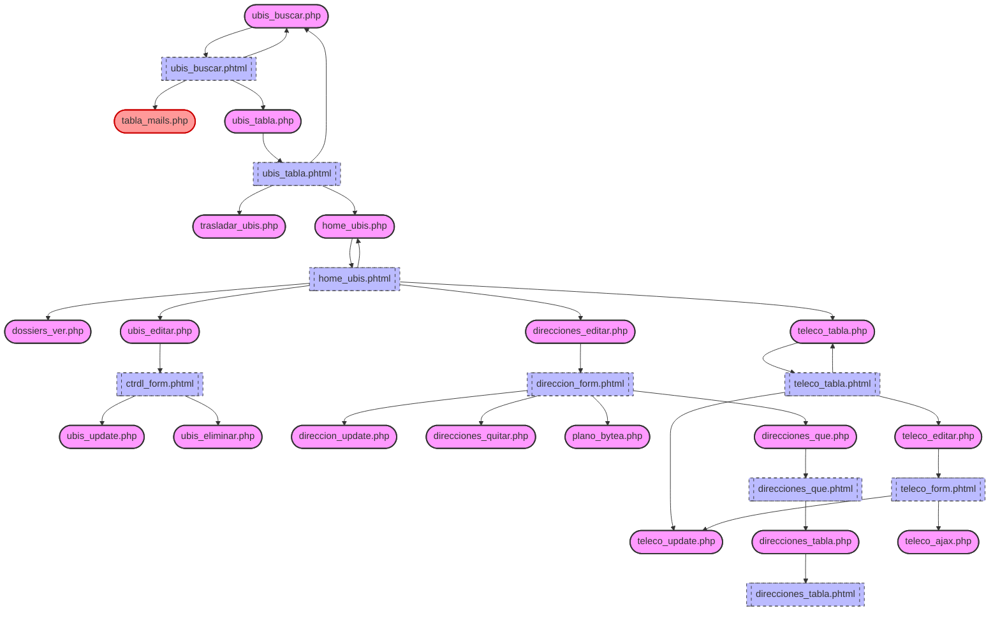

```mermaid
flowchart TD
    %% Estils de nodes
    classDef controller fill:#f9f,stroke:#333,stroke-width:2px;
    classDef vista fill:#bbf,stroke:#333,stroke-width:1px,stroke-dasharray: 5 5;
    classDef error fill:#ff9999,stroke:#cc0000,stroke-width:2px;

    apps_ubis_controller_ubis_buscar_php(["ubis_buscar.php"]):::controller --> apps_ubis_view_ubis_buscar_phtml[["ubis_buscar.phtml"]]:::vista
    apps_ubis_view_ubis_buscar_phtml --> scdl_tabla_mails_php(["tabla_mails.php"]):::controller
    apps_ubis_view_ubis_buscar_phtml --> apps_ubis_controller_ubis_tabla_php(["ubis_tabla.php"]):::controller
    apps_ubis_view_ubis_buscar_phtml --> apps_ubis_controller_ubis_buscar_php(["ubis_buscar.php"]):::controller
    apps_ubis_controller_ubis_tabla_php(["ubis_tabla.php"]):::controller --> apps_ubis_view_ubis_tabla_phtml[["ubis_tabla.phtml"]]:::vista
    apps_ubis_view_ubis_tabla_phtml --> apps_ubis_controller_trasladar_ubis_php(["trasladar_ubis.php"]):::controller
    apps_ubis_view_ubis_tabla_phtml --> apps_ubis_controller_home_ubis_php(["home_ubis.php"]):::controller
    apps_ubis_view_ubis_tabla_phtml --> apps_ubis_controller_ubis_buscar_php(["ubis_buscar.php"]):::controller
    %% DESTÍ NO RESOLT des de apps_ubis_view_ubis_tabla_phtml: $oHash->getCamposHtml(); [DESTÍ NO RESOLT]
    apps_ubis_controller_home_ubis_php(["home_ubis.php"]):::controller --> apps_ubis_view_home_ubis_phtml[["home_ubis.phtml"]]:::vista
    apps_ubis_view_home_ubis_phtml --> apps_dossiers_controller_dossiers_ver_php(["dossiers_ver.php"]):::controller
    apps_ubis_view_home_ubis_phtml --> apps_ubis_controller_home_ubis_php(["home_ubis.php"]):::controller
    apps_ubis_view_home_ubis_phtml --> apps_ubis_controller_ubis_editar_php(["ubis_editar.php"]):::controller
    apps_ubis_view_home_ubis_phtml --> apps_ubis_controller_direcciones_editar_php(["direcciones_editar.php"]):::controller
    apps_ubis_view_home_ubis_phtml --> apps_ubis_controller_teleco_tabla_php(["teleco_tabla.php"]):::controller
    apps_ubis_controller_ubis_editar_php(["ubis_editar.php"]):::controller --> apps_ubis_view_ctrdl_form_phtml[["ctrdl_form.phtml"]]:::vista
    apps_ubis_view_ctrdl_form_phtml --> apps_ubis_controller_ubis_update_php(["ubis_update.php"]):::controller
    apps_ubis_view_ctrdl_form_phtml --> apps_ubis_controller_ubis_eliminar_php(["ubis_eliminar.php"]):::controller
    apps_ubis_controller_direcciones_editar_php(["direcciones_editar.php"]):::controller --> apps_ubis_view_direccion_form_phtml[["direccion_form.phtml"]]:::vista
    apps_ubis_view_direccion_form_phtml --> apps_ubis_controller_direccion_update_php(["direccion_update.php"]):::controller
    apps_ubis_view_direccion_form_phtml --> apps_ubis_controller_direcciones_quitar_php(["direcciones_quitar.php"]):::controller
    apps_ubis_view_direccion_form_phtml --> apps_ubis_controller_plano_bytea_php(["plano_bytea.php"]):::controller
    apps_ubis_view_direccion_form_phtml --> apps_ubis_controller_direcciones_que_php(["direcciones_que.php"]):::controller
    %% DESTÍ NO RESOLT des de apps_ubis_view_direccion_form_phtml: $id_direccion_actual [DESTÍ NO RESOLT]
    apps_ubis_controller_teleco_tabla_php(["teleco_tabla.php"]):::controller --> apps_ubis_view_teleco_tabla_phtml[["teleco_tabla.phtml"]]:::vista
    apps_ubis_view_teleco_tabla_phtml --> apps_ubis_controller_teleco_editar_php(["teleco_editar.php"]):::controller
    apps_ubis_view_teleco_tabla_phtml --> apps_ubis_controller_teleco_update_php(["teleco_update.php"]):::controller
    apps_ubis_view_teleco_tabla_phtml --> apps_ubis_controller_teleco_tabla_php(["teleco_tabla.php"]):::controller
    %% DESTÍ NO RESOLT des de apps_ubis_view_teleco_tabla_phtml: $ficha [DESTÍ NO RESOLT]
    %% DESTÍ NO RESOLT des de apps_ubis_view_teleco_tabla_phtml: $oHash->getCamposHtml(); [DESTÍ NO RESOLT]
    apps_ubis_controller_direcciones_que_php(["direcciones_que.php"]):::controller --> apps_ubis_view_direcciones_que_phtml[["direcciones_que.phtml"]]:::vista
    apps_ubis_view_direcciones_que_phtml --> apps_ubis_controller_direcciones_tabla_php(["direcciones_tabla.php"]):::controller
    apps_ubis_controller_teleco_editar_php(["teleco_editar.php"]):::controller --> apps_ubis_view_teleco_form_phtml[["teleco_form.phtml"]]:::vista
    apps_ubis_view_teleco_form_phtml --> apps_ubis_controller_teleco_update_php(["teleco_update.php"]):::controller
    apps_ubis_view_teleco_form_phtml --> apps_ubis_controller_teleco_ajax_php(["teleco_ajax.php"]):::controller
    apps_ubis_controller_direcciones_tabla_php(["direcciones_tabla.php"]):::controller --> apps_ubis_view_direcciones_tabla_phtml[["direcciones_tabla.phtml"]]:::vista
    %% DESTÍ NO RESOLT des de apps_ubis_view_direcciones_tabla_phtml: $url_nueva; [DESTÍ NO RESOLT]
    class scdl_tabla_mails_php error;
```