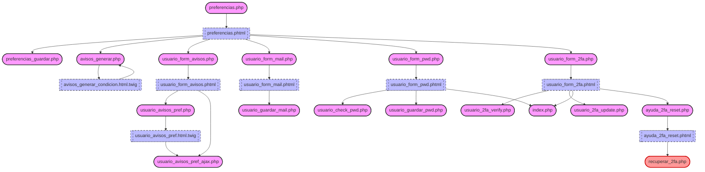

```mermaid
flowchart TD
    %% Estils de nodes
    classDef controller fill:#f9f,stroke:#333,stroke-width:2px;
    classDef vista fill:#bbf,stroke:#333,stroke-width:1px,stroke-dasharray: 5 5;
    classDef error fill:#ff9999,stroke:#cc0000,stroke-width:2px;

    frontend_usuarios_controller_preferencias_php(["preferencias.php"]):::controller --> frontend_usuarios_view_preferencias_phtml[["preferencias.phtml"]]:::vista
    frontend_usuarios_view_preferencias_phtml --> src_usuarios_infrastructure_controllers_preferencias_guardar_php(["preferencias_guardar.php"]):::controller
    frontend_usuarios_view_preferencias_phtml --> apps_cambios_controller_avisos_generar_php(["avisos_generar.php"]):::controller
    frontend_usuarios_view_preferencias_phtml --> frontend_cambios_controller_usuario_form_avisos_php(["usuario_form_avisos.php"]):::controller
    frontend_usuarios_view_preferencias_phtml --> frontend_usuarios_controller_usuario_form_mail_php(["usuario_form_mail.php"]):::controller
    frontend_usuarios_view_preferencias_phtml --> frontend_usuarios_controller_usuario_form_pwd_php(["usuario_form_pwd.php"]):::controller
    frontend_usuarios_view_preferencias_phtml --> frontend_usuarios_controller_usuario_form_2fa_php(["usuario_form_2fa.php"]):::controller
    %% DESTÍ NO RESOLT des de frontend_usuarios_view_preferencias_phtml: $oHash->getCamposHtml() [DESTÍ NO RESOLT]
    apps_cambios_controller_avisos_generar_php(["avisos_generar.php"]):::controller --> apps_cambios_view_avisos_generar_condicion_html_twig[["avisos_generar_condicion.html.twig"]]:::vista
    apps_cambios_view_avisos_generar_condicion_html_twig --> apps_cambios_controller_avisos_generar_php(["avisos_generar.php"]):::controller
    %% DESTÍ NO RESOLT des de apps_cambios_view_avisos_generar_condicion_html_twig: {{ oHashCond }} [DESTÍ NO RESOLT]
    frontend_cambios_controller_usuario_form_avisos_php(["usuario_form_avisos.php"]):::controller --> frontend_cambios_view_usuario_form_avisos_phtml[["usuario_form_avisos.phtml"]]:::vista
    frontend_cambios_view_usuario_form_avisos_phtml --> apps_cambios_controller_usuario_avisos_pref_php(["usuario_avisos_pref.php"]):::controller
    frontend_cambios_view_usuario_form_avisos_phtml --> apps_cambios_controller_usuario_avisos_pref_ajax_php(["usuario_avisos_pref_ajax.php"]):::controller
    %% DESTÍ NO RESOLT des de frontend_cambios_view_usuario_form_avisos_phtml: $oHashAvisos->getCamposHtml(); [DESTÍ NO RESOLT]
    frontend_usuarios_controller_usuario_form_mail_php(["usuario_form_mail.php"]):::controller --> frontend_usuarios_view_usuario_form_mail_phtml[["usuario_form_mail.phtml"]]:::vista
    frontend_usuarios_view_usuario_form_mail_phtml --> src_usuarios_infrastructure_controllers_usuario_guardar_mail_php(["usuario_guardar_mail.php"]):::controller
    %% DESTÍ NO RESOLT des de frontend_usuarios_view_usuario_form_mail_phtml: $oHash->getCamposHtml() [DESTÍ NO RESOLT]
    frontend_usuarios_controller_usuario_form_pwd_php(["usuario_form_pwd.php"]):::controller --> frontend_usuarios_view_usuario_form_pwd_phtml[["usuario_form_pwd.phtml"]]:::vista
    frontend_usuarios_view_usuario_form_pwd_phtml --> src_usuarios_infrastructure_controllers_usuario_check_pwd_php(["usuario_check_pwd.php"]):::controller
    frontend_usuarios_view_usuario_form_pwd_phtml --> src_usuarios_infrastructure_controllers_usuario_guardar_pwd_php(["usuario_guardar_pwd.php"]):::controller
    frontend_usuarios_view_usuario_form_pwd_phtml --> index_php(["index.php"]):::controller
    frontend_usuarios_controller_usuario_form_2fa_php(["usuario_form_2fa.php"]):::controller --> frontend_usuarios_view_usuario_form_2fa_phtml[["usuario_form_2fa.phtml"]]:::vista
    frontend_usuarios_view_usuario_form_2fa_phtml --> src_usuarios_infrastructure_controllers_usuario_2fa_verify_php(["usuario_2fa_verify.php"]):::controller
    frontend_usuarios_view_usuario_form_2fa_phtml --> src_usuarios_infrastructure_controllers_usuario_2fa_update_php(["usuario_2fa_update.php"]):::controller
    frontend_usuarios_view_usuario_form_2fa_phtml --> index_php(["index.php"]):::controller
    frontend_usuarios_view_usuario_form_2fa_phtml --> frontend_usuarios_controller_ayuda_2fa_reset_php(["ayuda_2fa_reset.php"]):::controller
    apps_cambios_controller_usuario_avisos_pref_php(["usuario_avisos_pref.php"]):::controller --> apps_cambios_view_usuario_avisos_pref_html_twig[["usuario_avisos_pref.html.twig"]]:::vista
    apps_cambios_view_usuario_avisos_pref_html_twig --> apps_cambios_controller_usuario_avisos_pref_ajax_php(["usuario_avisos_pref_ajax.php"]):::controller
    %% DESTÍ NO RESOLT des de apps_cambios_view_usuario_avisos_pref_html_twig: {{ oHash }} [DESTÍ NO RESOLT]
    frontend_usuarios_controller_ayuda_2fa_reset_php(["ayuda_2fa_reset.php"]):::controller --> frontend_usuarios_view_ayuda_2fa_reset_phtml[["ayuda_2fa_reset.phtml"]]:::vista
    frontend_usuarios_view_ayuda_2fa_reset_phtml --> recuperar_2fa_php(["recuperar_2fa.php"]):::controller
    %% DESTÍ NO RESOLT des de frontend_usuarios_view_ayuda_2fa_reset_phtml: $url_index [DESTÍ NO RESOLT]
    class recuperar_2fa_php error;
```